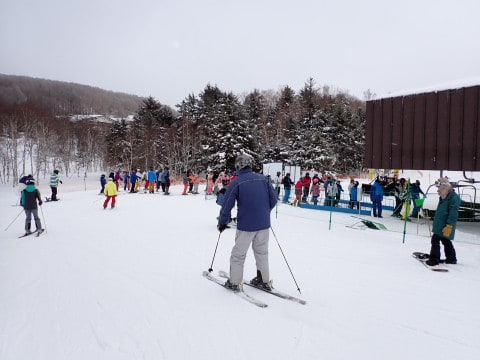
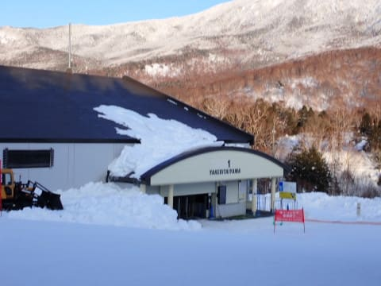

# 2024/2/3(土)の志賀高原焼額山スキー場は…朝は曇ったけど午後は晴れ！締まったいい雪でラストまで大回りOK！人は多めだけどリフト待ちは少なめ

📅 投稿日時: 2024-02-04 00:08:09

🏷️ カテゴリ: [2024スキー滑走日記](c453f687e8a0f05679e95831d0a02cd0c.md)

ということで．

今日も志賀高原で滑ってきました～！！

いつも通り，朝8:30の営業開始前に

焼額第１ゴンドラ前に並びますが…

まぁ，待ちはそれほど長くなく．

今日はそこまで混まなさそうな予感．

ってなことで．8:30の営業開始とともに

ゴンドラで山頂へ向かいますが…

山頂の気温は-11℃と冷え冷え！！

水曜に予想した-12℃から，1度の誤差で

当てましたよ～！！

で．

山頂は…

これも水曜の予想通り，ごくわずかに

雪も舞う曇り空（涙）

かなり暗めの曇り空で，雪面状況が

ちょいと見にくい，残念な感じの天気

です（泣）

でも．

雪面は…

昨晩の積雪が1cmほどあった感じで，

しっかり締まり気味の圧雪の下地に

わずかな新雪を巻き込んで圧雪された，

しっかりエッジが効く感じの締まり気味の

シマシマバーンっ！！

トップシーズンだと新雪が積もって

雪が柔らかくなり，圧雪しても

板が潜るような柔らか圧雪になることも

ありますが．

今日はトップシーズンらしからぬ，

しっかり硬めに踏み込まれた圧雪で．

それでいて表面が固まってコロコロに

なることもないという．

結構スピードが乗る，あさイチハイスピード

クルーズには最適の雪質！！

…まぁ，締まり気味のハイスピード圧雪

ということは．

逆に言うとここ数日新雪がほとんど積もって

ないということで，それはそれで

雪が例年より少なくヤバい感じなんですが．

でも，ほぼ全面可能の焼額．

ブッシュなんかの心配はもう全くない

ですよ～！！

ってな感じで，ガスっぽい曇り空の

中を滑っていたら…

だんだんガスが晴れていき．

雲も薄くなっていったのか，だんだん

ゲレンデが明るくなってきました…！

あさイチは見にくかったバーン表面が

よく見えるようになり，滑りやすくなったけど…

その代わり，ちょっとコース上の人口密度が

高くなってきちゃいました（涙）

2月に入ってスキーに来る人も増えたのか．

第2高速は朝10時前にピークでこのくらい

並んだし…

第1ゴンドラも，10時から11時くらいまでは，

ゲートの外まで列が伸びたけど．

…でも，ピークでもせいぜいこの程度．

11時には第2高速リフトもガラガラに

なったし…

第1ゴンドラも，昼になると待ち時間が一気に

減り，昼から午後にかけて，大体このくらいの

待ち時間と．

意外と待ち時間が伸びずによかったですね～…

で．

さらにそのうえ，

11時前には天気もかなり回復し始めてきて…

ゲレンデにときどき，日が差すように

なってきましたよ…！！

そして．

午前11時を超えると…

コースの人口密度も，サウスコースの一部を

除いて，かなり減ってきましたよ！

さらに昼を過ぎると…

ゲレンデに日が射し始めた…

というよりも．

これ，晴れてきてませんか？？

ってか．

13時ごろには，完全に晴れて，

北アルプスが見えるようになってきたんですが！？？

ってなことで．

午後1時から後の時間は．

完全に晴天のゲレンデを楽しめました～！

超ガラガラというわけではなく，

コース上にはそこそこ人がいますが．

滑るのに困るほどの人口密度に

なることはなく…

それでいて，晴天でこんなにいい雪質を

滑れるなんて…

これ，先週に続いて2週連続で，

超幸せデーなんですが！？？？

あぁ…

晴天の下で滑れるって素晴らしい…

それも，気温が冷え冷えの晴天．

日が射しても全く雪が緩む気配はないし．

それどころか，朝からかなり締まりぎみの

圧雪だったということもあり．

午後遅くになっても全くバーンが

荒れる気配がないのだが？？

ずっと大回り板で好き放題大回りできる

バーンコンディションが続くのだが？？

まぁ，斜度があるところはわずかに凸凹が

できかけている部分もあったし．

ちょっとゲレンデの人が多いタイミングも

あったものの…

雪が締まっているおかげで，雪は

ほとんど荒れず．

この営業終了直前の唐松コースが，

とても午後4時を過ぎたバーンコンディションに

見えないんですが！？？

これ，完全にフラットなままなんですが…！？？

サウスコースの一番凸凹しているところでも

この程度なので…

もう，今日は営業終了時間まで，大回り板で

好き放題大回りできる快楽デーでした…！！

ってなことで．

いつも通りわずか3時間睡眠で家を出て，

300㎞運転してあさイチから滑りはじめたと

いうのに…

そのまま昼休みも取らず．

日が暮れる夕方まで滑り続け…

あまりものコンディションの良さに，16:15の

営業終了まで，ひたすらぐるぐる滑り

続けたのでした…

いやーーーー．

良かった．

あさイチのバーンコンディションが

見にくい曇り空では，ちょっとテンション

落ち気味だったけど．

まさか午後はここまでの晴天で滑れるとは…

水曜に，

もしかすると夕方は晴れるかも…

と予想しましたが．

夕方よりもっと早い，昼過ぎから晴れてくれて．

いい方向に予想がちょっと外れてくれて

うれしい感じ…！

やはり神様は，私の日ごろの行いの良さを

見てくれているんだな～！！←違うから

うん．

こんな恵まれた日は…

当然．

あれですね．

…そうです．

ナイター参戦です！！！

午後6時スタートのナイター，

圧雪かけなおしてくれるので．

また，ぴかぴかのシマシマバーンを

堪能できるのだ！！

ってなことで．

ナイタータイム，

2時間の延長戦に突入！！

…今日のナイターは，ちょっと雪が

硬めすぎて．

軟らかさとういより，ちょっと足元がボロボロ

崩れる感じもかすかにあったものの…

でも，人がいないガラガラバーンで，

思う存分シマシマを堪能できるのだ！！

という感じで．

人が少ないのでシマシマがなかなか消えず．

思う存分シマシマフラットバーンを傾きたい

だけ傾いて滑って…

ナイターの2時間があっという間に感じるほど．

ナイターの営業終了の時間になっても．

こんなフラットの気持ちいいバーンのままで．

2時間たっぷり，快楽バーンを楽しみました～！

いやー．

みんな，ナイターに来ればいいのに…

ってなことで．

今日も睡眠不足で疲れていたのに．

それを忘れてまで朝からナイターまで休みなく

滑り続けてしまうほど．←あなたはコンディション悪くても朝から晩まで滑るでしょ

今しか楽しめない，トップシーズンの恵まれた

コンディションを一日堪能しまくったのでした…

いやーーー．

でも．

今日はほんとによかった…

明日も天気がいいといいんだけど．

明日は終日くもりっぽい感じ（ちょい泣）

でも，明日も雪はいいと思いますよ～！！

ってなことで．

明日も志賀高原で滑ってます～！！
