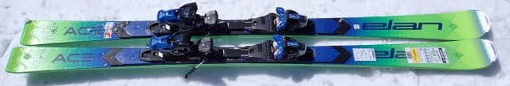
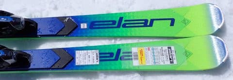
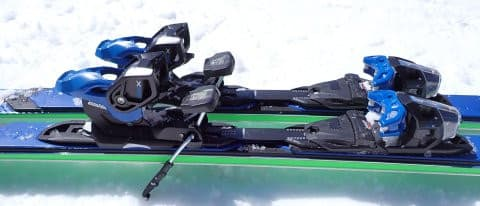
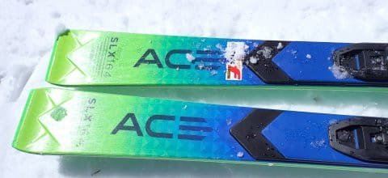
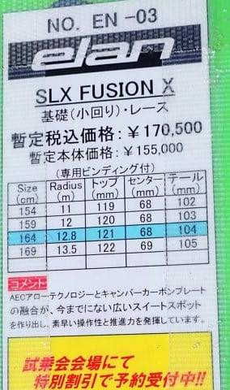

# 2024シーズンモデルのスキー板，試乗レポートその32…ELAN SLX FUSION X

📅 投稿日時: 2023-07-29 01:57:10

🏷️ カテゴリ: [スキー板試乗](c0bd8048615710cee890e403a36cc9a2b.md)

トレランシューズ対決の記事の途中ですが…

本日は，徒然スキーヤー日記としての

義務であるスキーネタをはさみます…

いや．

このBlogが，

徒然山歩き日記

にならないための義務です．

義務なんですよ…←試乗レポートが終わったらやばいんじゃないの？また山歩き日記になるよね…

今回は2024シーズンモデルのスキー板の

試乗レポート！

残るはこの板のほか，あと1種類…

ラスト一つ前は，エラン編です．

では，どうぞ～！

〇ELAN SLX FUSION X　164㎝

基礎小回り

この上にはSL競技用のSLX WORLDCUPが

ありますが．

ELANの基礎小回りとしてはトップモデルに

なるらしい，この板．

うーん．

ビンディングがかなり前についてる感じで．

トップが短いなぁ…

と思いながら滑ってみますが．

おっと．柔らかい！

かなり柔らかめで，たわみが良く出ますね！

ただ，たわみが良くでるけど，さらに板に

圧をかけてたわませていこうとすると…

がっつりグリップというよりは，板がちょいと

逃げる感じで，多少優しめのグリップ感．

この日はバーンが硬めというのもありましたが…

スピードを出して横Gを強めていくと，

板がじりじりずれる感じ．

ただ，ズルズル板が逃げていくというより，

板がずれながらもズレの中でターンしていく

回頭性があるので，強い圧をかけていくと

ずれながら小回りターンが仕上がっていく感じ．

それほど圧をかけずに，優しく板なりに

滑っていけば，しっかりカービングで

切れていってくれます．

…これ，たわみが出やすいので，

力や圧をかけられない人でも，たわみに

乗って切れて回る感覚がよくわかるし．

たわみの返りもそこまで強くないので，

たわみは大きいけど反復横跳び系の

小回り強制マシーンでもなければ，

吹っ飛ばされるようなリスキーな板でも

ないし…

そして，ずらしていってもズレズレじゃなく，

きれいに板が回りながらズレてくれるので．

硬い斜面をガンガンキレキレでかっ飛ばしたいとか，

体重・脚力がある人はもう少し強めの板が

いいと思いますが．

小回りベースとして，脚力がない人が

ゲレンデで履くにはよさそうな感じで．

さらに，板のたわみが使えるようになって，

ある程度のレベルから上達したい…

という人に向く板じゃないでしょうか．
