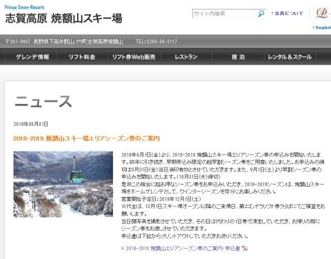
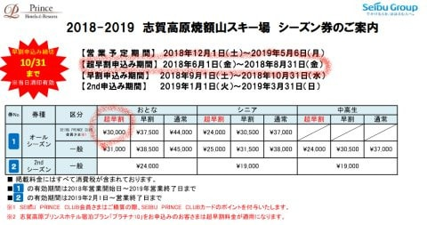
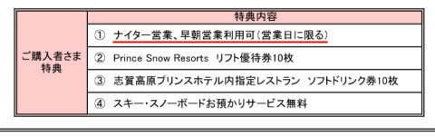
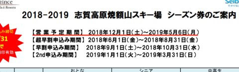
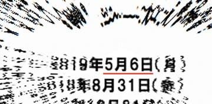

# なぬ？早くも焼額スキー場の2019シーズン情報が…来シーズンも早割シーズン券30000円！

📅 投稿日時: 2018-06-02 03:02:02

🏷️ カテゴリ: [スキー雑談](c1f9d2cb7478308da16419928ea3945e9.md)

えー．

どうやら．

いつも焼額で出会う方々は，

焼額に対する忠誠心がかなり高いらしく．

なんと．本日公開されたばかりの焼額スキー場の情報が．

[Olaf2125さん](https://blog.goo.ne.jp/olaf2125/e/70266afce4a8befe057edb40cefce45c)，[はっちさん](https://blogs.yahoo.co.jp/hatch_y1/66019845.html)，[Gokuさん](http://red.ap.teacup.com/gokurakuskier/930.html)のBlogで，

同時多発的に報告されてますね～！

…みなさん，この時期になっても，毎日

焼額のHPを確認してるってことですね．

焼額に対する忠誠度高すぎです（笑）←あなたもその一人なのでは…

とりあえず．

[焼額山スキー場のウェブページ](http://www2.princehotels.co.jp/page.jsp?id=226473)を見てみると…

ふむ．

2019シーズンも，焼額限定シーズン券を販売するとな？？

そして．

8月31日までに申し込めば，プリンスクラブ会員（入会無料）なら，

超早割が今シーズンと同じ3万円とな？？

で．

今シーズンと同じく，ナイターと早朝も使えるとな！？？

ドリンク券，リフト優待券が特典としてつくのも，

今シーズンと変わってないですね…

というところばかり気になっていたけど．

…よく見てみると．

うむ……？？

うむ！！？？？

！！！！！！

やったーっ！！！！

来シーズンも焼額，

GWまで営業だぁっ！！！

素晴らしいっ！！

雪不足のため，GWまで営業できなかった今シーズン．

（すごい状況の中，意地でなんとか[GW前半
　2日目まで営業](d20180429.md)してたけど…）

これに懲りて，

「もう2度と春営業なんてするもんかっ！」

ってことになってるんじゃないか…

と心配してたけど．

来シーズン，またGWまで営業してくれるようです！！

あー，よかった～…

…来シーズンも，イチゴンで春営業だといいなぁ…

（ヤケビスタッフへメッセージを送ってみる）

とりあえず．

雪が少なかった今シーズン．

GWの早朝営業が無かったので，

焼額の早朝営業には8日ほどしか参加できず．

また，焼額のナイターに参加したのも3日ほど．

…これだと，3万円払っても，もとは取れないけど．

でも．

10連休になるというウワサの来年のGW，

もし来シーズン雪がたっぷりあって，

GWの最後までめいっぱい滑れれば．

あと5-6日は早朝に行くだろうから，

シーズンで14，5日は早朝に行くはず…

だとすると．

焼額のナイターと早朝の費用が3万円を

超えてくるので．

超早割の3万円，払った方が得かも…

…って．

ちょっと待て．

これだと．

志賀高原の全山共通シーズン券と，

焼額のシーズン券．

同じスキー場で使えるシーズン券を2枚買う

っていうことになるんだけど…？？

これってかなり終わった人なんじゃ

ないかな…？？？←もうすでに終わっている人だから．いまさら

シーズン券2枚買っても誤差だから

でも．

いくら焼額を愛しているとはいえ．

やっぱり，全山シーズン券，いるよな…

さすがの私でも，

シーズン中，志賀高原の他のスキー場へ全く浮気をせず．

焼額だけを滑り続ける

というほどまでの忠誠心を持ち合わせてないよな…

ということを自覚した，Skier_Sなのでした．

## 💬 コメント一覧

### 💬 コメント by (olaf2125)
**タイトル**: 皆さんホント好きですね〜 (^^)
**投稿日**: 2018-06-02 09:36:48

ヤケビ＋共通で10万円。これに

・ヤケビの早朝とナイター

・プリンスのリフト割引券10枚

・ヤケビドリンクタダ券10枚

が付くんですね。

後はヤケビ以外の早朝とナイターですね…(ｰｰ;)

いっそ中野市あたりに移住するかな (^^)

### 💬 コメント by (Goku)
**タイトル**: セカンドシーズン券
**投稿日**: 2018-06-02 10:20:57

来シーズンも早朝営業がＧＳコースで、雪がＧＷまで持ちそうで、尚且つＧＷが１０連休ならば、セカンドシーズン券を買おうと思っています。

### 💬 コメント by (はっち)
**タイトル**: Unknown
**投稿日**: 2018-06-02 19:26:54

Facebookでヤケビをフォローしているので最新情報は逃しません ！　ヤケビ縛りはきついので、ふるさと納税との併用も考えてます。

### 💬 コメント by (しんちゃん)
**タイトル**: 高速道路も･･･
**投稿日**: 2018-06-02 20:02:32

信州中野ＩＣまでの高速道路往復シーズン券も出ないかなぁ(^^;

他にも、中野市内のガソリンスタンドと組んで、志賀高原リフト券提示（返却）でガソリン・軽油\1,000引き、とか地域貢献含めてやってくれないかなぁ(^^ゞ

### 💬 コメント by (michi)
**タイトル**: Unknown
**投稿日**: 2018-06-02 21:27:41

私はFacebook見て昨日知りました。

今年と同じくらいのペースなら間違いなく基を取れるので買おうかと思っています。

1000円上がりましたね。プリンスクラブに入ろうかと思います。

しかし、キッズフリーパスって何がお得なのでしょうか？リフト券購入に並ばなくて良いだけ？

3000円の価値があるのか？と思いました。

### 💬 コメント by (Skier_S)
**タイトル**: みなさん，焼額への忠誠心が高い…
**投稿日**: 2018-06-03 01:07:01

＞olaf2125さま

ヤケビのナイターは，夜8時で終わっちゃうので，

宿の夕食を食べるとほとんど滑れないんですよね…

だもんで，私はダイヤかサンバレーのナイターが

多いです．

奥志賀の早朝も捨てがたいですが…

まぁ，1ゴンが早朝をやってくれれば，

焼額の早朝の方がいいかな～，って感じです．

とりあえず，中野市への移住をお勧めします（笑）

＞Gokuさま

そうか．Gokuさんはナイター行かないから，

早朝だけならセカンドシーズン券でいいんですね．

春営業が1ゴンかどうかは，シーズンが始まる

ころにようやっと裏情報で分かるかな…

というところですよね．

今年も春営業が1ゴン…って公式案内が出たのが

確か2月下旬だったか3月だったかだと思うので…

私もヤケビナイターに3，4回行けば超早割シーズン券が

オトクなんですが，そこまで行かないかな．

GWまでもちそうかどうかの雪の状態を見てから

ゆっくり買えるセカンドシーズン券にしておこうかな…

＞はっちさま

ヤケビのFBをフォローしてるなんて，さすが忠誠心が高い！

でも，ヤケビ縛りはちょっときついですよね…

うーむ．

ヤケビの早朝のみシーズン券，出ないかな？？

＞しんちゃんさま

高速道路シーズン券…

あったら私も即買いですね（笑）

うちのレガシィは燃費が良くて，往復600kmは

全く問題なく無給油で走るので，

ガソリン割引は無くても困らないですけど（^^;

＞michiさま

ヤケビメインだったら，問題なく買いなんですが…

割引券があっても，毎週来てたら超早割

シーズン券の方がダントツお得ですよね（笑）

キッズフリーパスは，リフト券待ちに並ばなくてよい

というのと，大人と同じようなシーズン券を持っているという

子供の所有欲がメインでしょうか．

うちの娘も欲しがってます…（;_;）

