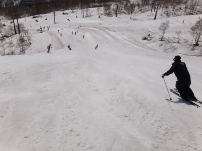

# 5月14日土曜日のかぐらは…

📅 投稿日時: 2011-05-15 22:10:48

🏷️ カテゴリ: [2011スキー滑走日記](ca488c98cfb9169941c3e73770dcefb56.md)

で．

予告どおり，行ってきました．

かぐらスキー場．

混むだろうなぁ，と思ってましたが．

8時からの営業開始に出遅れ，

8時半ごろに駐車場に到着した際，すでに駐車場はほぼ満車．

9時ごろに来た人は，駐車場に入れたのかなぁ．

んで．

リフト券購入待ちがあり，

さらにロープウェー乗車に15分ほど待って，

みつまたゲレンデへ．

数日前までは結構雪があったようですが…

みつまたゲレンデ，滑れる部分はほぼ廊下状に

なっています．

うーん．事実上の連絡用ですね．

ここを滑って楽しむのは不可能．

ということで，ゴンドラに乗って上へ向かいます．

うーん．

みつまた高速リフトからゴンドラへの連絡コース，

来週までは持つだろうけど，再来週までは持たない

だろうなぁ…

再来週はさすがに，ロープウェー山頂からゴンドラまでは

バスかな？

んで，ゴンドラに乗ってかぐらのベースへ．

かぐらエリアまで上がってくると，さすがに雪は

たっぷり．コース全面雪がついてます．

山頂部分で滑れるのは…

メインコースとテクニカル，ジャイアントコースの3本．

メインコースは問題なくコース全面可能ですね．

すばらしい…

いつもは雪が少ない和田小屋と高速リフト間も

まだ雪はいっぱい．

ジャイアントコースも，ほぼ全面OK.

コブが深くなったところ，そろそろやばいかな…

という場所が数箇所ありますが，それ以外はOK.

かなり面白いコブラインになってます．

高速リフト乗り場方向から見たジャイアントコース下部は

こんな感じ．

テクニカルコースは…

最後の急斜面，そろそろ土が出始めてきてます．

ただし，最後の落ち込みの取り付き部分のみ．

それ以外はすべてのコブラインで土が出ることなく

滑れます．

うーーーん．この時期にこれだけ滑れるのは，2006年だったかの，

超大雪の時に続く，2回目ですね…

さすがに人は多いです．

かぐら高速リフト，

9時半には10分待ち，

10時～10時半がピークで25分待ち，

11時ごろには15分待ち程度でしょうか．

今シーズン，最高のリフト待ちですね…

午前中に一生懸命リフト乗り場・降り場に雪付けしてるな～

と思ったら，昼から高速と並行してかかっているペアリフト

が動き出しました．

おかげで，午後は5分待ち程度にリフト待ちが短縮．

助かった．

ただ…

ゲレンデの人は多いですね．

やっぱり．

雪は，結構張り付く雪です．

午前中はメインバーンはフラットで快適．

人が多かった割に，コース幅が十分広かったし，気温も

壊滅的に高いわけではなかったので，荒れはじめるのは

遅かったですが，11時には結構でこぼこし始め，

午後1時過ぎにはほぼ全面コブ斜面に．

夕方には，例年通り完全全面コブになりました．

天気は，午前中は晴れましたが．

午後には日が差したり，時々ぱらぱらと雨が落ちてきたり

とめまぐるしく変わる天気．

雨は，せいぜいぽつぽつと降る程度だったので，それほど

問題にならなかったのが救い．

16時にかぐら高速営業終了．

ゴンドラコースをひたすら下りて…

みつまたコースに上がるリフトも2本動いていたので，

それほど混むことなく．

みつまたコースの硫安が効きまくった廊下を降りて…

ゴンドラ10分待ちほどで下山．

午前中はちょっと混んだけど．

3コース滑れて，コブ溝にも土が出てきておらず．

コブラインもいっぱいあって．

コブのトレーニングと思えば，結構満足度が高い

一日でした．
