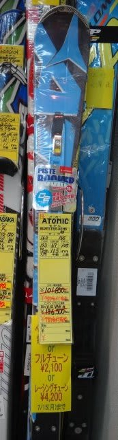
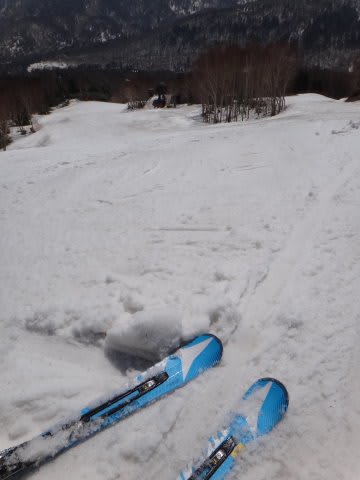

# というわけで，板を買ったのだが…

📅 投稿日時: 2013-07-13 00:49:41

🏷️ カテゴリ: [スキー雑談](c1f9d2cb7478308da16419928ea3945e9.md)

物欲に～負けた～

って感じで．

[全く予期せず板を買ってしまった](e9a16d9757c2d52b7254fe8a802071c63.md)わけですが．

今回，無料のチューンナップがついてくるということで．

サイド88度のベースビベル1度という，まぁATOMICの基本設定値で

申し込んできたんですけど．

実は．今回．

生まれて初めて，板にプレチューンをやるんですよ．

…なんと．

これまでの板．

すべて，買ったときにチューンナップすることなく，

工場出荷そのままの状態で履いてたんですね～．

なんでかって言うと，私はスキー板を決めるにあたって，試乗で

気に入った板に決めているわけで．

んで．試乗板ってのは．

大体プレチューンなし，工場出荷そのままで出てきてるわけで．

だもんで．チューンナップすると，その板の性格が試乗時から

変わってしまう気がして…

例えば．

このシーズンさんざんお世話になったATOMIC BLUESTER DEMO SX．

この板…工場出荷のままだと，トップのシャベル部から20cmほど．

むちゃくちゃコンケーブになってます．

ワックスを塗るときにアイロンを当てても，板の真ん中部分には

アイロンが当たらないくらい，コンケーブなんです．

…でも．

むちゃくちゃコンケーブなこの板ですが．

乗り心地と操作性，すごく気に入ってます．

トップがグッとグリップしてたわみが出て，くるりと回っていく快感．

たわみがテールに向かって抜けていく，抜けのよさ．

…つまり．

「コンケーブの状態」での性能が，かなり気に入ってるわけで…

まぁ，プレチューンなんかしなくてもいいな，と…

基本的に私は，よっぽど板の動きが気に入らなくて

ビベル角を浅くしたいとか．

とんでもなくコンベックスでルーズになっちゃってる…

とかいうことがない限り．

チューンナップに出さないんですよね～．

今シーズンさんざん履いたATOMICも，今の板の動きが

気に入っているので，シーズンオフにチューンナップに

出さないですし…

＃エッジの研ぎは自分でやっている

…

…

とか．

いろいろ書きましたが．

実は．

ただ単に

お金がもったいないからこれまでプレチューンしてこなかった

というのが正解かも(^^;

これまでプレチューンしたことないけど，不満は

なかったからな～，

うーん．

今回．

ソールを完全フラットにすると，トップのグリップが

弱くなって性格が全く変わるんじゃないか…

とか，ちょっと心配ではあるけど．

今回．

初めてプレチューンに出した板．

…どんな風に仕上がってくるか，楽しみでもあり，不安でもある．

## 💬 コメント一覧

### 💬 コメント by (komu)
**タイトル**: 暑いですね
**投稿日**: 2013-07-15 07:19:20

板の準備は出来たようですね。

次はブーツデスね(=゜ω゜)ノ

### 💬 コメント by (Skier_S)
**タイトル**: komuさま
**投稿日**: 2013-07-15 17:27:33

準備万端（？）です．

あとはブーツとグローブとパンツです(笑)

