# 3連休初日，1月7日の志賀高原は…やや混んだものの晴天！最高のスキー日和！

📅 投稿日時: 2017-01-08 00:34:54

ということで．

中2日仕事をした後．

またまた志賀高原に舞い戻ってきている，

Skier_Sです．

＃もう，社会人として会社に戻れない体になってきている気がする…

えー．

本日の志賀高原は．

晴天で，超Goodなスキー日和でした…！

朝，結構凍り気味の道を登ってやってきました，

志賀高原．

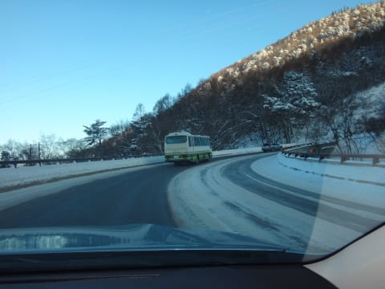

いつもの焼額山頂に出ると…

天気は予想通りの晴天！

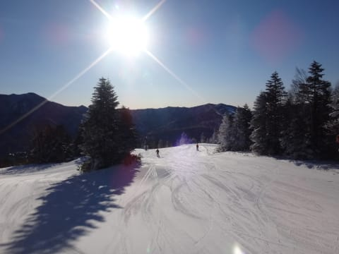

朝イチの気温は，山頂で-7℃と，

結構な冷え込み！

んだもんで．

朝イチのゲレンデは…

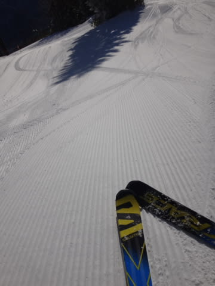

うはっはっはは！！

最高シマシマっ！！！

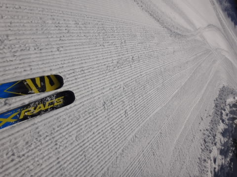

冷え冷えシマシマバーンを，いただきます～！！！

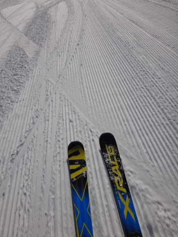

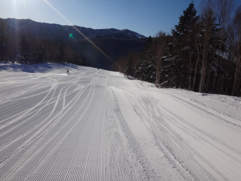

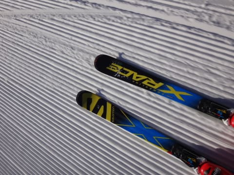

朝から天気は最高の快晴で．

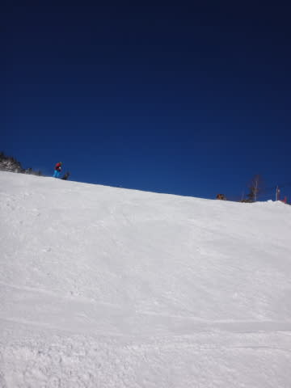

だのに，雪は冷え冷え．

結構いい雪質！

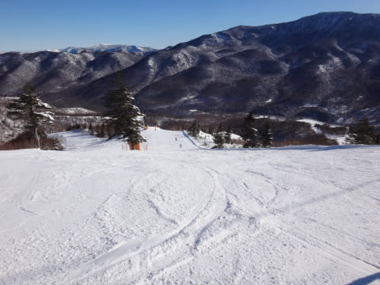

…ただ．

やはり，3連休なので．

ゲレンデの人は，ちょっと多めだったかな…

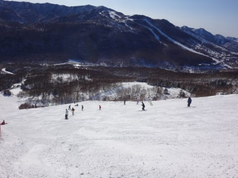

そして．

朝10時過ぎには．

ゴンドラにも，ちょっと待ち時間が…（涙）

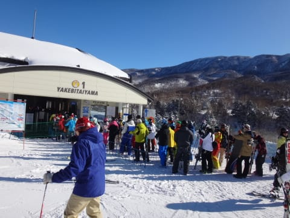

まあ，これでも3分待ちってところでしょうか．

それほどひどい待ちじゃないのが救いかな．

その混雑の中でも．

オリンピックコースは，比較的すいてたかな！

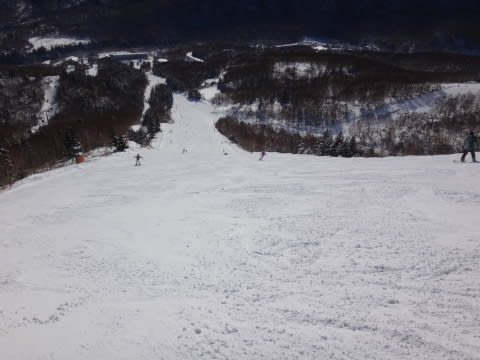

コースによっては，ちょと人口密度が多く．

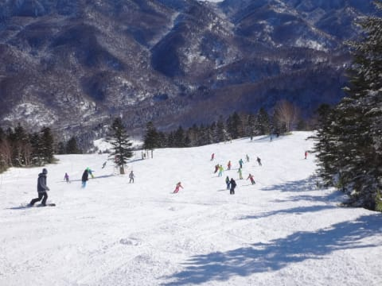

好き勝手なラインをとれない人の

多さだったけど．

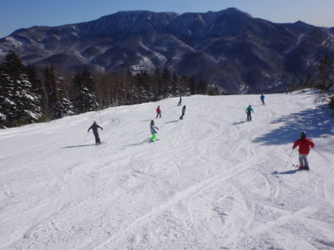

ただ，その中でも．

急斜面のオリンピックコースは，人も少なく

好きなラインを取り放題！

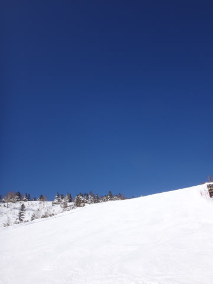

昼にはゴンドラも結構空いてきましたが．

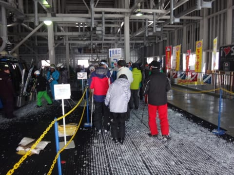

今日は比較的人が多く，午後になっても，

この程度の待ち時間が発生することが

ありましたね～(涙）

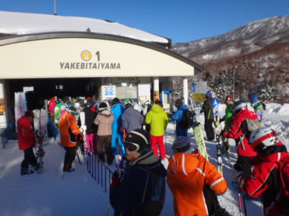

とはいえ．

午後になっても，天気は全く崩れる様子もなく．

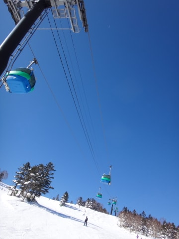

終日，雪質は結構いいままで．

午後になっても，雪は結構サラサラでしたね～．

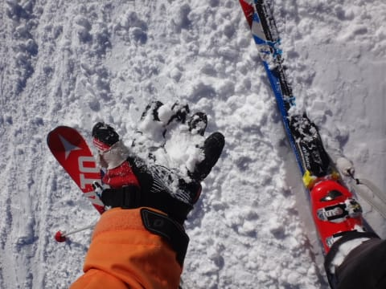

まぁ，その代わり．

午後のゲレンデはちょっと荒れたものの

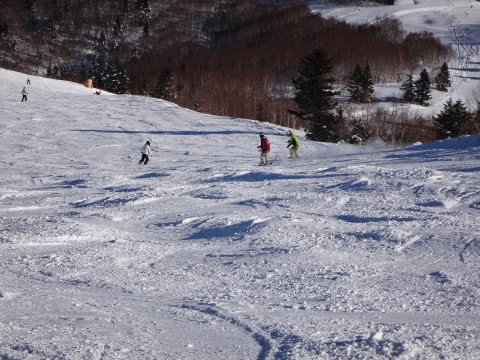

でも．

今日は午後まで雪質も比較的よく

＃ちょっとごく一部，硬い雪も出てたけど…

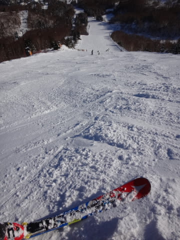

でも，滑りいい一日でしたよ～．

というわけで．

この後は．

当然ナイターへ行くわけで．

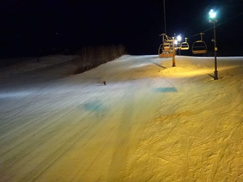

一の瀬ダイヤモンドナイター．

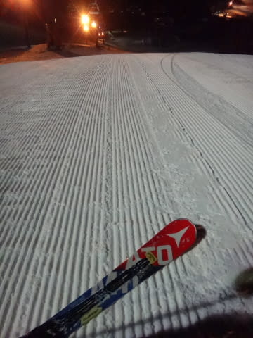

いや，圧雪かけたて，シマシマで，

気持ちよかったですよ～！

とりあえず．

今日はかなり飲んでます…

ってことで．

今日のレポートはこのくらいで．

また明日～！

## 💬 コメント一覧

### 💬 コメント by (はなげ親分)
**タイトル**: 業務連絡～
**投稿日**: 2017-01-08 22:11:20

めでたくオカミさんのOKがでまして、本日ヤケビナイターで復帰しました～♪

全部で20人ほどの滑走者でしたので、

最後まで快適に滑る事が出来ました！

あ～やっぱりスキーは楽しいっ!!

### 💬 コメント by (Skier_S)
**タイトル**: はなげ親分さま
**投稿日**: 2017-01-09 00:20:21

復活しましたか！

おかえりなさい～

ヤケビナイター，やっぱりガラガラだったんですね…

明日も滑るようでしたら，また

ヤケビでお会いしましょう！

早々にお二人そろってゲレンデに復活できる

よう，祈っています．

