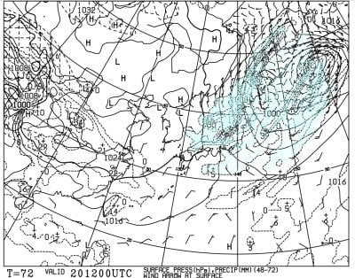

# やはり10月17日，横手山は雪が降りました！！…次は20日に積雪がありそうだけど，そのあとは…

📅 投稿日時: 2021-10-18 01:52:55

🏷️ カテゴリ: [日記](cc4b5682fb7b8b144980957a978653fb0.md)

えー．

17日夜から18日にかけて．

志賀高原でも，2000m以上のところは積雪

しそう…

と[予想しました](e104c3de7fea01d7b731992345cb4910d.md)が．

なんと．

17日の夜どころか，横手山は17日の

昼前から雪だったようですね…！

（[横手山Facebook](https://ja-jp.facebook.com/yokoteyama2305/)より）

そして．

17日深夜25時の段階で．

横手山の麓，硯川は気温マイナス3℃と．

降れば確実に雪の気温です…！！

ただ，積雪があるかどうかは，ライブ

カメラの画像では分からないですね…

（[北信建設事務所道路気象状況ページ](http://hokushin.pref-nagano-roadcamera.jp/)より）

しかし，今は志賀では降水量が無いようなので．

冷えてるけど，残念ながら雪は降ってない

ようです…（ちょい涙）

…とはいえ．

現在，凍結恐れのため，志賀草津道路は

通行止めのようですね．

（[群馬県土整備部防災情報ページ](http://www.kendobousai-gunma.jp/kisei/RegulationDetail.htm?trafRegId=a7974a3ab4524ac2a7d07ced60ba26e2&sortItem=3&sortDirection=asc%2Casc%2Casc%2Casc%2Casc&sortItemWinter=3&sortDirectionWinter=asc%2Casc%2Casc%2Casc%2Casc)より）

当分の間通行止め…ということで，

解除の日時が不明なので．

冷え込みが続く今後しばらく

通行止めが続くかも…？

ってことで．

本格的な冷え込みで，志賀でも初雪と

なった本日．

果たして，この冷えは今後も続くのか…？

と，気になるところですが．

一旦19日に気温は上がるものの．

その後，20日～21日も冷えそう！

なんてったって，20日は赤く印した

850hpaの0℃線が志賀のすぐそばまで

近づくレベルだし…

そして，気圧配置も冬型で，

日本全体に水色の降水域がかかって

いるので．志賀高原は横手・熊の湯

だけじゃなく，一の瀬より上は

積雪があっても不思議では

ない予想です…！

…素晴らしいっ！

…この冷えが，いつまでも続いて

欲しいなぁ…

と，思うところですが．

一か月長期予想，[FCVX14](https://www.data.jma.go.jp/gmd/cpd/data/longfcst/fax/fcvx14_12.png)を見ると…

水色で示した，冷え冷え祭り期間は

一瞬で終わり．

その後，24日以降は，850hpa気温は大体

平年並みが続きそうな予想なので．

冷え冷え祭りは23日か24日あたりで

終わりそうな感じ…（涙）

あぁ…冷え冷え祭りは一瞬で

終わりか…（泣）

うーむ．この予想だと，23日ごろまでの

冷え以降は，横手オープンの11月6日まで

人工降雪は厳しい日が続くかも…

でも．この予想を裏切って，ガンガン

冷え込んでほしいところなので．

いつものことですが．

スキーヤー全員の願いを込めた寒いギャグ

を連発して．

日本近辺を極寒の状況に

陥れようではありませんか…！！

さぁ皆さん，ご一緒に！

「鹿が𠮟った」

「イカが怒った」

「豚がブッた」

「カバが庇った」

……なんだか．

自分の周りが，すごく耐えられないほど

寒くなってきました…

こ，これで本当に志賀に雪が降って

くれるなら，この寒さに耐えるのだ…！

「猫が寝こんだ！」

「馬が埋まった」

「猿が去る」

「…」

（後日，Skier_Sは謎の凍死体で発見）

## 💬 コメント一覧

### 💬 コメント by (northfox)
**タイトル**: Unknown
**投稿日**: 2021-10-18 16:28:12

「布団が吹っ飛んだ」

「コーディネートはこーでねーと」

。。。

### 💬 コメント by (ダウンヒル)
**タイトル**: Unknown
**投稿日**: 2021-10-18 21:27:57

スキーが大好きぃ～～

Sさんに触発されS`化し、

名古屋エスカで物欲(食欲の...)選手権

レモンの入れもん...

### 💬 コメント by (Skier_S)
**タイトル**: 寒い…
**投稿日**: 2021-10-19 01:57:36

＞northfoxさま

地球温暖化防止にご協力ありがとうございます…

日本のごく一部は寒くなっているものと思います…

＞ダウンヒルさま

名古屋エスカは，かなりローカルなネタですね（笑）．

### 💬 コメント by (ikkun)
**タイトル**: Unknown
**投稿日**: 2021-10-20 00:21:24

寒かったです(・・;) 白く染まりました山頂、１日で無くなりました  まだまだ早すぎますから  但しガソリン下がらないので灯油少し仕入れましたよ

### 💬 コメント by (Skier_S)
**タイトル**: ＞ikkunさま
**投稿日**: 2021-10-20 01:36:04

寒くなりましたね～…

ってか，10月上旬と下旬で気温が変わりすぎです（笑）．

そういや，ガソリンも値が上り続けてますね…（涙）

