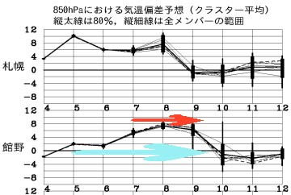
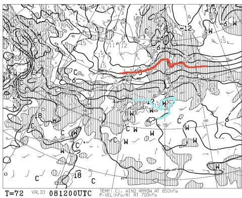
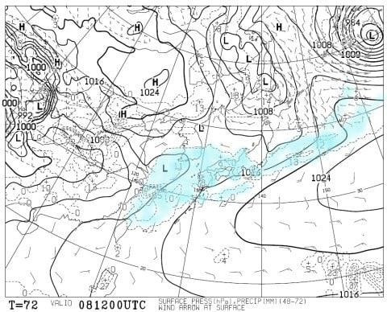
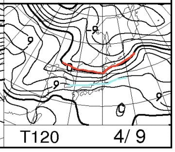
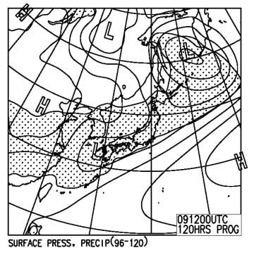

# 4月8，9日の週末の志賀高原の天気は…雪解けを誘う高温の2日間（涙）．土曜は曇り，日曜は雨かな．

📅 投稿日時: 2017-04-06 02:10:36

🏷️ カテゴリ: [スキー天気予想](c6554f5c3c106093b511a8daae23757e8.md)

えー．

そろそろ，スキーシーズンは終えたよ…

という人が増えてきて．

「週末のスキー場の天気？

　もう，そんなもの気にならないから～！」

って人が増えてきているであろう今日この頃．

皆様いかがお過ごしでしょうか．

…でも．

スキーシーズンはまだ3か月くらいあるはずで．

終わるなんてまだまだ先の話だと

思ってる，Skier_Sです．…←それは，月山に行く終わっちゃった人の意見ですから～っ！

ということで．

水曜深夜恒例の，スキー場天気予想．

まだまだ続きますよ～．

えー．

本日から，予想通り志賀高原はぐんぐん気温が上がったようですが…

この平年より気温が高い期間は，この図の水色矢印で

示したように，9日の日曜まで続きます…（涙）．

そして．

赤矢印で示した7日以降は，さらに気温が上がり，

平年比+5℃以上に上がります…（泣）．

こんな状態で，金曜7日は降りそうなので…

そう．

この気温で降れば，志賀高原の山頂でも雨です．

液体です．

諦めてください…

そして．

肝心な土曜日，8日の午後9時の850hpa気温図を見てみると…

あうーーん．

ダメです．

赤く印した0℃線は北海道より北．

そして，志賀高原には．

水色で示した+12℃線が近づいてます…

…これは．

志賀高原では，昼間の気温が+10℃を突破しますね（涙）．

そして．

地上天気図を見ると…

うむ．

この日は水色で塗った降水域は，志賀高原にかかっていないので．

このままの天気図なら，土曜は気温が上がるものの，

雨が降らずに済みそうです…

で．

日曜，9日の850hpa気温ですが．

あぁ．やっぱりこの日も，0℃線は津軽海峡近辺…

志賀高原には，水色で示した+9℃線が…（涙）．

この日も，志賀高原は山頂でも+10℃に迫る高温に

なるでしょう．

そして．

この日の地上天気図は…

ががががーーん．

網掛けの降水域．

日本全国を覆っているので…

日曜は雨です．

高温の雨です（泣）．

はい．

諦めてください．

ということで．

まとめると．

8日土曜：天気は終日曇り．朝から気温は高く，リフト営業開始時には

　すでに+5℃を超える気温の生暖かい風が吹く．

　雪は昨日の雨で水分を含んだ，ずっしりとした重い雪．

　気温は終日高く，最高気温は山頂でも+10℃以上．

　終日ズッシリ重い雪が続く．

　終日太陽が射さず，時折ガスがスキー場を覆うかも…

　先週までとは打って変わった，曇天の春の雪のスキー場になる．

9日日曜：天気は朝は降ってないかもしれないけど…

　午前から雨がぱらつく一日．

　朝から気温はプラス．最高気温も10℃近くまで上がる．

　雪は雨を吸ったしっとり雪．

　今のせめてもの救いは，ゴンドラが止まるような風には

　ならなさそう，というところか…

　雨の中，ゴンドラならぬれずに済むけど，

　リフトにはあまり乗りたくないところ．

　終日雨が降ったりやんだり，時折強く降ったり．

　雪はかなりやられそう．

…って感じです．

ってことで．

先週までの天国コンディションに比べれば，

一気に超高温＆雨にやられ，ゲレンデ全面

重い湿雪という最悪コンディションになって

しまいそうです．

　

今年は半端なく雪が多いので，この程度の雨なら

ゲレンデに穴が開いたりすることはなさそう，

ってのがせめてもの救いでしょうか…

とりあえず．

また，直前に，最終予想やりますので～！

＃って，今週末スキーに行く人どのくらいいるんだろう？

## 💬 コメント一覧

### 💬 コメント by (Lombard)
**タイトル**: いつもありがとうございます
**投稿日**: 2017-04-06 11:27:22

いつも情報ありがとうございます。

私は愛知県在住の60歳のスキーヤーです。大体シーズン15,6日を家内と一緒に滑ってます。（たまに息子が合流します）

私もほとんどが志賀です。（志賀7,戸隠2,八方1）

再来週、その後は予定がありこの週末が最後（？）になりそうです。

貴兄の予想で土曜日に行こうかと思っています。個々数年は、松本か長野に泊まってそれぞれの駅前で飲んで翌朝志賀にいきます。

貴兄を焼額で気にしてますが、なにせウェアーが分からず、いまだ確認できていません。

今後ともよろしくお願いします。

### 💬 コメント by (いさ)
**タイトル**: はじめまして
**投稿日**: 2017-04-06 12:42:14

週末は雨ですか！残念ですが今週はお休み⁉にします。今シーズンはこのまま終了かな。

今年はS様を何度かお見かけしましたが、声はかけられず…来年お会い出来ればご一緒させてください。

しかし今シーズンは良かったですね。ほぼ毎週、妻と志賀高原に来てしまいました。20000mの皆さん、こちらのコメントと滑り方ですぐわかりますね（速い！）。数本の板を使い分けるS様を発見した時は感動でした。またお会い出来た時には妻共々20000m教に入信させてくださいね。（gold資格ありです）

### 💬 コメント by (Skier_S)
**タイトル**: 今日も夜が遅い…
**投稿日**: 2017-04-07 02:23:27

＞Lombardさま

ご愛読ありがとうございます～．

コメントありがとうございました．

私はこの週末，日曜日帰りになると思います…

なので，残念ながらお会いできなさそうです．

残念…

＃ホントは雨が降らなさそうな土曜に行きたいんだけど

ちなみに，私はウェアは晒してませんが，

板に特徴があるのですぐわかるかと…

20000mクラブゴールドシールを目印で

探していただければと思います．

また来シーズン，志賀でお会いしましょう～！！

＞いささま

初めまして～！

初コメントありがとうございます．

…もしや，SKILINEでISAMLさんで登録されている

方でしょうか？？

だとすると…今シーズンもしっかり20000m行かれてますね！

次回お会いした時に，ゴールドシールお渡ししますので，

ぜひ声をかけてください…

今シーズンも，まだGWまでたっぷり雪は残ると思いますので，

来シーズンと言わずに今シーズン，ぜひまたお越しください～！

そして板に怪しいお札を貼る，20000m教信者になってください（笑）

### 💬 コメント by (はなげ親分)
**タイトル**: Unknown
**投稿日**: 2017-04-07 10:25:13

怪しいお札のくだり…

コーヒーを吹き出しそうになりました(爆)

冷え冷え踊り→シール→お札→集団暴走→宗教

いったい何処を目指しているのだろう？？

私は今週末、大人の事情でお休みします

### 💬 コメント by (Skier_S)
**タイトル**: はなげ親分さま
**投稿日**: 2017-04-08 01:54:26

どこを目指しているのか…

最終的に教祖様になることでしょうか（笑）．

…最近一種の宗教化しつつある気がしています（笑）

今週はスキー行けないのですね…

私も行けないかも（涙）．

また来週お会いしましょう～！

