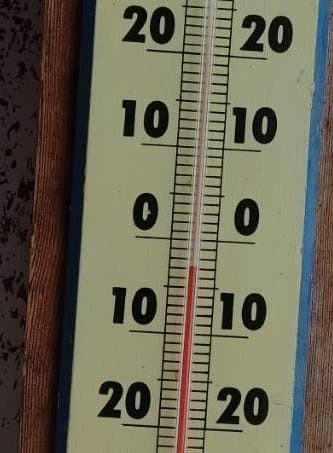
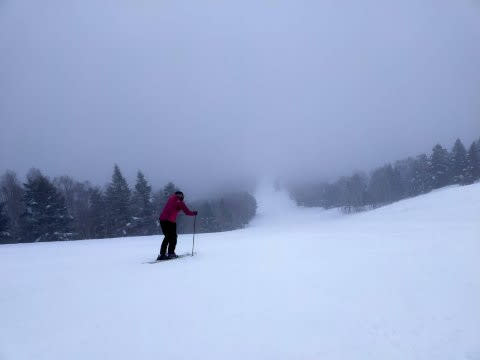

# スキーウェアの色あせ防止に，UVカット機能付き防水スプレーが効くんだって…

📅 投稿日時: 2023-02-14 02:57:02

🏷️ カテゴリ: [スキー雑談](c1f9d2cb7478308da16419928ea3945e9.md)

えー．

本日の志賀高原．

　0℃を超えるかというくらい気温は高めで，

　曇り～時折雪がぱらつく天気．

という予想をしていたわけですが…

志賀高原の特派員からの報告によると，

朝，標高は低いところは雨で…

志賀高原の登り，スキー場にかなり

近づいたところでようやく雪になった

ようですが．

一応，朝の焼額の駐車場はギリギリ雨に

ならず，うっすら雪が積もっていた

みたいです…

あさイチの山頂の気温は-3℃と，

予想通り，この時期としては異常に

高め（涙）

まぁ，このくらいの気温なら，間違いなく

雪ですが…

しかし，積もっているのはかなり湿った雪で，

下地はちょい硬めっぽいですね…

麓は昼間は0℃を越えるくらいに

なったので．

降っているのは，かなーり湿った雪

だったようです(涙)

で．

この雪が降ったり止んだり．

時折視界も悪くなるような天気の

一日で．

バーンもところどころコロコロが出たり

したみたいですが…所によってはかなり

硬くなっていたみたいです（涙）

…ってな感じで．

今日の志賀高原は，

日曜の高温＆日差しで解けた雪が

固まった上に重い湿雪が降り続くという，

2月の志賀と思えない残念な状況

だったようですが…

でも．

皆さん，ご安心ください．

今，志賀高原は結構冷えて，雪が降ってます！

上林のチェーンベースで―2.7℃，蓮池では-9℃

近くにまで冷えて，雪が積もり始めてます…！！

（[北信建設事務所道路気象情報](http://hokushin.pref-nagano-roadcamera.jp/)より）

この雪は，明日火曜の朝までに

10cmくらい積もってくれそうだし．

明日は昼間も降り続けます…

この雪は，15日の深夜まで降り続けて

くれそうなので．

硬い下地はある程度隠れてくれそう

です…！

が．

積もるのは14，15日でそれぞれ10～20cmずつ，

せいぜいブーツパフくらいしか積もらなさそう

なので…

そこまでの積雪量の積み増しは期待でき

なさそう（涙）

でも，これから14，15日は，冷え冷えで雪が

降る2日間になりますよ～！！

ってなことで，本題へ．

（というか，本題より前フリの方が長くないか？）

寒さや雨，日差しなどにさらされる

過酷な環境で使われるスキーウェア．

汚れがつかないように，防水スプレーを

使う方が多いかと思うのですが…

私も，これまで汚れ防止や撥水のため，

防水スプレーを使ってました．

でも，スキーウェア．

汚れが着くだけじゃなく…

長く着ていると，日に焼けて色が

褪せてくることが多いですよね．

私も歴代のスキーウェアは，毎回

色が褪せて．

「もともともっと濃い色だったんだけどなぁ…」

と思ってフードをめくると，日の当たらない

フードの影と日に当たる部分で色がくっきり違う…

という経験をしています．

そんな時．

[Gokuraku Skier](https://www.youtube.com/@GokurakuSkier)さんから教わったこいつ．

UVカット防水スプレ～！！

こいつを2か月に一回ぐらいスプレー

しておけば．

かなりの頻度で着るウェアでも，色あせを

ほぼ完全に抑えられるようです…

このUVカット防水スプレー．

Amazonでは1080円で売ってます！

ちなみに，Gokuさんはこのスプレーのことを

[Sakuraちゃん](https://www.youtube.com/watch?v=tXws4SCE2C8&t=215s)のパパから聞いたようですが…

GokuさんとSakuraちゃん．

全く同じウェアなのに色の抜け具合が

全然違っていたらしく．

「なんで？？」と尋ねて，

その秘密を教えてもらったようなので．

その効果のほどは確認済みのようです…

ってなことで．

私も物欲に負けて購入したNewウェア．

結構色あせしそうな色のウェアなので…

このスプレーを塗ってみました．

色が褪せないかどうか，経緯を見てみようと

思います～！

結果報告は来シーズン以降になりそうですが…

## 💬 コメント一覧

### 💬 コメント by (レインボー75)
**タイトル**: Unknown
**投稿日**: 2023-02-14 15:18:59

火曜日の志賀高原情報

朝の湯田中は新雪5cm

上林-4℃　蓮池-9℃。寒い朝の吉永小百合。

白樺はさらさら5cm快適。

ベストはGSサイド。前日のまっ平ら圧雪の上にさらさらがブーツパフ。私でも平気で大回りできちゃう好条件。オリンピックはスネパフ。ブレーキなど一切かからない。とにかくさっらさらのふっかふか！

三高サイドもふっかふか。こんなに快適なのに寒い。獅子で昼食してると雪はどんどん激しく風も負けずに強くなってきました。こんなに雪がいいのに「やめよか」。昼から少し滑っただけで終了。己れをいたわることを忘れない老人クラブです。

ただ上から下へ落ちるだけのスポーツなのに、一年の1/3をスキーに費やす老後が待っていたなんて、、、(嬉しい)

それから今はやけびには日本◯育大の団体さんが多数。彼らは整列もきちんとしていてコースをふさがない。礼儀もきちんと。毎年微笑ましい気分にさせられます。

### 💬 コメント by (Gokuraku Skier)
**タイトル**: Unknown
**投稿日**: 2023-02-14 19:25:22

サクラちゃんと並ぶとその差は歴然です。

もっと早く知っていれば・・・(-_-;)

### 💬 コメント by (マルハバ)
**タイトル**: 私もお勧め商品を一つ
**投稿日**: 2023-02-14 20:27:31

Sさんと云うと思い出すのは、テープぐるぐる巻きで補修されたスキーグローブ・・（笑）

私のグローブも指の部分の皮がかぎ裂きに破れてしまい、修繕用品を探していてamazonで見つけました！

シールになっているので適当な形に切って貼り付けるだけ。薄くて柔らかい皮革で接着力も結構あり

1日使ってみましたが剥がれる様子はなかったです。何より10枚入りでこの値段です！試してみる価値ありと思っています。

https://www.amazon.co.jp/dp/B09WY9QL1J?psc=1&ref=ppx_pop_dt_b_product_details

### 💬 コメント by (Skier_S)
**タイトル**: 記事を書く時間がない…
**投稿日**: 2023-02-15 01:41:36

＞レインボー75さま

今日は久々の冷え冷えデーでしたね．

もう少しパウダーが積もってくれるといいのですが…

明日も朝は新雪10~15cmですよ！！

＞Gokuraku Skierさま

偶然二人が全く同じウェアってのがすごいですよね…

Youtubeの画像だと，色の違いはあんまり判らないですね．

＞マルハバさま

をを！！

そんな，革のシールみたいな補修材があるんですね…

ゴンドラの乗り降りを繰り返すと，板を持つ必要からエッジですぐグローブがダメに

なるので…

テープや補修材は必須です（笑）

### 💬 コメント by (炎の北海道民)
**タイトル**: Unknown
**投稿日**: 2023-02-15 12:58:33

いい情報有難うございます。

### 💬 コメント by (Skier_S)
**タイトル**: ＞炎の北海道民さま
**投稿日**: 2023-02-16 02:39:02

いえいえ…

教えていただいたのは，Gokuさん経由でサクラちゃんパパからですので…

お礼がわりに，GokuさんとさくらちゃんパパのYoutubeをいっぱい見てやってください(笑)

