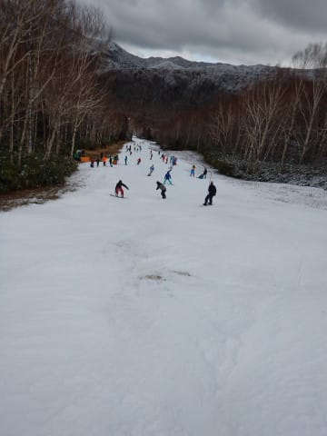
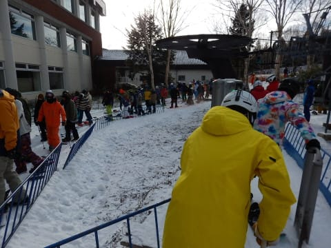

# 2018/12/8(土)の志賀高原，焼額山スキー場は…冷え冷え，時折日も射す天気だけど，狭い・硬い・混雑の3重苦（涙）

📅 投稿日時: 2018-12-09 00:02:36

ってなわけで．

本日も志賀高原にやってきましたが…

まぁ，どんな状況だったか，おいおい

語っていきましょう…（涙）

とりあえず．

最大10㎝の積雪を予想した本日朝．

志賀高原の登り路に差し掛かりますが…

…

…雪，無いんですけど（涙）

サンバレー付近でようやくうっすら

白くなってきましたが．

…ゲレンデの雪，先週より減ってない？？

そして．

高天ヶ原近辺までやってきても…

積雪，せいぜい2cmか…（泣）

人工降雪部分以外，まだ茶色の部分が見えている

レベル（激涙）

焼額に到着して．

案内板を見てみると…

なぬ？？！

積雪20cm！？？

気温はほぼ予想通り，－7℃と冷え冷えだけど…

先週の積雪30cmから，10㎝も減ってます…

そして．

リフトに乗ってみても…

雪，積もってないですね（涙）

ゲレンデも…

雪がついていて滑れそうなのは，幅10～20m程度で．

昨週より，コース幅狭くなってるよ！！

そして．

雪をつけてある幅の狭いコース上も…

朝イチからすでに，結構やば気な感じ…（涙）

さらに．

この雪．

朝イチから硬いです（激涙）

エッジを研いでないと，ところどころツルっと

行く感じ（泣）．

天気自体は，予想通り雪がぱらついているとは

いうものの…

いったい，誰だ！？？

　朝イチは，雪降り天気だけど人工雪＋うっすら積もった

　新雪のミックスに圧雪がかかっていい感じ！

とか書いた，いい加減な奴は…っ！←自分でしょ

朝イチから斜面は硬いし．

そして…狭い（涙）

下半分，ほとんど廊下なんですけど…

さらに．

営業開始後しばらくすると．

熊の湯もまともな状況じゃなく．

一番長いコースが滑れる焼額に

人が集まってきたようで…

リフト5分待ち（泣）

なんてこった…

リフトが混んできたということは．

コースも混んでくるということで…

うーーーん…

廊下状のゲレンデにこれだけ人が集まるって…

これは…Yetiか！？？？

まさか，12月第2週の志賀高原で．

Yetiと同じレベルのゲレンデで滑るとは

思わなかったよ…（激涙）

リフト待ちは少なそうに見えるけど．

でも，輸送量の低いペアリフトなので，

そこそこ待ちます．

昼間は，平均的に5分近く待ったかも…

で．

朝のうちは雪もぱらつく曇り空だったのが．

時折日が差すタイミングもあり…

日が差すものの，

気温は低いので，ゲレンデの雪は

昼間になっても全く緩む気配を見せず．

朝から硬めだったゲレンデ．

急斜面部分は大勢で削られて．

ツルツルになっていきます…（涙）

午後になっても，ゲレンデ上の人は減ることはなく．

リフト待ちも長いまま…（涙）

まさか．

12月に入っても．

10月のYetiみたいな，

混雑した廊下ゲレンデを滑らなくては

ならないとは思わなかったよ…（涙）

これで，雪は硬くて，リフト待ちが長いんだから．

もう，ゲレンデは．

硬い・狭い・混雑の3重苦…（激涙）

急斜面部分はブッシュも出てきたし…（泣）

浮石も多いです（涙）

昼間も気温が低いままの冷え冷えなのは

良かったけど．

おかげで，終日ゲレンデは硬いまま…

結局，今日は．

午後4時のリフトストップまで，

人はそれほど減らず．

硬い・狭い・混雑の状況は．

日が暮れるリフトストップ近くまで

続いたのでした…

しかし．

まさか，12月第1週より12月第2週のほうが

コンディションが悪化するとは思わ

なかった…（悲）

もう，今日のゲレンデがいかにひどかったかは．

Skilineラストシーズンのおととし，

総合2位だった某氏．

普段はゲレンデ止まっているのすら

見たことがないのに．

本日は，レストランで昼ご飯を

食べていたどころか．

リフトが動いているにもかかわらず，

昼食後に1時間昼寝をしていた

というだけで，どれだけすごかったか

分かろうというもの…！！

（他の20000mクラブメンバーに話すと．

　「あの人が休むなんて！！！

　そんなことがあるんだ！！」と

　驚くほどの，天変地異レベルの衝撃）

いや．

今日はそのくらい楽しくない一日でした（涙）

…今，全く雪が降っている気配は

ありませんが．

明日の朝までに1mほど積もって．

明日，ゴンドラ動いてくれない

かな～←無理だから．人工降雪つけてないコースは，こんなだから…

## 💬 コメント一覧

### 💬 コメント by (michi)
**タイトル**: Unknown
**投稿日**: 2018-12-09 16:30:32

昨日はありがとうございました。

リフト１本であの混雑、ガリガリ、狭いというゲレンデ状況でも子供達はラストまでカッ飛んでましたね（笑）

私も楽しかったです(^^)

今日は長野市内も雪がチラチラしてましたよ。

来週末には良いコンディションで滑れることに期待してます。

### 💬 コメント by (Skier_S)
**タイトル**: michiさま
**投稿日**: 2018-12-10 01:07:35

土曜はお世話になりました～！

楽しむには微妙なゲレンデコンディションでしたが．

子供たちは楽しかったようですね…

本日も，小学校高学年チームはツルツルバーンを

爆走してました(笑)．

私も追いつけず（涙）．

とりあえず．

来週にはゲレンデ状況が改善することを祈りましょう…

