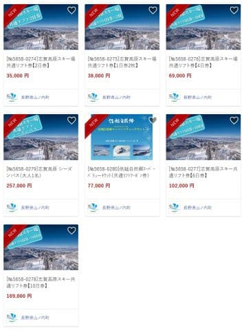
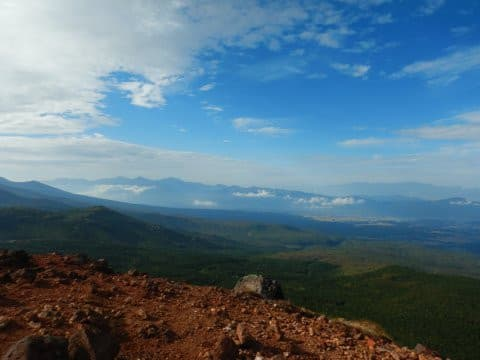
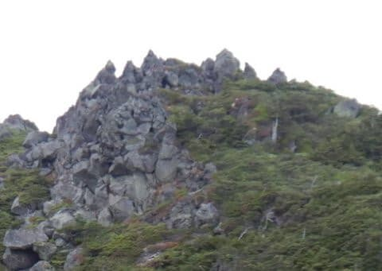
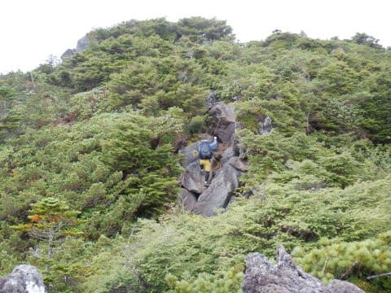
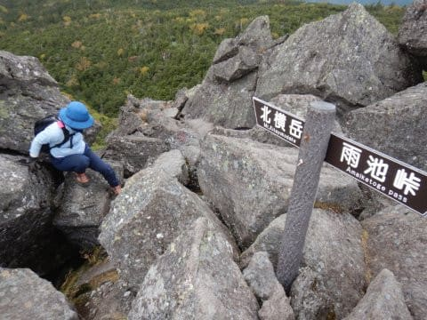
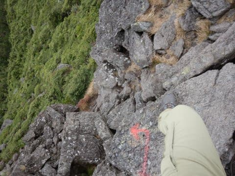
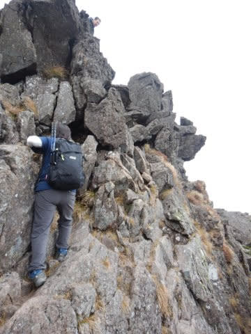
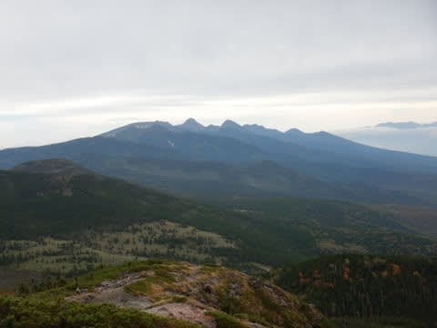
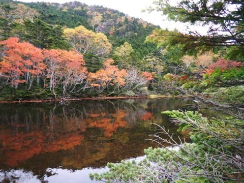

# ふるさと納税で2021シーズン志賀高原スキー場のリフト券が申し込み可能に！そしてGoToトラベル地域クーポンもリフト券購入に使えるみたい

📅 投稿日時: 2020-10-05 02:58:51

えー．

志賀高原常連さんの，[まうちゅうさんのBlog](https://mousetyu.blog.fc2.com/blog-entry-2327.html)を見ると．

志賀高原の次シーズンのリフト券が，

ふるさと納税で申し込めるように

なったみたいです！

まだ，志賀高原索道協会にもシーズン券

申込書が掲載されてないですし．

2021シーズンのリフト券価格も公開

されておらず．

数日前にふるさと納税サイトを見た時は，

まだ申し込み期間外になっていたのですが…

どうやら，10月1日か2日あたりに

申し込み可能になったみたいです！

10日券が169,000円の寄付，

シーズン券が257,000円の寄付ですか…

寄付の3割が特典の費用ということから

計算すると，寄付金が1000円単位という

ことからくる端数は出るものの，

だいたい昨シーズンのリフト券代と

同じになりますね…

たぶん，次のシーズンの志賀高原，

リフト券の値上がりはないと思って

いいのかな…！

そしてもう一つ．

[志賀高原中央エリアのホームページ](http://shigakogen.co.jp/archives/7134)を見ると．

志賀高原全山共通券・中央エリア券に

GoToトラベルの地域共通クーポン券が利用可能

という案内が出てました…！

…って．

全員もれなくシーズン券をもっている，

20000mな皆さんや，焼額常連の皆さんには，

全く意味のない情報ですが…

ということで．

本当なら，今日は妙義山レポートを

書くつもりだったのですが．

この週末も，ちょっと山に登って

きてました～！

…だもんで，妙義山登山レポートを

書く時間が無くて…

待っていた方すみません．

また明日以降にご期待ください！

でも．

妙義山に登ってからというもの．

普通の平らな山では物足りなくなって

しまったのか．

また，こんなところを登ってきて

ました…

ってか，この山が目的地じゃなく．

ここは単なる通過点だったんですが(笑)

また，こんな感じの落ちたら死ぬ

ルートがあったとはいえ．

(この矢印を見た時は，向き間違えてないか？と思った)

妙義山に登ってしまうと，

このくらいはもう全然怖くない感じ．

妙義山を超える怖いところは

そうそう無いですね…

通過ルートの三ッ岳Ⅰ，Ⅱ，Ⅲ峰が

ちょっと厳しかった以外，

あとはお気楽お散歩コースで，

景色はよかったし．

満喫できた，北八ヶ岳プチ縦走でした～！

また，暇と根性があれば

レポートします…

## 💬 コメント一覧

### 💬 コメント by (Noname)
**タイトル**: Unknown
**投稿日**: 2020-10-05 12:07:05

プリンス、シーズン始めは南館のみオープン？？

今は西館や東館は予約出来ない

ちょっと前は空室ありだったのに！

### 💬 コメント by (Skier_S)
**タイトル**: ＞Nonameさま
**投稿日**: 2020-10-05 23:43:36

焼額常連メンバーの情報では，プリンスはシーズン初めは南館のみ．

西館は今シーズンは団体のみ，東館は年末オープンと聞いてます…

西館，一旦予約サイトオープンしたんですが，その後上記方針に変わって今は予約できなくなったようです．

### 💬 コメント by (まうちゅう)
**タイトル**: Unknown
**投稿日**: 2020-10-06 22:33:20

Skier_Sさんも申し込み完了ですか？

### 💬 コメント by (Skier_S)
**タイトル**: ＞まうちゅうさま
**投稿日**: 2020-10-07 01:04:34

我が家は昨年の返礼品は山ノ内町の宿泊券にしました…

シーズン券にするとかなりの納税額なので，足が出る可能性が(笑)．

### 💬 コメント by (西舘)
**タイトル**: Unknown
**投稿日**: 2020-10-07 05:47:43

シーズン券の申し込み今日から開始されましたね!

料金据え置きで良かった！

### 💬 コメント by (Skier_S)
**タイトル**: ＞西舘さま
**投稿日**: 2020-10-08 01:08:44

私もシーズン券申し込みサイト確認したので，

今回記事にしました～！

例年と違う記載があって，「やっぱりな…」という感じでした．

