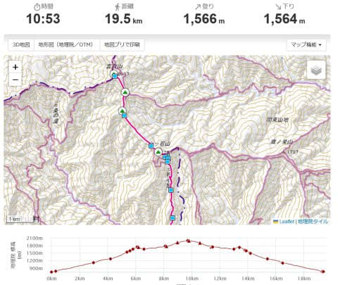

# 2023年9月，雲取山に登ってみた…その1，登山スタート！

📅 投稿日時: 2024-07-30 03:43:18

🏷️ カテゴリ: [登山・旅行](c1d637a11a25b457ac978d197adbdafc5.md)

ということで．

スキー試乗レポートも終わってしまい．

スキーネタも尽きかけてきたので．

そろそろこのBlogも夏モード．

登山やダイビングネタでつないでいく

感じになっていくわけですが…

今年はまだダイビングに行ってないし．

山も陣馬山往復しか行ってないので．

今年のネタはまだない状態（泣）

なので．

去年登ったけど，まだ記事にしてない

山のレポートを書いてみようということで．

今回はそのうちの一つ，雲取山の登山

レポートを行ってみます…！

そういや，夏モードになると読者数が

減るけど．

意外と山登りネタは，ダイビングネタより

アクセス数は多いんですよね…

ダイビング人口と登山人口の差かな？

ってなことで，本題へ．

昨年9月の，雲取山登山レポートです！

まず．

皆さんご存じの，

東京都の最高峰である雲取山．

標高2017mとそこまで高い山ではないですが，

東京都では唯一の2000m越えの山となります…

で．

雲取山はいくつか登山ルートがありますが，

今回は奥多摩湖側の丹波山村村営駐車場

からの登山スタートとしました～！

ヤマレコさんの仰せによると．

このルートの標準タイムは10時間53分．

距離は19.5kmで，標高差は1500m越えと．

急登や鎖場などの難コースがあるわけでない

ですが．

意外と距離と標高差がある，体力を

必要とする山ですね…

ってなことで．

9月のとある休日のこと．

日の出直後の5時過ぎに，丹波山村村営

駐車場に到着！

かなり広い駐車場でしたが，整備された

トイレもあり便利な駐車場ってこともあり．

この時間にはもう結構な車が止まって

ましたね…

準備して，5:25に登山スタート！

登山口こちらの案内標識に従って．

駐車場からの舗装路を進むこと，5分ほど．

雲取山の案内看板が出てきます…！

なるほど．

舗装路をそれて，こっち側を登って

行くようです…

舗装路を外れると．

そんなに広くないけど，よく整備された

適度な斜度の歩きやすい山道になってます．

この山道を気持ちよく歩いていると．

朝日が昇ってきて…

だんだん周りが明るくなってきます…！

完全に日が昇ると．

いやー．

急でもなく，足場もボロボロ岩場とか

木の根っこがいたるところってわけでない，

かなり歩きやすい，いかにも山登りを

楽しめる感じの山道が続きます…

順調に登り，スタートから1時間の

6時27分に，堂所とかいうポイントを通過．

その後しばらく経つと，斜度がちょっと

急なところも出てきますが．

引き続き歩きやすい道で．

スタートから1時間45分の

7時10分に…

七ツ石小屋に到着！

朝は売店の営業はやってませんでしたが．

ここは宿泊できる山小屋なんですね…

七ツ石小屋からさらに5分ほど登ると，

分岐点があり．

七ツ石山を経由して雲取山方面と…

ブナ坂を経由して，雲取山方面という，

どっちに行っても雲取山に行ける分岐が

でてきます．

今回は七ツ石山を経由して登るのですが．

数10mだけブナ坂方面に足を延ばすと…

こんな感じで水場があります．

ここで冷たい水を補給して，

次は，七ツ石山山頂へ！

（[続く](e2d47c5be2688322eb6225fab93c6fdea.md)）
