# 2023/1/21(土)の志賀高原焼額山スキー場は…曇り時々晴れ時々雪．かなり寒かったけど雪質はトップシーズンに戻ったよ！

📅 投稿日時: 2023-01-22 00:31:52

ってなことで．

本日．

実に．

実に2週間ぶりに，志賀高原に舞い戻って

きました～！！！

いや～．

２週間もの長きにわたってスキーをしない

なんて．

スキーのやり方を忘れちゃうんじゃないか？？

ってくらいのブランクでしたよ…

まったく．

だもんで．

信州中野からのチェーン規制でかかるマージン

時間を考慮しない時間に家を出発したので，

到着したのはゴンドラ営業開始３分前（涙）

開始前のゴンドラに並べず，一番ゴンドラに

乗ったのは営業開始数分後でした…（泣）

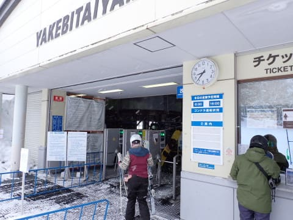

で．

山頂の気温はー13℃と，結構冷え冷え！！

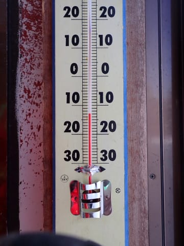

どうやら．

昨晩からの積雪は10～20㎝くらい

あったようで…

圧雪バーンは圧雪の上に新雪が5㎝くらい

乗っていて．

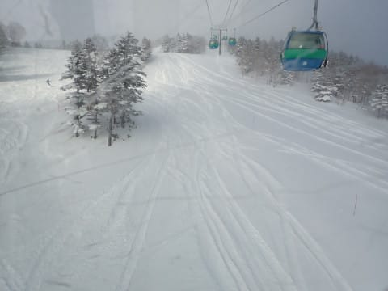

非圧雪バーンは，ブーツパフ，

所によっては，膝パフ近くに雪が

たまっているところも！！

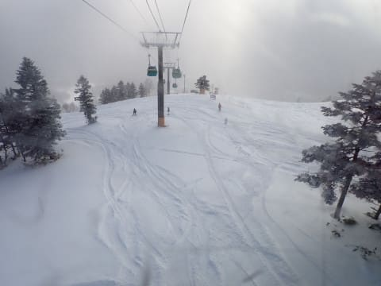

そして．

朝イチの山頂は…奇跡的に晴れてるよ…！！

では，実に2週間ぶりの滑走へ，Go！！

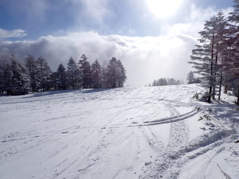

うひょーーー！！

圧雪バーンも軽い新雪！！

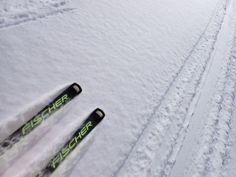

昨日までは先週の雨の影響が残り，

バーンが堅かったみたいですが．

今日は冷え冷えの完全トップシーズンの

バーンに戻ってます！！

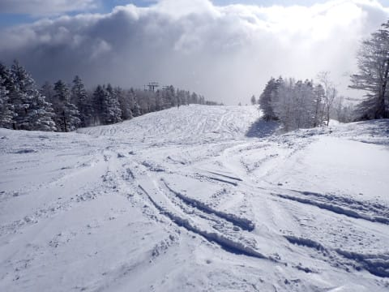

私が到着する朝にピッタリ狙ったように

冷え冷えの軽い雪が降り．

バーンコンディションも回復するし．

そして朝から予想外の日差しがあるとは…

これはやはり，私の日ごろの行いが良いから

に間違いないですね！！！←間違いだから

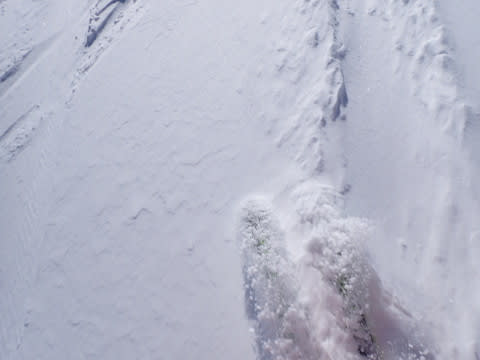

…ただ．

晴れていたのは一瞬だけで．

この後は，基本的に曇り空で，

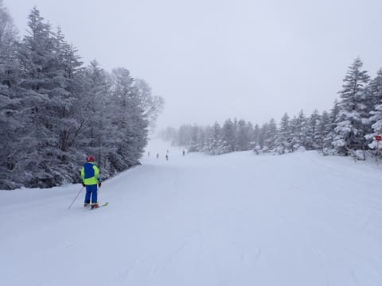

時折雪がぱらぱら舞うような天気．

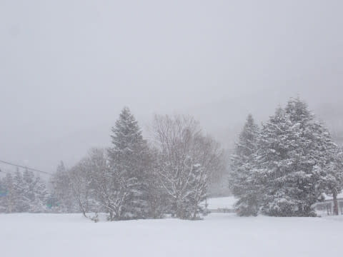

でも，時々雲の間から日が差す感じの

天気だったし．

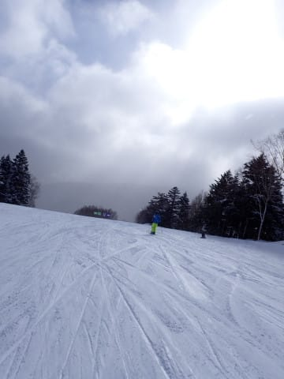

ひえひえで雪質もよく．

いやーーー．

トップシーズンのスキー日和！！

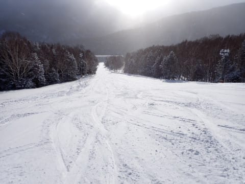

雪質も，完全に普段の1月の志賀高原の，

冷え冷え雪質に戻りましたよ！！

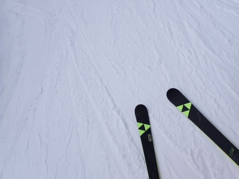

ただ…

ちょいと残念ながら，朝10時ごろに

焼額第2ゴンドラが故障で運休（涙）

…なんてこった．

これは，第1ゴンドラ，混むぞ…（泣）

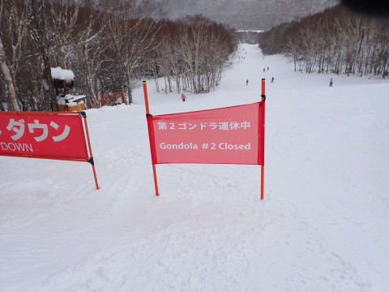

やはり，そのあおりで第2高速が混み始め

ましたが…

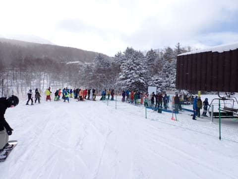

でも．

第1ゴンドラは，なぜか全く混まず．

ゲートの外に列が並ぶことはなかったです…

うん．ラッキー！！

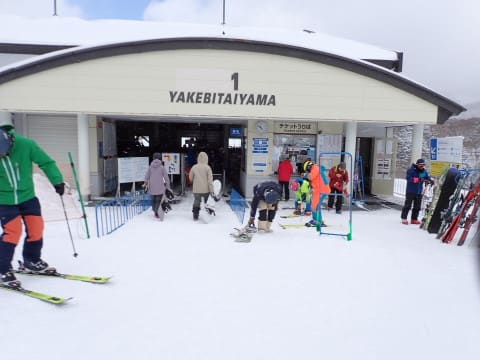

で．

11時50分ごろに第2ゴンドラの故障が

直りましたが．

そのころにはお昼休みタイムってこともあり，

第1ゴンドラはスカスカがら空き！！

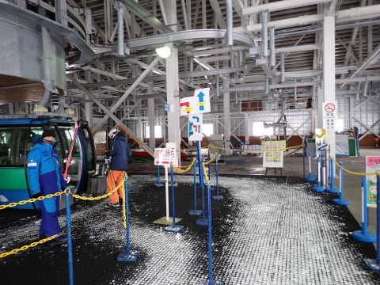

第2高速などのほかのリフトも，完全に

待ちがゼロになりました…！！

…こんながら空きで，焼額，経営大丈夫か？？

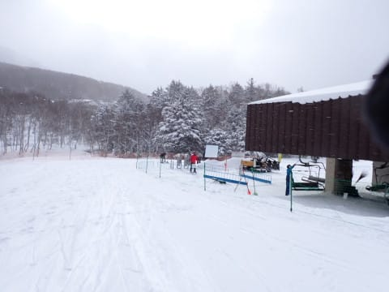

当然，ゲレンデもそんなに混んでいないし…

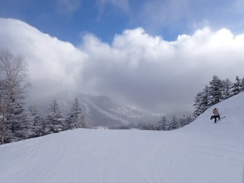

GSコースは，柔らかい雪が積もったおかげで

午後はちょっとコブコブになり，滑りにく

かったけど．

それ以外の白樺コースやパノラマ，唐松，

サウス，イーストコースは夕方まで

ずっとフラット！

ひたすら大回り可能！！

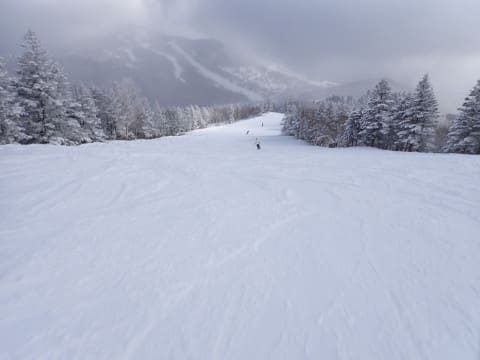

天気は時折雪が強く降るときもあったけど…

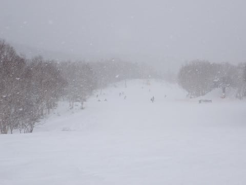

ちょくちょく晴れ間もある，恵まれた

天気だし．

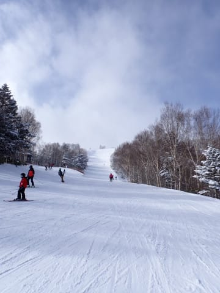

午後までずっと冷え冷えで，雪質もよかったし．

（昼間の最高気温でも-7℃！)

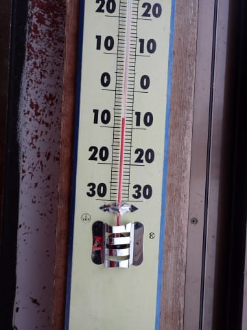

週の初めころには，今週末も滑りにいくのは

無理かも…

と思っていたのに，無事滑りに来れた喜びで，

休むことも止まることもなく．

ラストまでフラットで大回りしたい放題の，

最高雪質のゲレンデを．

日が傾く，ラストリフトの最後の1本まで，

ひたすら滑り続けたのでした…

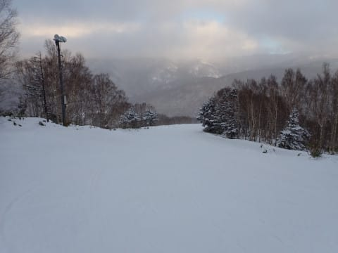

いやー．

ホントに今週は滑りに来れないかと思ってた．

めちゃくちゃしんどかったけど，

仕事やっつけて，滑りに来れてよかった…！！

無理してでも滑りに来てよかった…

うん．

2週間ぶりに滑りに来れてよかった…

…2週間ぶりだし．

先週滑れなかった分も，まだまだ

滑り倒さねばいけないよね……！！！

と．

当然のごとく，デフォルトでやることになっている

焼額ナイターに今日も参戦です！！

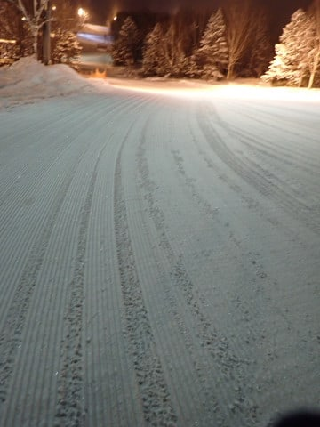

見よ！！

この焼額クオリティーの，最高級の

シマシマをっ！！

まだ誰も踏み入れてないシマシマ，

いただきま～す！！！

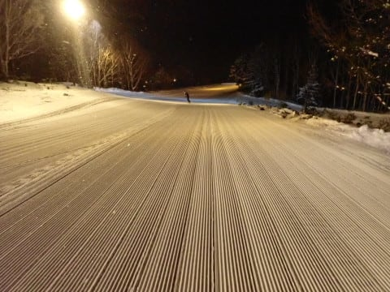

うははははっは！！

これだよ！

このシマシマがナイターの醍醐味！！

今日は朝イチ出遅れたけど．

ナイターで思う存分シマシマを

味わうのだ！！！

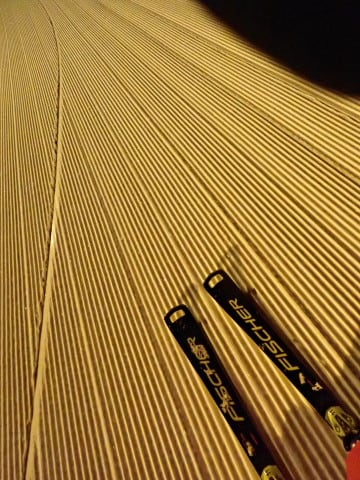

ってなことで．

今日の冷え冷え最高雪が見事に圧雪

された，シーズンでもそうそう味わえない，

クリーミーにすら感じる超絶ハイクオリティーの

シマシマ圧雪を，ナイターに来た数すくない

お客さんだけで，思いっきり独占できた，

最高のナイターだったのでした…

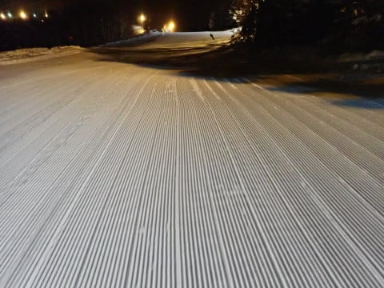

しかし．

残念ながら，ナイターも20時で終了．

あぁ…どうして楽しい一日はこんなに早く

終わってしまうんでしょう…（涙）

滑り足りない．

まだ滑りたいんだけど…っ！！

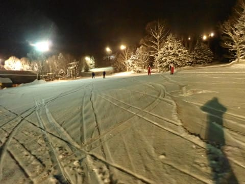

ってなことで．

金曜は睡眠1時間半．

さらに今日は睡眠4時間で家を出て

300㎞運転してきたので．

朝のうちは激烈に眠く，

「昼にはちょっと1時間くらい仮眠取ろうかな…」

と思っていたのに．

気づいたら昼休みも取らず，

まったく止まらず休まず，ナイターまで滑りつくした

自分がいたのでした…

そして．

日付が変わるまでBlog書いてるし…

ダメだ．

さすがにもう眠いので寝ます．

おやすみなさい…

## 💬 コメント一覧

### 💬 コメント by (アリス)
**タイトル**: 復活おめでとうございます
**投稿日**: 2023-01-22 11:52:34

S様

二週間ぶりのヤケビ復活おめでとうございます。

しかも最高のクオリティーでスキーヤーにこの上ない喜びのゲレンデですね♪

画像を見る限り昨日の金曜日より空いています♪

土曜日は後ろ髪惹かれる思いの帰宅でした💦

唐突な質問なんですが、Sさんは本当のところ地球人でしょうか？

睡眠も食もしないでも、生命を維持できる特殊な身体の構造を持つ惑星から来たとか？

今までここまでの体力の持ち主に会った事がないですΣ（・□・；）

たぶん、この驚きは私だけではないと思います・・

### 💬 コメント by (新米パパ)
**タイトル**: Unknown
**投稿日**: 2023-01-22 14:31:00

土曜、サイコーのコンディションだったみたいでよかったですね。

今週来週末はスキーおやすみです。

気づいたんですが、S様って、アレ1人じゃないですね。何人かS様がいて、よくよく観察すると身長が2センチくらい違いますよ。さすがに1人でこれだけをこなすのは地球人には無理です。

### 💬 コメント by (レインボー75)
**タイトル**: Unknown
**投稿日**: 2023-01-22 19:03:38

日曜日の志賀高原情報

朝の上林-6℃　蓮池-11℃。しめしめ冷えている。

昨日の新雪が圧雪されて、それこそパラダイスの上手くなったと勘違いバーン。

パノラマの壁、唐松とも美味しゅうございました。

オリンピックがベスト。途中でぶつかってる人を助けたご褒美か、私の前が無人に。30度の急斜面をあれ程までに思うように余裕をもって滑れたのは初めてかも。

気分は最高潮。だけどそのあと子連れの友人と遭遇。懐いてくれてるのでずっと一緒のはめに。

昼はメインの高天原の銀嶺。ロースかつ定食が、分厚くて感動。

西舘はマスターズのレース中で通行規制。ブナのゴンドラを乗り継いでファミリーからヤケビへ帰還。

最後は第三でリハビリ？してレインボー(２時)終了。

今日は３人もの知人に偶然出会えたこともあって、とっても幸せな日でした。エス様のご生存も確認できました。明日からは空いてる平日。またまた幸せ独占です。ごめんなさいね。

### 💬 コメント by (なるなる)
**タイトル**: Unknown
**投稿日**: 2023-01-22 23:04:57

一の瀬の大御所の方とリフトを乗り合わせて、正直、自分は正面が怖いのですと話しところ、

慣れだと言われました。

え～～っw

その後、正面をグルグルするも慣れることは出来ず…

20000mへの道は遠いですwww

### 💬 コメント by (Skier_S)
**タイトル**: 今日は良かった…
**投稿日**: 2023-01-23 03:53:52

＞アリスさま

いやーーー．この週末は最高でした！！

無理して滑りに来て良かった…

…いや．でも，ホントにかなり無理して滑りに来たので，普通の神経だったら

絶対滑りに来ないと思います…

＞新米パパさま

あ，ばれましたか(笑)．

実はSkier_Sというのは3人いて，

一人は天気図を読むのが得意で，

一人は車のことが得意で，

一人はスキーが好き…

というチームだったんです！！

で，3人で8時間ごと交代で仕事してるんですよ…（噓）

でも，こう書くと信じる人がいそう…

＞レインボー75さま

今日は最高でしたね～！！

やはり私が来たからコンディション良くなったんですよ！！

でもこれから一週間，雪が降り続けそうなので雪搔き大変になりそうです…

＞なるなるさま

いや…私も正面バーンは慣れることができないです…

無理です．昼間で20000mはやらない方が身のためだと思ってます

私もナイター込みの20000突破は何度もやってるけど，

昼間だけで20000mは一度も達成したことがありませんから…

### 💬 コメント by (富山県民)
**タイトル**: Unknown
**投稿日**: 2023-01-24 15:06:30

１月２１日の志賀高原は曇りだったのですね。

僕はその日はよませ温泉スキー場と高井富士スキー場を滑走しました。

天候は晴れ時々曇りでしたが昼頃は雪も降りました。

雪質は上部はふかふかのパウダーでした。

### 💬 コメント by (Skier_S)
**タイトル**: ＞富山県民さま
**投稿日**: 2023-01-25 03:03:13

21日は雪が降ったり曇ったり晴れたり…という目まぐるしい天気でした．

この週末は冷えたので，よませや高井富士もコンディション良かったでしょうね…

先週だと悲惨だったと思います．

今週を選んで正解です！

