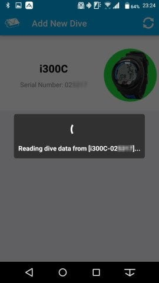
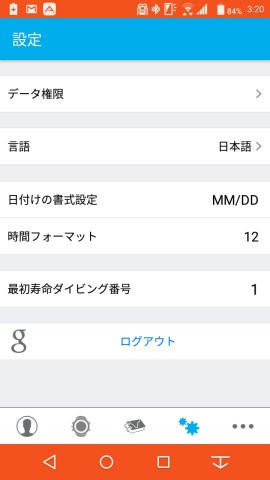

# 新しいダイビングコンピューター，Aqualung i300Cの記事の続き…Bluetoothでスマホとつないでみた

📅 投稿日時: 2019-10-18 00:57:30

🏷️ カテゴリ: [PC,カメラ&小物](c0d8caed13e597efe97b661a8ae56bed0.md)

ってなことで．

今年のモアルボアルダイビングで

息絶えてしまったダイコン，

[AIREのSQUAREの次世代機として
i300Cを購入した](e9c798a0452aefde4440cdeb9704b4eae.md)と以前レポート

しましたが…

その際に，

「Bluetoothでスマホとつないでみた

詳細報告は，また次回！」

と書いて以来．

続きを書くのを放置してしまってました．

…いや，山登りネタやら，

スマートウォッチネタやら，

書きたいものがいろいろあった

ものですから…

すみません（謝）

ってなことで．

かなり今さらですが，

ダイビングコンピューター,

Aqualung i300CのBluetooth接続の

詳細報告です…！！

というわけで．

こいつの最大の特徴は，

Bluetoothでスマホと接続

できること．

ダイビングコンピューターで，

Bluetoothでスマホに接続できるのは．

この機種の他には，

TUSAのソーラー充電タイプのIQ1204と，

そのOEMモデルのAqualung カルム＋

くらいで．

まだ珍しいですね…

ってなことで．

まずは，スマホへアプリのインストール

から始める必要があるわけで．

Google Playから，DiverLogを

インストールします．

インストール後，起動すると…

まず，ダイコンとペアリングするために，

ダイコンのBluetoothをONにしろと

言われます．

このアプリ．

残念ながら日本語対応してないのか…

ふむ．

仰せの通り，ダイコンのBluetoothを

Onにしてやろうじゃないか…

と，ダイコン本体を操作して，

SetupメニューのBluetoothを選び，

Onにします．

しばらくすると…

見つかったダイコンが

表示されます．

見つかったダイコンを

タップすると，ペアリングが

開始されて．

ペアリングが完了！

ダイコンから受け取った情報が，

表示されるようになりました～！！

ってなことで．

何ができるか，いろいろ

トライしてみましょう…

まずは，「Settings」をタップしてみると．

うおお！

すごい．

スマホから，ダイコンの設定変更やら

時計の時間合わせができるよ！！

上から見てみると．

・12時間/24時間表示切替

・何月何日の表示が，月/日か日/月かの切り替え

・スマホでダイコンの日時設定をするか

・スマホの時計にダイコンの日時を合わせるか

…といった設定ができるようです．

さらに設定を見ていくと…

なんと！

ガス設定もスマホからできるじゃないか！

Nitroxの酸素分圧設定とか，

ダイコンのボタンをぽちぽち

押してやるのはめんどくさいけど．

これなら楽だよ…！！！

そのほか，ダイコン本体のファームウェアの

アップデートも可能なようです…

ちなみに，Referenceをタップすると，

マニュアルが読めます．

で．

トップメニューへ戻って，

矢印で示す「Log」メニューを

タップすると．

しばらく，ダイコンからのログデータの

読み込みを実行して…

今度は，ログ画面に移ります．

下の画面は，自分のログではなく．

アプリの参考データとして入っていた

モノなのですが．

こんな感じでログが出るようです…

まずはプロファイル画面．

下にスクロールさせると，

ダイビング日，ダイブ開始時間，

最大深度，ダイブタイム，

水面休憩時間，水温…

が見れるようです…

けど．平均深度と，

エグジット時間は出ないの？

ちょっと残念…

で．

最後に．

トップ画面の，設定を

タップしてみます．

これは，ダイコンの設定ではなく，

このアプリそのものの設定画面

なのですが…

この画面を開くと…

んんん？？

なぬ？

Language？？？

タップすると…

ありゃ！！！

日本語が選べるじゃないですか！！！

日本語を選ぶと…

ちゃんと日本語表記

されるようになりました…

…でも．

なんだかちょっと，怪しげな

日本語です（笑）．

ってなことで．

アプリもちゃんと日本語化

されてるし．

（ちゃんとSystemのロケールがja_JPなら

　日本語で立ち上がるようにしようよ…）

ダイコンの時刻合わせやら

ガス切りかえやらもBluetoothを

使ってスマホで設定できるので．

海外で時差があるときや

Nitroxを使う際に，

ダイコンのボタンをボコボコ押して

ややこしい設定をしなくて済むし．

ログの読み取りもスマホで

できて，便利だし，

どこで潜ったかも，スマホの

場所と同期して記録してくれるし．

（平均深度とExit時間が出ないのが惜しいけど…）

ダイコンが覚えきれないログも，

スマホに記録されていくし．

スマホ時代のダイコンとして．

これで2万円台なら，十分買う価値があるな

と思った，Skier_Sなのでした…
