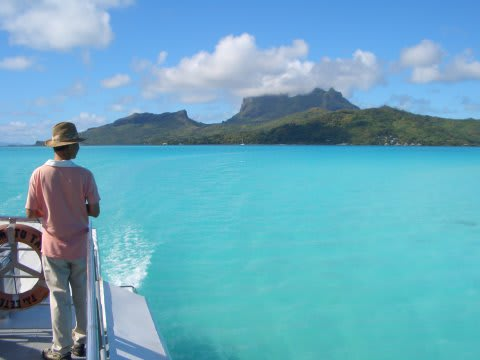
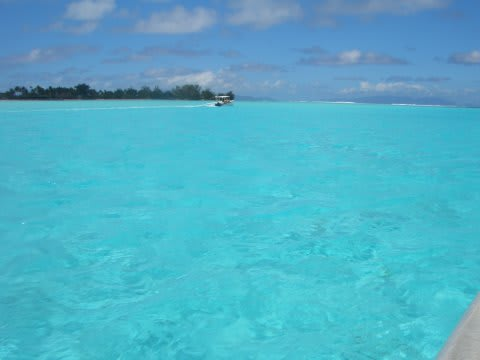
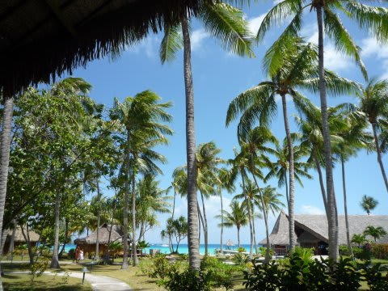

# 2009年　初の海外子連れダイビング旅行記　プロローグ2　タヒチについて

📅 投稿日時: 2012-08-23 00:21:01

🏷️ カテゴリ: [ダイビング日記](ce3a7a8d424d112fce83ee85c81a0e344.md)

タヒチ．

それは，正しくは「フランス領ポリネシア」

独立国ではなく，フランスの海外領地．

場所的には，オーストラリアのケアンズからまっすぐ東．この南緯15度ラインと

ハワイからほぼ南に伸ばしたラインがクロスするあたりに浮かぶ，

複数の島々からなる場所．

この矢印の場所あたりです…

このフランス領ポリネシア．日本と同程度のかなり広い範囲に

散らばった島々なんですが．

中心となるのが「タヒチ島」なので，このフレンチポリネシア全域を

通称「タヒチ」

と呼びます．

南緯15度…

ちとイメージが湧きにくいですね．

北緯に直せば，大体グアム・サイパンと同程度になります．

マレーシアやパラオ，フィリピン，そしてモルジブなんかのダイビングサイトが

だいたい南緯5度～北緯10度に集中していることを考えると，結構赤道からは

遠いです．

タヒチには，広いエリアに渡って複数の島，環礁が散らばっていますが，

国際空港のある中心地，タヒチ島はあくまで空港があって，フレンチポリネシアの

産業・流通を支える中心となる島であり，決して観光客が楽しむ島ではありません．

なんにしろ火山性の島なので，ビーチの砂は「真っ黒」．

ビーチリゾートが成り立つ島じゃないんですね～．

ということで．タヒチでは，タヒチ島をベースとして，ほかの島の

リゾートに行くわけですが．

日本人が一番良く行くメジャーな島は，

「ボラボラ島」

でしょう．

大体タヒチ島から飛行機で1時間程度

この島は結構大きく，レストランや商店もある程度あって，

ホテルもかなり多くのバリエーションから選べます．

ダイブショップもいくつかあって，うち2件は日本人ガイドがいます．

で，大きな島なのに．

ものすごいきれいな海の色です．

空港に降り立った瞬間に「おおおおおっ！」

と言ってしまうほどの海の色．

海のきれいさ，ホテルの選択肢，適度な便利さを持った

バランスの取れた島だと思います．

ダイビングサイトもかなりのバリエーションがあり，

珊瑚のシャローダイブからパスのドリフト，シャークフィーディング

ポイントまでいろいろあります．

で，その次にメジャーなのが

「ランギロア」

では無いでしょうか．

ここも，タヒチから飛行機で1時間ちょい．

ホテルが二つといくつかのペンション．

ローカルレストランも商店もいくつかある島です．

ここには2件のダイブショップがあります．

うち1件は，島で最大のリゾートホテル「キアオラ」内にあり，

日本人ガイドがいます．

ホテルにも日本人スタッフがいます．

ポイントは「ティプタパス」1箇所のみですが．

しかし．このポイント．

INの流れとOUTの流れ，パスのどのあたり外から

エントリーするか，パスのどのあたりを通るか…

で，かなりのバリエーションが楽しめます．

それ以外の島は…

いくつかありますが，ダイビングを売りにしているのは

ティケハウ，ファカラバ，マニヒくらいでしょうか…

どの島も，ホテル1件と民宿があるかないかくらいの

素朴な島です．

当然日本人ガイドなんかいません（笑）．

あ，タヒチ島から船で30分程度のところに，

モーレア島がありましたね．

…でも，モーレアにダイビング目的で行ったって人の

話は聞かないので，あまりダイビング目的で行く場所じゃないかと．

という感じなので．

大体の日本人は，タヒチでダイビングというと，ボラボラか

ランギロアを選ぶと思います．

まぁ，ボラボラを選んでおけば無難でしょう．

しかし．

ランギロアがすごいらしい．

透明度が高い海．

イルカ．サメ．バラクーダ．マンタ．

激流ぶっ飛びドリフトダイブ．

…と聞いて．

どっちも行きたいじゃないの？？？

と，ボラボラにもランギロアにも行ってしまった2005年．

かなーーーーーーり気に入りました．

海のきれいさ．

透明度の良さ．

アジアンリゾートとは異なった落ち着き．

ゲストの品格の高さ．

フレンチの料理の美味さ．

そういうものを総合すると，結構ポイントが高い…

これが，タヒチの魅力ですね～

＃なんだか，旅行社の紹介ページみたいになっちゃった
