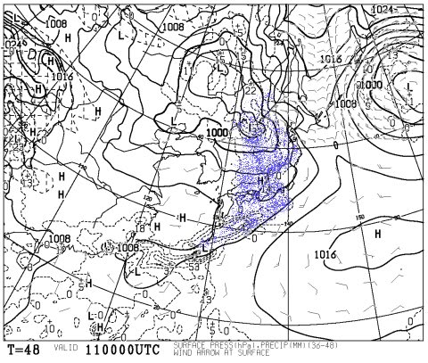
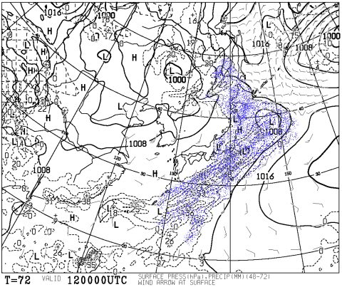

# まだ続く！今週末のスキー場の天気は…？

📅 投稿日時: 2013-05-10 00:49:58

🏷️ カテゴリ: [スキー天気予想](c6554f5c3c106093b511a8daae23757e8.md)

さてさてさて．

このGWで，私の焼額通いも終わったわけですが．

この週末からは，かぐら通いが始まる予定なわけで…

ということで．

この週末の天気の予想をば…

えー．

土曜ですが．

土曜朝9時の予想地上天気図を見ると…

雨が降る，青く塗った領域が日本上空にありますね…

えー．この日は．

気温は山頂でもプラス10度近くまで上がりそうなので．

雪になることは無く，絶対雨です(涙)．

…あきらめてください．

かぐらはおそらく，朝からぽつぽつ雨が降り始めるでしょう…

時たま，強くなるタイミングもあるけど．

基本的には，しとしとと降ったり止んだりが続くかと…

志賀は，もしかするとそれほど降らずにすむかも．

午前中は，晴れ間ものぞく可能性が…

でも，午後はぽつぽつと降りそうです．

で．日曜の朝9時の予想地上天気図を見ると…

こちらは，おおむね雨の領域が東に抜けちゃってますね．

ということで．

かぐらも志賀も，どっちも朝早くはぱらぱらと雨が残る可能性がありますが．

午前9時ごろには止んで，晴れてきそうです．

あー．

この日も気温は，プラス10度以上に上がります．

暖かいです．

ということで．

今週末は，すべりに行くなら天気がよさそうな日曜日！

土曜日に滑りたい人は，かぐらより志賀のほうが，雨がそれほど降らずにましかな～．

って感じです～．
