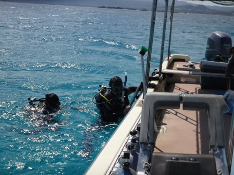
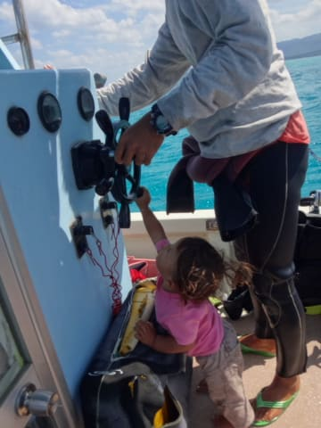
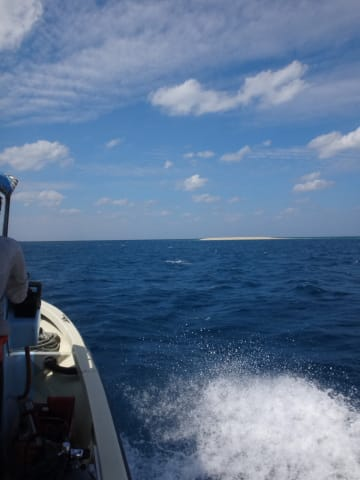
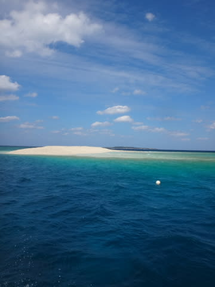
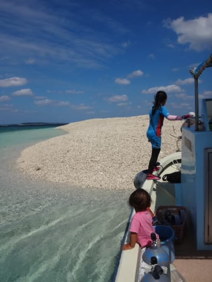
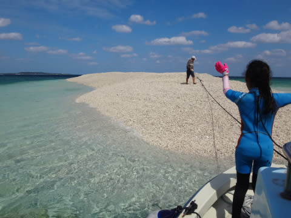
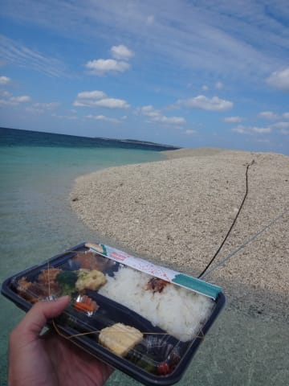
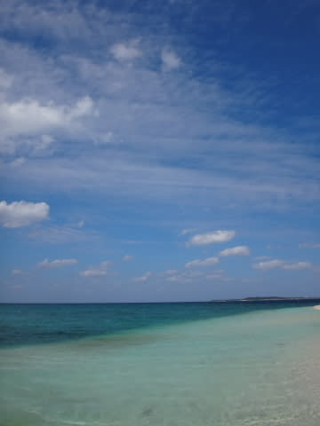
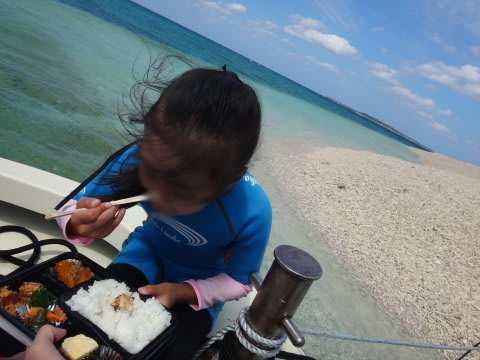

# 2015年10月　子連れで西表へダイビング旅行その13…お昼休みはバラス島で

📅 投稿日時: 2016-09-08 01:56:57

うーむ．

なんだか．

今年は，まだスキー場のオープン情報が

出てきませんね～．

今のところ，軽井沢が11月3日（祝日）オープン，

ってくらいで．

狭山も丸沼も鹿沢もアサマ2000もかぐらも，

まだオープン日の情報が出ていません…

例年なら，9月に入ると早々にアナウンスが出る

ところが多いんですけど，今年はどうしたんだろう…

と，

ちょっとスキーネタの前フリをやったところで．

本題のダイビング日記へ，Go!

---

ということで．

ダイビングタイム60分越えの，

濃厚な2本目が終わった後は…

お昼ご飯の場所へ，ボートを動かします…

天気は完全に回復！

すっきり気持ちいい晴れになってきましたよ～！！

しかし…

オーナーのお子さん．

ホントに船に慣れている…

で．

晴天の中，10分もボートを走らせると…

そうです．

見えてきました，バラス島．

バラス島…それは，サンゴのがれきが溜まって

海の真ん中にぽつんと浮かぶ，

長さ数10m，幅10mも無いような小島．

体験ダイバーや，ダイビングの合間の休みに

立ち寄るボートが多いので．

いつもはそこそこ人がいるのですが…

今日は貸し切り！

ってことで．

アンカーをかけて，船を固定したら…

いざ，お弁当タイム！

いやー．

天気も回復したし．

きれいな景色を見ながらのお弁当は，

やっぱりおいしいなっ！！

