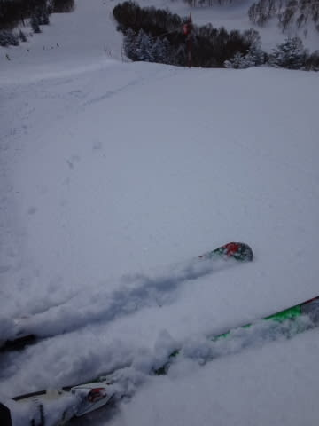
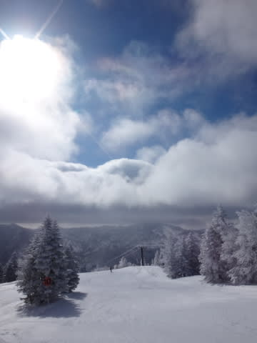

# 3月15日の志賀高原は…冷え冷え晴天！3月にしては，上出来の一日！

📅 投稿日時: 2014-03-15 22:21:12

🏷️ カテゴリ: [2014スキー滑走日記](c992167609b6415052179ee69ea1ea7d8.md)

えー．

本日は．

天気予想のとおり，基本的に，冷えて晴れの一日だったのだ！

3月というのに，志賀高原の上り坂の道路状況は，

…まだ本格雪道ですねー．

うーむ．

かなり冷え込んでそう…

で．

ゲレンデに出てみると．

…うむ．一昨日に予想したとおり．

マイナス10度を下回ってますね～

冷えひえですっ！

そして，朝のうちは予想のとおり，わずかに雲が

残っていて…

オリンピックコースは，5cmほどの積雪．

うーむ．予想の10cmには，チョイ足りなかった…

これだけ薄い新雪だと，イマイチ．

って感じで，圧雪コースに繰り出したのですが．

9時ごろには雲が切れて…

それ以降は晴天にっ！

うはははは．

圧雪コースは，今日も最高！

冷え冷え晴天，今日も，締まった圧雪を大回り

できるのだ！

この後は，ずっと晴れが続き…

人もそんなに多くなく，ゴンドラ待ちも終日0！

昼間の最高気温も，こんな感じでマイナス4度．

3月の晴れた昼間に，雪質もいいままとは…

やはり，私の日ごろの行いの良さが現れてますね←やっぱりそれか！

いやー．

3月中旬にしては，めぐまれてるんじゃないですか？

…と，思っていたところ．

やはり，昼過ぎには予想通り，固い下地がところどころ

顔を出し，ちょっと難しくなってくる場所も…

そして，夕方には，ちょっと緩んだ雪が固まりだし，

全体的にゲレンデが硬い感じになってきたなぁ…

…って感じで．

残念ながら，夕方までやわらかい最高の雪…

ってわけにはいかなかったけど．

でも．

この時期とすれば．

かなりめぐまれたコンディションだったかな！

明日も，そこそこいいコンディションが続きそう…
