# 2月16日の志賀高原のゲレンデ状況は…パウダー天国！．．．なれど吹雪(激寒)．

📅 投稿日時: 2013-02-16 21:58:52

🏷️ カテゴリ: [2013スキー滑走日記](c91dbe557f9a69230b1600e48622fdd61.md)

えー．

来ましたよ～．

予想通り．

そうですっ！

パウダーデーですっ！

パウダー好きにはもうたまらん，パウダーデーっ！

＃…寒くて吹雪いて視界悪かったけど…

今日は，信州中野のインターを降りたところから，すでに積雪があり…

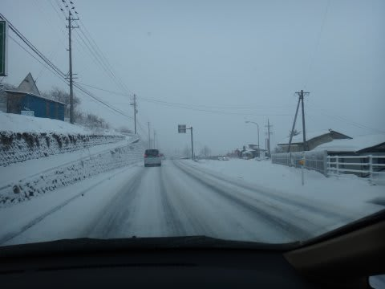

焼額山頂でも，かなりの雪がシンシンと降り続けてます．

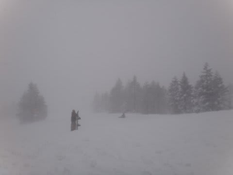

んで…朝イチの気温が．

なんと．

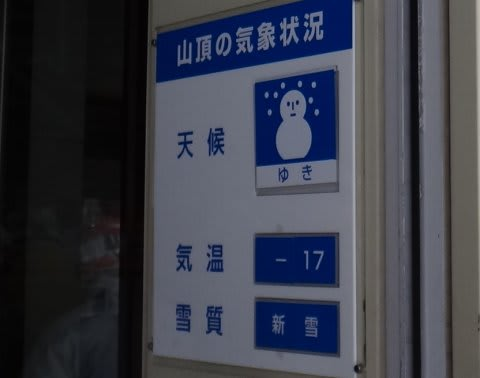

マイナス17度…

さらに．

これだけでは済ませてくれない志賀高原．

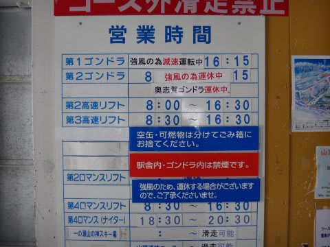

…強風です．吹雪です．

焼額第2ゴンドラも奥志賀ゴンドラも動きません．

北風に異常に強い焼額第1ゴンドラは，かろうじて減速運転．

でも．

それがどういうことかというと…

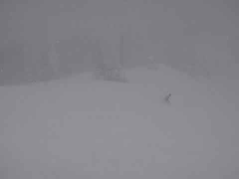

前が見えないくらいの降りってことですね（涙)．

んでも．

圧雪済みのゲレンデ上は薄く軽い雪が乗っている程度で．

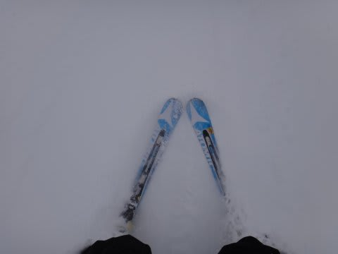

ぱふぱふではありませんね～．

当然，パウダーを求める人間は，朝の圧雪が入ってないコースに行くわけで．

オリンピックコースは…

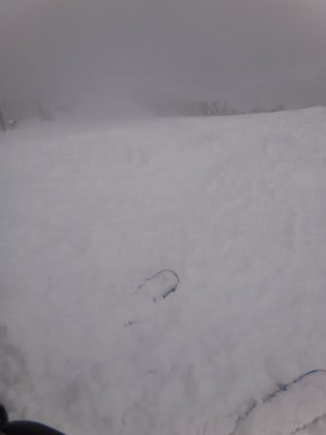

OH!

膝パフっ！！

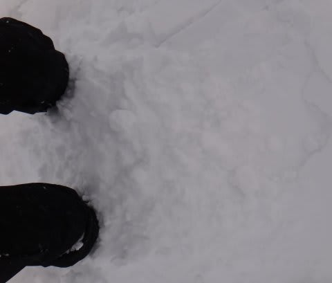

雪温低くてさらさらしてるけど，密度間があって，

突っ込むとちょっとブレーキがかかる感じ．

でも，

最高っ！

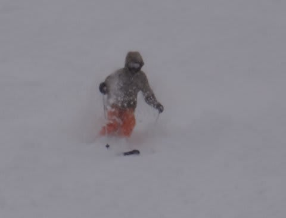

いやー．

朝10時までは，ほとんど人がおらずひたすらパフパフをたらふく

ご馳走になって．超満足してたけど…

第2ゴンドラも，奥志賀ゴンドラも動いてないってことは．

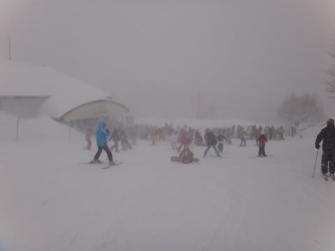

焼額第1ゴンドラ，すごい待ち…(涙) 

午前10時から12時近くまで，5-15分待ち（悲），

さらに，午後もかなりの待ち時間．

かといって，昼でも気温がこんな感じで吹雪いている本日．

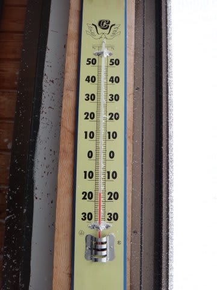

リフトに乗ってたら，凍死しちゃいます．

ということで．

私にしては珍しく，じっと我慢の子で．

ゴンドラ待ちに並んで待ったんですが．

…これが3連休だったら，15分待ちじゃ済まなかったかも…

でも，やはり2月のトップシーズン．

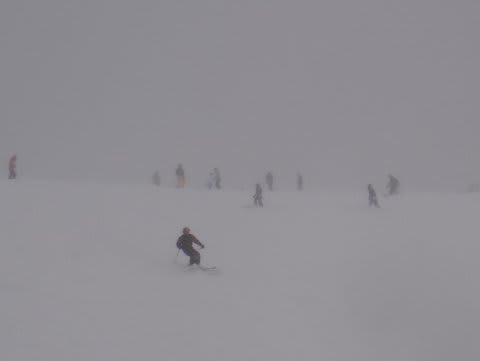

ゲレンデの人口密度は多めでしたね～．

寒いのに，こんな日によく滑る気になるな～←人のことがいえるのか？？

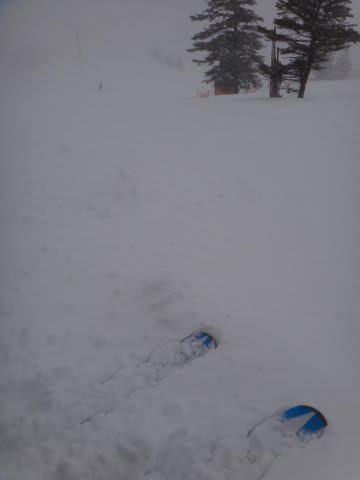

午後までゲレンデはこんな感じで．

ところどころパウダーをいただけました．

圧雪バーンは，意外とでこぼこにならず，滑りやすかったな～．

見えなくてちょっと混んでて寒くて風が強くて大変だったけど，

ゲレンデコンディションは結構よくて楽しかったですよ～．

＃もしかすると，普通の人だと楽しくないコンディションだったのでは？？←自己突っ込み

…ってことで．

ナイターです．

（なにが，ってことなんだろう？）

いやー．一日降り続けてるおかげで．

圧雪が終わった後のナイターでも．

これもんです．

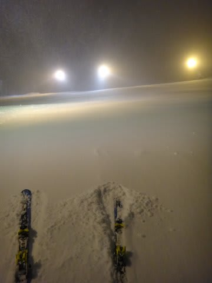

パウダースプレーあげながら滑っちゃいます

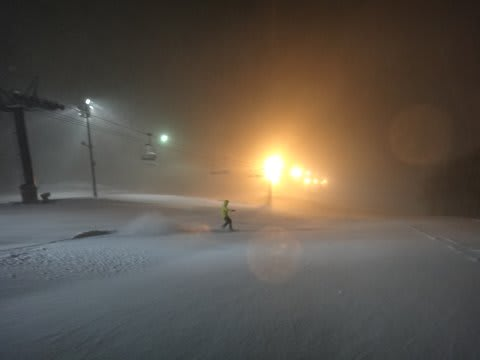

むほほほほ．

楽しいっ！

(寒いけど)

幸せ！

(かなり寒いけど)

…ナイターも十分満喫．

で．

まだ，こんなペースで降り続けてます．

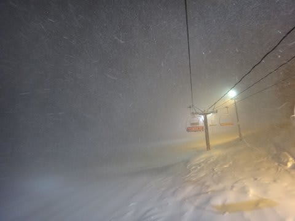

すごいです．

ってことなので．

明日の昼前くらいまでは降り続けるはずだし．

間違いなく，朝イチはぱふぱふパウダーなのだっ！！！！

## 💬 コメント一覧

### 💬 コメント by (mari)
**タイトル**: Unknown
**投稿日**: 2013-02-16 23:25:25

いいな～、今週来週は用事があって志賀行かないのでめっちゃうらやましいです。さっき先週末の動画で下ちびが雪煙あげながら熊ぱう滑ってる姿見て、私もスキーモード入ってしまったあ…。パウダー天国、楽しんできてくださいね～＼(^o^)／

### 💬 コメント by (Skier_S)
**タイトル**: mariさま
**投稿日**: 2013-02-17 23:49:05

パウダー天国でしたが…

風も強く，寒かったです(涙)．

強風で，一の瀬はクワッドが動いておらず，

うちの娘は，下のペアリフト1本乗ってる間に

「寒い～(涙)」

と，リタイヤ宣言でした…

来週はすべりにいけるんですか？

