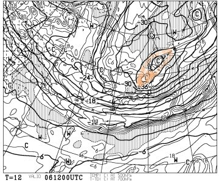

# この週末はGoodコンディション！

📅 投稿日時: 2012-04-07 00:17:03

明日から．

また志賀高原ですが．

…この週末は，[先日の天気予想](e66097e561113f17cd6e5321feef45b88.md)の通り，いい週末になりそうです．

金曜用9時の段階で…

こんな感じで，500hpa面に，この時期としてはありえないマイナス36度の

寒気(オレンジで縫った部分)が入ってます．

ということで，

これから明日の午前にかけて．

結構積もります．

それも，この時期にしてはありえないいい雪質の雪が．

土曜日は，4月上旬とは思えないいいコンディションのはず！！

終日冷えるので，一日いい雪質をキープします．

かなり寒いかも…

で．

日曜日は．

朝のうちは冷えていい感じ．

日曜朝イチは最高でしょうね～．

朝のうちは雲が残るかもしれないけど，

午前中から晴れてきます．

日曜は太陽のぽかぽか陽気の中滑れそうです．

雪は昼ごろには緩んじゃうでしょうけど．

壊滅的にドボドボにはならないですね～．

日曜も，春スキーらしいスキー日和．

ということで．

この週末は，最高のはずっ！！！！

## 💬 コメント一覧

### 💬 コメント by (雪上の翁)
**タイトル**: 今高天ヶ原です
**投稿日**: 2012-04-07 12:46:18

今、一の瀬の試乗会に飽きて（笑）高天ヶ原にいます。

雪質最高ですね～^^;

### 💬 コメント by (mari)
**タイトル**: 試乗会
**投稿日**: 2012-04-07 13:52:48

グッドコンディションすぎて寒いですね。

マイナス10℃くらいまで下がってたとか(汗

おかげで試乗会もトップシーズン並みの雪質で試乗できましたが。

うちの2歳児は午前中に4回リフト乗って滑って飽きたらしく

レストランのキッズコーナーでずっと遊んでます。

### 💬 コメント by (Skier_S)
**タイトル**: 私は…
**投稿日**: 2012-04-07 21:41:21

>雪上の翁さま

予想通り，最高の週末ですね～．

私は9時半～10時半ごろまでと，

1時～3時まで試乗してました…

それ以外はいつもの焼額です…

明日も焼額で終日滑っている予定です．

>mariさま

子供背負って試乗していらっしゃる方が

いたので，「これがもしや…」と思っていました．

うちの娘も，寒すぎたらしく10時半ごろから滑り始めましたが，ゴンドラ2本滑って11時半リタイヤ．

その後はずっとホテルの部屋で遊んでました…

だから，私は午後ずっと市場で着たんですが(笑)

### 💬 コメント by (雪上の翁)
**タイトル**: いかがでしたか？
**投稿日**: 2012-04-08 18:46:28

今日の焼額山、いかがでしたか？

昨日の試乗会にSさんもいらっしゃるのかな～

と思ってキョロキョロ見ていたのですが、

なかなかわからないですね(笑)

ちなみに私の腕章番号は16番でした。

気に入った板はありました？

### 💬 コメント by (Skier_S)
**タイトル**: 私のお気に入りは…
**投稿日**: 2012-04-08 23:15:18

試乗会，結構人数多かったから，見つけるのは不可能かと…

私は70番だったんですけど．

私のお気に入りは，やっぱりVolklのPlatinumCDですね～．

あと，意外にもDynastarの小回り基礎系が良かったです…

今シーズンはこれで終了ですか？

お疲れ様でした．

### 💬 コメント by (mari)
**タイトル**: 158番だったかな？
**投稿日**: 2012-04-08 23:30:21

子供おんぶして試乗してるのはうちの旦那しかいなかったので、ビンゴでしょうｗ

私は10時半から12時半までと2時から3時まで、

旦那が1時から2時まで単身、2時から3時までおんぶで試乗してたと思います。

男性はCD評判いいですねー。

軽量非力な友人女性たちは自分を含め総じてSWが高評価でした。

あとはHEADのIntegrale009がツボにはまってしまって困ってます＾＾；

12月からGWにかけてあらゆる雪質の志賀を滑り倒すなら009だけど、

レベルアップを狙って整地をメインで滑りこむならSW。

今日もその2本ばかり散々試乗しましたが（フォルクルとHEADのお兄様方には笑われました）

まだ決心がつかない。。。

### 💬 コメント by (Skier_S)
**タイトル**: やっぱりビンゴでしたか…
**投稿日**: 2012-04-10 00:21:50

もう，試乗が終了する直前の3時前ぐらいにお見かけしたので…

ビンゴですね(笑）．

HEADのIntegrale009は試乗していないんですが…

私はどちらかというとハイスピードでアグレッシブな

滑りをするほうなので，ある程度強い板のほうが

好きです…

試乗の難しさは，

「自分が履いて調子いい」

板と，

「自分の滑りを良くしてくれる」

板は違う，というところがあります…

自分の悪い癖を封じてしまう板は，

「合わないな～」

と思っても，人が見ると

「今の滑り，良かったじゃない」

とかいわれることがあります…

試乗はだから難しい(＾＾;

