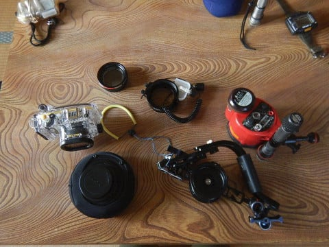
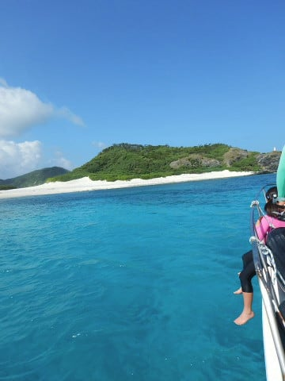
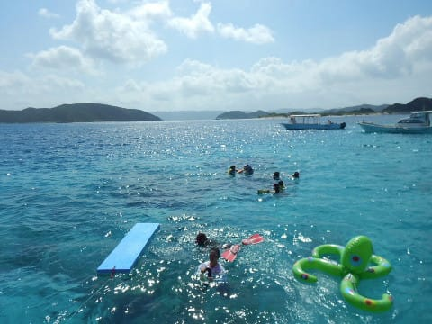

# 2017年8月，小学生の子連れで座間味でダイビングその2…2日目は晴天！子供だらけのボートで出発！

📅 投稿日時: 2017-10-24 01:25:24

🏷️ カテゴリ: [ダイビング日記](ce3a7a8d424d112fce83ee85c81a0e344.md)

やはり．

大変残念なことに．

ええ．

22日の夜から23日の朝にかけての台風の．

雨＆強風＆高温にやられてしまったらしく．

…Yetiのゲレンデは，再び壊滅状態になった

ようです…（あふれる涙）

（[Yeti Facebook](https://www.facebook.com/YetiSnowtown/posts/1472199842869387)より）

ということで．

やはり，悪い予感が当たってしまい．

残念なことに，23，24日のYetiは，

休業となってしまいました（泣）

その間，ひたすら造雪して

ゲレンデ回復に努めるようですが…

（[Yeti Facebook](https://www.facebook.com/YetiSnowtown/posts/14724267995133587)より）

そう．

アイスクラッシュシステムの中の人が，

必死にかき氷機を回して作り続けている，この雪．

あさっての営業開始までに，またたっぷり溜まるよう．

アイスクラッシュマン，全力でガンバレ！！

…と．

みなさん，応援するのです…っ！！←…中の人などいない！…というツッコミ多数

…って前フリのあとは．本題の，

ダイビング日記です←いつもだけど，ここまでが本題じゃないの？

-----

ということで．

2日目の，朝．

ぐっすり眠って，起きると…

うむ．

絶好のダイビング日和になりそうな

晴天ですな！

朝7時から朝食ですが…

ペンション星砂さんは，1日おきに

和食と洋食の朝食が入れ替わるのですが…

今日は洋食の日ですね．

朝食後，ダイビングのピックアップの9時まで

時間があるので，水中カメラを組み立てたり…

（組み立て前）

（組み立て後）

ダイビング器材を準備してたりすると．

朝9時に，ダイビングショップのトラックが

器材を運ぶために来てくれて…

トラックに器材を乗せたら，人間は港まで

歩いていきます．

いや．

ホントに今日はいい天気ですな…

そして，港にやってくると…

1年ぶりのティンガーラ号と再会です！

勝手知ったるわが娘．

一番のお気に入りの，舳先のネット部分を陣取ります．

そして，

同船の他のお客さんが乗ったら，

出航しますが…

さすが，子連れに優しいザマミセーリングさん…

お客さん，みんな子連れじゃないですか！

舳先は，大勢の子供ですごいことになってます…

子供だけで，7人もいるよ！！

いや…すごい…

ってことで．

大勢の子供を乗せたティンガーラ号は，

南国の海をしばし走り…

ダイビングポイントに到着！

ここで…

子供たちは，ショップの雄大さんとヘルプの

おねーさんに連れられての，シュノーケリング

タイム！

こういうきれいな海に向かって…

みんな楽しそうに泳ぎ出していきました．

…そして，子供たちが海で遊んでいるこの間に．

大人たちは，ダイビングタイムです！
