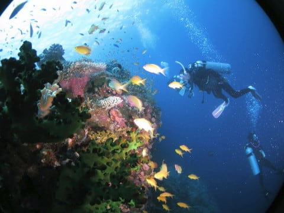
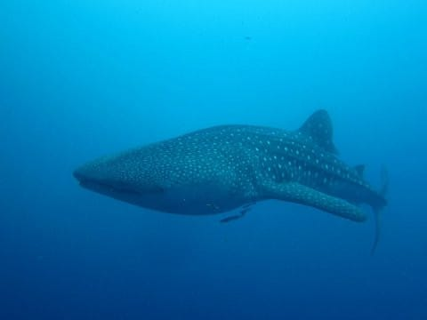
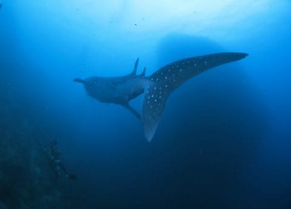
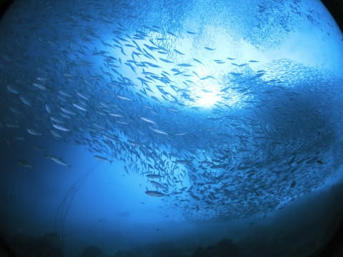

# 2019年8月，4度目のモアルボアル・小6の娘Cカード取得1周年！　プロローグ

📅 投稿日時: 2020-07-20 01:08:37

そう．

それは1年前のモアルボアル…

娘がジュニアオープンウォーターの実習を受け，

無事Cカードホルダーになった場所．

講習中にイワシとアジの巨大群れに囲まれ，

さらにドロップオフを，ボートダイブの

ドリフトダイブで海洋実習という

超ゼイタクな環境で，

完全マンツーマンで講習が受けられるだけじゃなく．

…そして，子供が海洋実習をしている間に

親はこんな凄いものを見ることができるという…

これで，Cカード取得の費用も日本で

受けるよりずっと安く．

さらに，エア・ホテル・ダイビングフィーを

全て入れても，

伊豆で4日滞在して毎日3本潜るより

安くつくという，経済的にすごく

ありがたい環境のため．

すっかり嵌ってしまった，モアルボアル．

当然，娘がCカードを取った後も

リピートを誓ったわけで…

…だけど．

昔より短縮されているわが娘の夏休み．

7月20日から始まり，8月25日に終わるのか…

昔みたいに8月いっぱい休みじゃないんだな…

果たして．

この1か月弱の間に，私が休みを取れる

日程を調整して．

実家にも帰りつつ，志賀高原の大蛇祭りにも

出かけつつ，沖縄とモアルボアルの両方に

潜りに行くというタイトスケジュールが

成り立つのか！？？←いや，無理に沖縄とモアルボアル両方行かなくていいから…

…と，必死に調整してプランニングした結果．

8月1日~4日：座間味（有給休暇2日）

5日~9日：出社

10日~12日(山の日)：関西某所に帰省(土日+祭日)

13日：群馬の草津で焼額キッズ達と遊ぶ(会社休日)

14，15，16日：出社

17日~22日：モアルボアル(夏休み4日)

23日：1日だけ出社

24，25日：土日で志賀高原の大蛇祭りへ…

…と．旅行費用が爆裂に高いお盆時期を外しつつも，

娘の夏休みの8月25日までの25日間で，

6日間休みをぶち込んで，

全ての予定を突っ込んだ

ギチギチの強引プランを計画，

実行に移したのでした…

とりあえず．

私にとっても，娘にとっても．

思い出ぎっしりの夏休みになる

はずの8月．

Cカードを取って1年の娘は，座間味で

1年ぶりのリフレッシュダイブを終えて．

いざ，モアルボアルへ出発…！！

　

　

　

　

　

　

## 💬 コメント一覧

### 💬 コメント by (yumi)
**タイトル**: Unknown
**投稿日**: 2020-07-20 02:00:18

Ｓさぁ～ん🌞🏖️🏝️

去年は かなりタイトなスケジュールだったのですね☺️

今年は また、心配になって来ましたねぇ🤔

私は 久々の夏で どう過ごして良いのか解らず、ついに不良になってしまいました😅

連日の夜更かし・・・

あぁ～

雪❄️が無いと 不健康でぇ～す😭😭😭

### 💬 コメント by (Skier_S)
**タイトル**: ＞yumiさま
**投稿日**: 2020-07-21 00:31:08

去年もタイトでしたが，毎年タイトな気が…(笑)

今年は海外に潜りに行けないので，余裕がありますけど（涙）．

私も毎週どこにも行かない週末が続き，不完全燃焼気味＆不健康な日々を過ごしてます．

早く状況が改善することを願うばかりです．．．

