# コドモとコモド！子連れダイブクルーズ15　大感謝のマンタダイブ！

📅 投稿日時: 2011-07-18 00:34:36

あけてクルーズ3日目…

この日も晴天です．

で，今日も朝食前の朝7時から1本目のダイビングです．

娘が寝てる時間なので，妻を置いて私が潜りに行くことに

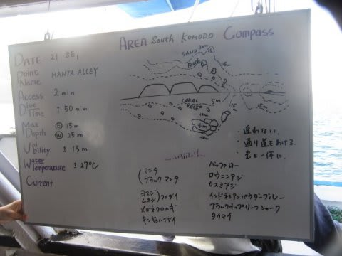

ポイント名は「マンタアレイ」．

そう．マンタポイントです．

この名前でマクロポイントだったら超フェイントですね…

＃そんなのヤダ

コモド島の南側にぽつんと突き出た岩山の回りが，

マンタのクリーニングポイントになってます．

いざ，マンタポイントへ！

水温は，南エリアなのにあったかいですね～

27度近くあります…

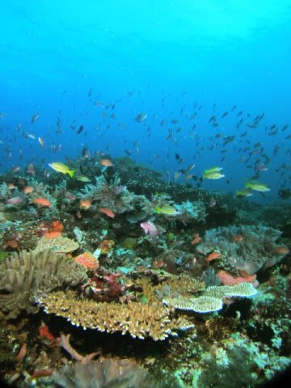

このポイント，マンタが出なくてもこんな感じで

きれいなポイントなんですが…

エントリー後からいきなりマンタ5枚！！

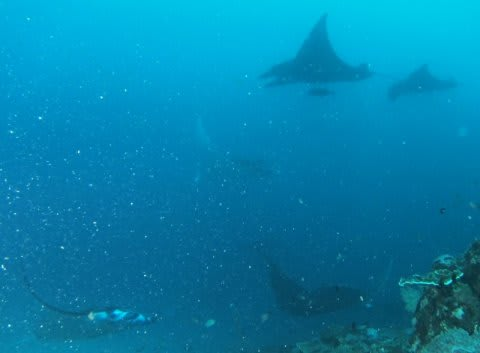

それも，ブラックも混ざってます！！！

…ちょっと透明度が悪いけど…

マンタぐるぐるです．

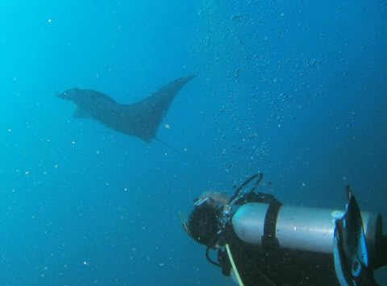

かなり近づけます．

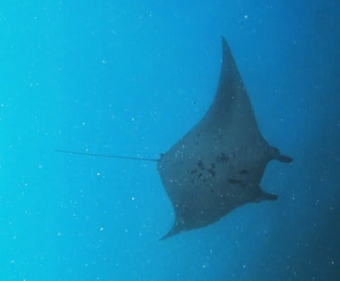

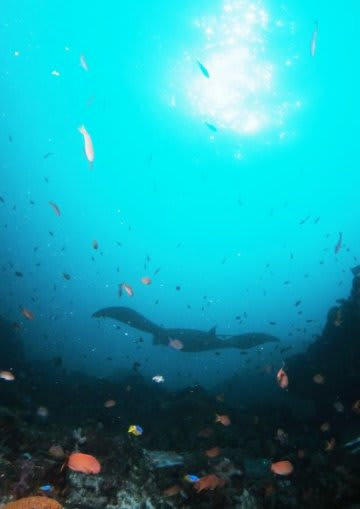

他のマンタポイントだと，マンタ以外の魚がいなくて寂しいけど，

ここはこんな感じでキンギョハナダイ越しにマンタが眺められます．

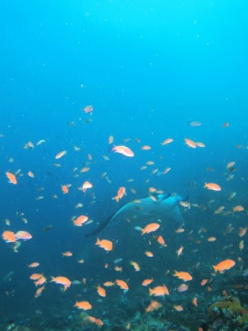

写真栄えしますねー．

次から次へとっかえひっかえ…

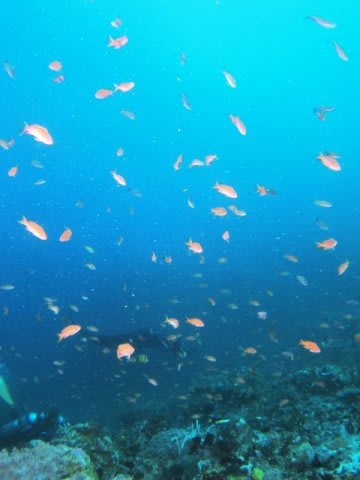

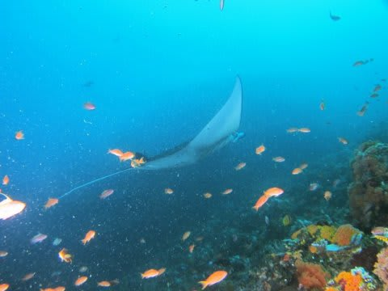

最初はあっちから来たと思えば，次はこっちから，

こっちからと思えばあっちから…

ダイブタイム58分．

満足のマンタダイブ．

しかし．

平均水深12m，最大25mで，マンタをベストアングルで撮影

出来るポジションへ移動しながらの1時間のダイブ…

ということは…

エグジット後，こんなことに．

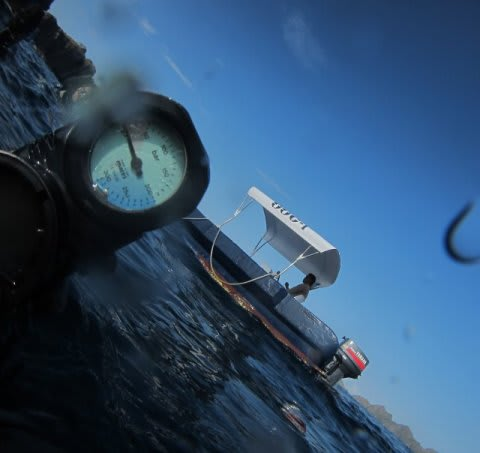

ふはははは．

なんとか最後までもったけど，

安全停止中はちょっとびくびくものでした．

よい子はまねしないように…

で．

船に戻ると．

すでに，娘と妻はダイビング組が帰ってくる前に

朝ごはんを食べ終わって，くつろいでました．

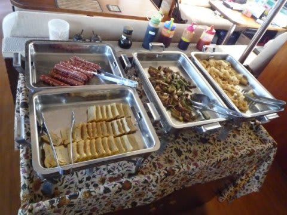

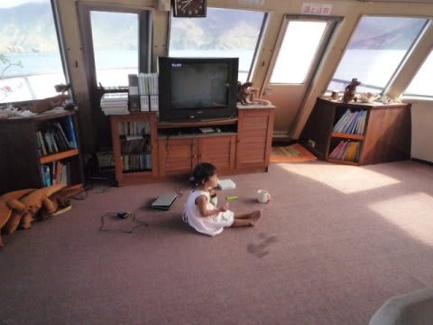

で．

ここで，ガイドのK村さんからすばらしい提案が！

K村さん「1本目と2本目の間に，奥さん潜りに行きますか？」

…え？それは，うちの嫁さん一人だけのために，スペシャルボート

出してマンツーで潜ってくれるってこと？？？

K村さん「ええ．それで2本目は，Sさんが潜りに行けば…」

なんとーーーーーーーーーっ！

すばらしいっ！

妻だけのためにK村さんがガイドして1本余計に潜って

くれるってこと？？？？

でも，そうするとK村さん，午前3本ぶっ続けで潜ることになるん

ですが…

K村さん「いいですよ．普段からお客さんのダイビングの合間に

　調査で潜ったりすることもあるし…」

あ，あ，ありがたや～！！！

（感泣）

＃この日はお客さん少なかったから＆私が乗船3回目の

＃リピーターだったからという理由のスペシャルかも…

…しかし．

しかし，気になるのは置いていかれる娘が泣かないか．

チラッと娘のほうを見ると…

一心不乱にTVのアンパンマンを見てます．

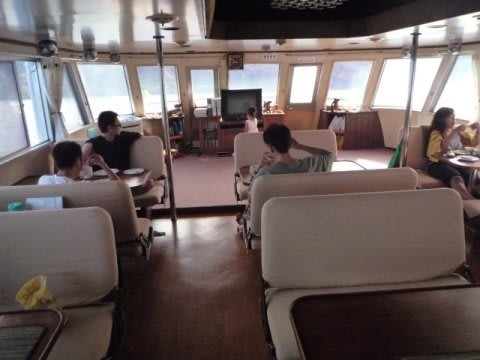

…わざわざアンパンマンのDVDをもってきて良かった．

このスキにそっと妻は姿を消し…

しばらく後，ボートのエンジン音が遠ざかっていくのが聞こえます．

…無事，妻は潜りに行ったようだな．ふふふ．

アンパンマンに夢中の娘は気がつかなかったぞ．

ふっふっふ．なんだかんだ言っても所詮子供．

この程度でごまかされるとは…

何度か「ママは？」と聞いたけど，

いつもみたいに他の人が潜りに行っちゃって誰もいないわけではなく，

いろんな人が相手をしてくれるので気がまぎれるのか，

泣き出すことは無く…

無事，妻が帰ってくるまでおとなしくDVDを見ていました．

で，妻が帰ってきたらお出迎え．

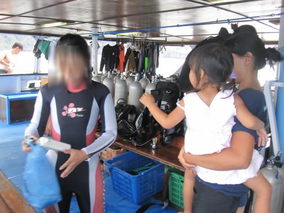

妻「いい子にしてた～？」

私「ずっとアンパンマン見てたよ…」

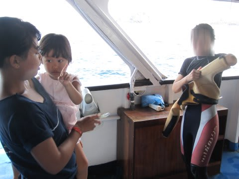

…とりあえず，妻がマンタポイントに無事潜りに行くことができ．

子供も泣かなかったので，一安心．

今後，何とか妻も潜りにいけそうだなぁ…

妻が帰ってくると，すぐ入れ替わりで2本目のダイビング．

私が潜りに行く番です．

次のポイントもマンタアレイ．

ああ．

本来なら，今日の午前中2本，私が1本，妻1本と思い込んでたけど．

K村さんのおかげで，私は2本潜れることになったよ…

ありがたや～（感涙）．

とりあえず，感謝の気持ちいっぱいで2度目のマンタアレイへ，Go!!
