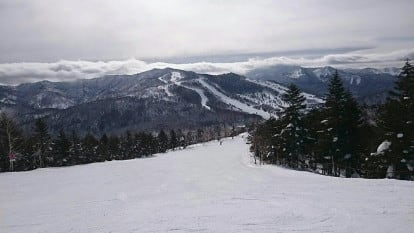

# 1月28日の志賀高原特派員情報…27日の雨でゲレンデはどうなったのか？そして平日丸池・サンバレーエリア営業縮小

📅 投稿日時: 2021-01-29 04:47:23

🏷️ カテゴリ: [日記](cc4b5682fb7b8b144980957a978653fb0.md)

ということで．

昨日の記事で．

27日はほぼ全面霧雨（山頂は湿った雪）で，

ゲレンデは春の重い雪になってしまったと

特派員報告を受けましたが…

本日の志賀高原，果たしてどうだったのか？

…あさイチの焼額山頂の気温は-4℃．

うーむ．-5℃を下回るという予想は，1~2℃

外したか…

あさイチの天気がすっきり晴れと言うより

ちょっと雲が残ったので，放射冷却が

弱まって気温が読みより上回った

ようで…←外した言い訳をしている

とはいえ，朝イチのゲレンデは…

シマシマ！

それも，予想通りの硬めのシマシマ！

…でも，アイスバーンほどではないものの，

ちょっとボソボソ固まった感じのシマシマ

だったようで…

シマシマが崩れた後の午前中は，バーン全面

かなりのコロコロになやまされたようで…

　あさイチの気温は-5℃を下回る程度で，

　前日の高温で湿った雪が固まった

　硬めの圧雪でスタート！

　午前中はバーン全面コロコロが出そう…．

という予想，気温自体は1-2℃外したものの．

それ以外はほぼぴったり当てたようです！

でも．

午前中は雲が多かったものの，

時折日が射すタイミングもあり．

さらに人が少ないので，昼ごろまで

シマシマが残っていたところも

あったみたいで．

今日もゲレンデはどこに行っても

人が少なく．

天気は曇ったり，

時折日が射したりで．

昼間の気温も-2℃程度までしか上がらず．

コンディション自体は，それほど悪く

無かったようです…！

午後2時を過ぎると，すっきり晴れてきたみたいで．

午前中はちょっとコロコロに悩まされる

こともあったものの，

焼額や奥志賀エリアは，ゲレンデも

カリカリのアイスバーンになることもなく．

昨日の雨の影響は最小限に抑えられた

ようです…！

いやー．

良かった…

ってなことで．

雨の影響が最小限に収まって

安心したところ．

さらに，志賀高原．

深夜3時半現在，雪が積もり始めています！

この雪は，明日一日降り続けそうなので…

雨でちょっと硬めになった雪は隠れてくれて，

週末はまたトップシーズンの雪に

戻ってくれそうです…！

…ただ，西風が強いので，

ドサドサは積もりそうにないですが．

明日一日だけじゃなく，30日の昼過ぎ

くらいまで降るかも…

昨日の予想では，30日は朝には雪が止んでいて，

午後は晴れそうと思いましたが．

ちょっと降り止むタイミング，昨日の

予想より遅くなるかも…

…と．

雪のコンディションはよくなりそうなものの．

本日，ちょっと残念なニュースが…

2月いっぱい，平日の志賀高原．

サンバレー，丸池，蓮池エリアが営業休止

になるようです…（涙）

（[志賀高原中央エリアホームページ](http://shigakogen.co.jp/archives/9316)より）

まぁ，平日全て営業しないわけではないようですが．

緊急事態宣言の予定期間の2月7日を過ぎて，

2月末まで，週に3日間ほど休みになるようです…

…だんだん休止リフトが増えていく…（泣）

このままコロナウイルスが収まらないと，

来シーズンあたり，

「丸池，蓮池，サンバレーエリアは廃止しました～」

とかならないか，心配…

うむ．

新型コロナウイルスじゃなく．

新型滑りたいウイルス

みたいなのが突如発生して．

人命にかかわらないけど，感染すると

みんな無意識にスキー場に向かって

しまうような．

そんなウイルスが流行ればいいのかも

しれない…←スキーバブルの頃がそんな感じだったよね

## 💬 コメント一覧

### 💬 コメント by (レインボー73)
**タイトル**: Unknown
**投稿日**: 2021-01-29 06:11:58

ちなみに湯田中辺りでは、新型たまには休みたいウイルスが、蔓延しているとか？

### 💬 コメント by (レインボー73)
**タイトル**: Unknown
**投稿日**: 2021-01-29 12:37:08

金曜日の志賀高原情報

ニゴン駐車場新雪８cm。朝の蓮池マイナス８℃。久しぶりに寒い！　

さむさのみ　さむさやさむさ　みのさむさ

後ろからも読んでみてください。（さむっ！）

山頂マイナス１２℃、積雪は変わらず、太板敗退。滑りやすいけど、二高は寒すぎて２回は無理。ほぼ１ゴン回しばかり。そのうち雪が舞うようになりましたが、視界は良好。

雪はだんだん強くなり、すぐに数センチの積雪が。だけど降り始めはやっぱり重い。サウスの迂回路に勢いよく飛び込んだら、ストップ雪！

こんな日でも終礼まで滑り続ける人種もいるのかと、イレブン撤退。新型たまには休みたいウイルスに、感染したかも？

そうそう、昨日は硬めで実によく滑る雪だったので、スピード好きの隊員がエキスパートで、なんと125km/h！

急斜面に入って３分の１過ぎた辺りから低いクローチングを組んで、エッジを立てて縦に。奥志賀の圧雪の継ぎ目が、すごく怖かったとか。これに懲りて、もうやらないとは、本人の弁。

明日はどれだけ積もるのでしょう！　太板くん、あんたの出番だよ。

### 💬 コメント by (Skier_S)
**タイトル**: ＞レインボー73さま
**投稿日**: 2021-01-30 03:12:53

たまには休みたいウィルスですか…

レインボーさんがそんなウィルスに感染しますかね？？

ゲレンデは水曜の雨から復活して，完全にトップシーズンに戻ったようですね．

ただ，土曜の朝もそれほどの積雪はなさそうなので，太板の出番ってほどでは

無い気がします…（笑）

