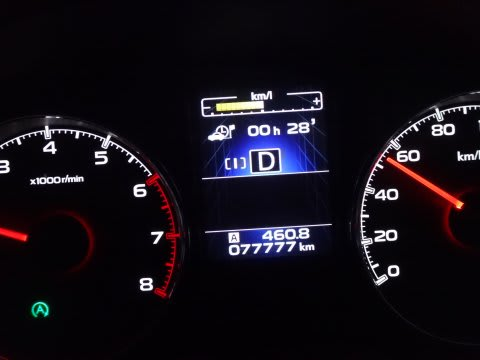

# レガシィ77777km走ったよ…そして明日から志賀高原

📅 投稿日時: 2015-12-25 23:01:52

🏷️ カテゴリ: [車](cba0e8330b3f2ded7c1addfacc75d4547.md)

ってことで．

[紆余曲折の購入](eb1b0e385b422753c3e3aad5a58c12234.md)から2年半経ったわがBRレガシィ君．

このたび，早くも走行距離77777kmのゾロ目を突破しました…！

うーむ．

年間3.3万kmペースですか．

来年，3年目の一回目の車検を迎える時には．

10万km行っちゃいそう…（涙）．

早くも，車の買い替えを考えないといけないのかな…？？

で．

また明日から志賀高原なわけでして．

うーむ．

今晩，チラチラと雪は降ったようですが．

そんなにたくさん積もってはいないようで…

土曜の第1ゴンドラの営業は無理っぽい感じ…（泣）．

土曜も終日雪がちらつき，日曜までは降るので．

うーん．日曜には第1ゴンドラ動いてほしいところ（祈）．

とりあえず．

日曜はパウダーデーのはずなので．

土日の積雪に期待！

あと4時間後に出発です．

では，行ってきます～．
