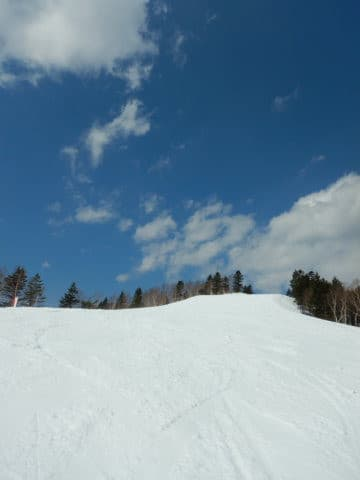
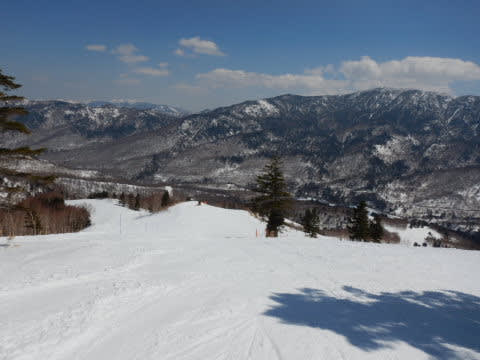
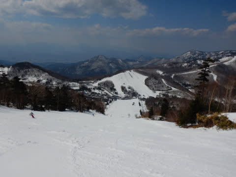
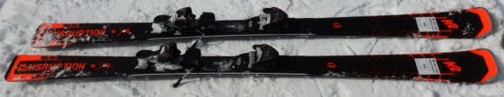
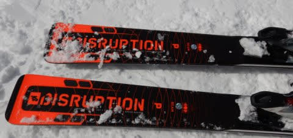
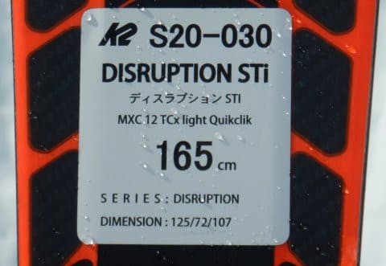

# 2021シーズンモデルのスキー板，試乗レポート…K2 DISRUPTION STi

📅 投稿日時: 2020-04-05 00:55:18

🏷️ カテゴリ: [スキー板試乗](c0bd8048615710cee890e403a36cc9a2b.md)

えー．

昨日の記事で．

　5日(日)：前日夜から雪降り！かなりの冷え冷え．

　朝までに10cm程度の積雪．

と書きましたが．

風向きが完全に西向きに変わりました（涙）

そのため，

日曜は，志賀高原への積雪はほとんどなさそうです．

…繰り返します．

日曜は，志賀高原への積雪はほぼなさそうです（涙）

でも．それ以外の，

・朝は風が強そう（焼額ゴンドラが止まるほどではない．午後は弱まる）

・気温は朝から冷え冷え！昼間も-5℃程度までしか上がらない

・夕方に向かって晴れていきそう

…ってあたりの予想は変わらず．

積雪だけがない予想になりました…（泣）

ただ，今晩から朝までに1-2cm程度とはいえ

うっすらと積もりそうで．

下地は硬いけど，冷え冷えで，

雪が解けて板の滑りが悪いザブザブ雪よりは

いいんじゃないかな…

…

ガリガリにならなければ．

ってことで．

本日の志賀高原ですが．

朝から晴天で…

朝イチはコロコロが多かったものの，

-2℃と予想通りの冷え込みのシマシマバーンで…

ガラガラだったようですが．

午前11時ごろには，強い日差しで

焼額，奥志賀とも，かなりの張り付き雪に

なってしまったようです（涙）

午後1時半ごろには，張り付き雪も解消していた

ようですが．

朝日を浴びない西斜面の一の瀬や寺子屋は，

一日中張り付き雪にならなかったようです…

とりあえず．

明日の積雪がない予想になったのは残念ですが．

先週の積雪もあり，写真を見ても，意外とまだ

コース全面に積雪は残っているし．

焼額スタッフの方々は，

「これならGWまでもたせられるかも…」

と思い始めているようです．

…ぜひ．

なんとしてでも，GWまで雪をもたせてください！！（焼額スタッフへ全身全霊でお願い）

ってことで，本題．

本日は，引き続きスキー試乗レポート．

K2編です．

では，どうぞ～！

○K2 DISUPTION STi 165cm

オールラウンド．

165cmでR13.6mと，比較的小回り寄りな

スペックに感じますが．

センター幅72mmと，割とセンター幅が広めで，

比較的雪質を問わずオールラウンドに

使えそうなこの板．

実際，履くまでは「165cmのR=13だから，小回りベースだな…」

と思っていましたが．

滑ってみたところ．

小回りから大回りまで，どんなターン弧でも

滑れる，かなりオールラウンド性の高い

板でした…

驚くのは，板の幅が広いからか，

びっくりするほど安定性が高く，

かなり荒れ気味の斜面をかなりの

スピードで滑っても，全く怖くない！

むしろ，かなりのスピードで滑りたく

なる板．

重いわけじゃないのに，荒れた雪を

蹴散らしながら落下して行けます．

ターンは超お気楽で，傾けば板が曲がってくれます．

スキーヤーは板の上で力をかけずに傾けば，

その傾きに沿って板が大回りで回ってくれる

感じ．

もう，気楽に力を入れず傾くだけで，

驚くほどのハイスピードクルージングが

楽に，恐怖感無くできちゃいます．

それも，バーンが多少荒れていようが

なにしようが，見た目からは想像が

つかない振動吸収性と安定性で，

まるで整地のように落ちていけます…

もう，力を入れて板の操作をしたり，

スキーヤーが意図的に板を動かして行ったり

という操作は不要．

板の上に楽に乗って落ちていけば，

スキーヤーの傾きに従った回転弧で

回っていき，楽に滑り降りることができる，

まるで20000m御用達のような板です…

履いた感じは175cmかそれ以上の安定感．

決して基礎スキーヤーが必死にいろいろな小技を

使って，美しくターンを仕上げていく板では

ありません．

もう，ホントに気楽にゲレンデを驚くほどの

ハイスピードで滑って行ける，

なんだか不思議な感じのいたでした…

## 💬 コメント一覧

### 💬 コメント by (かず)
**タイトル**: Unknown
**投稿日**: 2020-04-05 10:16:27

レインボーさん  明日ですヨ！！笑

### 💬 コメント by (AK)
**タイトル**: Unknown
**投稿日**: 2020-04-05 21:13:07

今日のヤケビは冷え冷えで4月とは思えないコンディションでした。午前中は霧と雪で視界が悪かったですがうっすら積り午後の晴れ間GS上部は最高でした。

本当はGWまで滑りたいとこですが今日でシーズンオフしました。逆にシーズン終わりに昨今の問題でよかったとプラスに考え山菜採りに切り替えます(笑)

これからもブログ楽しみにしてます(特に物欲選手権希望)

### 💬 コメント by (レインボー)
**タイトル**: Unknown
**投稿日**: 2020-04-05 23:34:52

おそらく最後の志賀高原情報

エス様の気温予報がピタリ。ずっとマイナスを保って最高でした。２時間でやめるつもりが、、、

3ヶ月ぶりに帰宅して、妻の顔色伺いとご機嫌取りに四苦八苦しております。人生、苦労もあるものです。

あさってからは山ごもりして山菜採りです。よほどの悪魔のささやきがない限りは、、、

今シーズンもありがとうございました。皆様の安全とご健康をお祈りいたします。

### 💬 コメント by (RO)
**タイトル**: 4月6日朝
**投稿日**: 2020-04-06 13:43:40

日曜よりももっと軽い雪が降っています！

### 💬 コメント by (かず)
**タイトル**: Unknown
**投稿日**: 2020-04-06 22:21:55

最後の志賀高原ぷち情報 

本日朝方雪！ヤケビオープン前にはなかなかのふりでした ベース−6℃  トップ−8℃  この時期の降雪は微妙な場合もありますが30mmですがガリガリが隠れ軽い雪

壁も欲張らなければ薄っすらパウダー感有り！人がまばらで午前中は快適

午後は晴れて緩みましたが帰り１４時半ベース−1℃しか上がらず

予想よりかなり良くて無理して来たかいが有りました！本日でしたヨ笑

今シーズンはレインボーさんの志賀高原情報でかなりパウダーを当てましたしハズレも回避！来シーズンもぜひお願いしたいのでお互いコロナには気をつけましょう

Sさん早くヤケビに復帰できるといいですけど…現状なかなか難しいですね

### 💬 コメント by (ほっぽ)
**タイトル**: Ｋ２
**投稿日**: 2020-04-07 00:09:04

Ｓさん

Ｋ２は全くノーマークでした。

５シーズンほど前にはChargerに乗ってた時期もありましたが、

China製になってから縁遠くなってしまいました。

インプレ読む限り私の使い方にピッタリの気がして、

是非とも試乗してみたいのですが、残念ながら試乗会はことごとく中止。

来年の試乗会ではＫ２にも乗ってみようと思います。

http://www2.tokai.or.jp/nana_hoppo/

### 💬 コメント by (Skier_S)
**タイトル**: 今週は冷え冷えウィーク！
**投稿日**: 2020-04-07 03:13:26

＞かずさま

志賀高原レポートありがとうございます～！

朝の真冬並み冷え冷え雪降りで，結構当たりの一日だったようですね…！

このBlogを通じた情報交換が役立っているようで良かったです…

そして，かずさんからの情報も特派員情報として使わせていただいてます．

ありがとうございます…

＞AKさま

あら…シーズン終了ですか．

意外と雪が長持ちしそうなところ，この騒ぎですから仕方ないですね…

また今後ともご愛読のほど，よろしくお願いします！

＞レインボーさま

ついにシーズン終了ですか…

毎日毎日，レポートありがとうございました．

また，シーズン中はいろいろお世話になりました．

これからの山籠もりも楽しそうですね．

また夏にもお会いできるといいですね…

＞ROさま

月曜も冷え冷えの雪が積もって良かったみたいですね…

12月から2月までの雪不足を考えると，今のところ

この4月は恵まれてる気がしますね…！

＞ほっぽさま

いや…

私もノーマークだったK2.

たまたま空いていたので履いてみたのですが…

ハイスピードクルーズ板としては，かなりスピード耐性もあり，

いい板でした．

ただ，深回りや小回り等には向かないので，まさに板なりに

楽に降りていく，クルーズ板だと思います…

