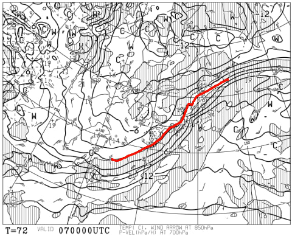
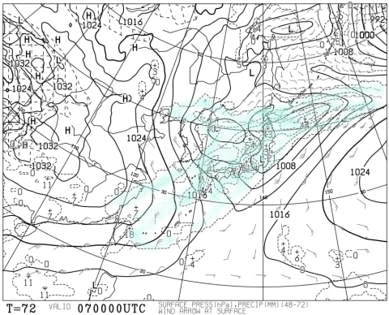

# 4月7，8日の週末の志賀高原スキー場の天気は…土曜は雨のち雪，日曜は冷え冷えの晴天かな．

📅 投稿日時: 2018-04-05 04:22:36

🏷️ カテゴリ: [スキー天気予想](c6554f5c3c106093b511a8daae23757e8.md)

どうやら本日の志賀高原．

夜に雨がちょっと降ったようですね…（涙）

それほどひどい降りではなかったようですが．

雪が…雪が解けていく…（泣）．

しかし．

スキーシーズンも残すところ，あと3か月ほど

になってしまったようです…←確かに，7月上旬まで月山で滑ればそうだけど…一般から基準がズレてないか？

あぁ…

早くもシーズンが始まってから，半年も経ってしまった

のかっ！！←確かに，10月上旬のYetiオープンから6か月経ってるけど…一般から基準がズレすぎてないか？？

ってことで．

残りわずか3か月となったスキーシーズン．

ラストスパートの後半戦に突入ですが．

水曜恒例の，週末のスキー場の天気予想，行ってみよう！

えー．

まず．

土曜，7日の朝9時の850hpa気温図ですが．

うーーーーむ．

赤く印した0℃線は志賀高原より北．

志賀高原には，+3℃線が掛かってます…

そして．

土曜朝9時の地上天気図を見てみると…

うがーーーー！

降水域が志賀高原にかかってるよ…っ！！！

これは…

これは，土曜の朝は…

まさか，雨！？？？

土曜日は，夜まで雨が降り続けるのか？？

土曜夜9時の850hpa気温を見てみると…

おおっと．

夜9時には，赤い0℃線．

ぎりぎり志賀高原の南まで下がってくれてますね…

土曜夜9時の地上天気図を見てみると．

降水域は日本全域を覆ってますが…

でも，これはほとんど朝の降水量かな．

午後はそんなに強く降らなさそうな感じ…

とりあえず，午前9時から午後9時の間に，

0℃線は志賀より南に下がるので．

志賀高原はどこかのタイミングで雨が雪に

変わります．

うーん．

朝早くに変わってくれると嬉しいけど…

午後遅くかなぁ…

で．

日曜の850hpa気温図は．

うをををををををっ！

久しぶりの冷え込みだよっ！！！

赤い0℃線どころか，水色の-3℃線が志賀より

南に下がってます！

これは…

冷える．

日曜は久しぶりに冷える．

そして，日曜の地上天気図を見ると．

概ね高気圧に覆われて，晴れそうな予感…！

これは，日曜は冷え冷えの晴れか！？？

土曜の午後にうっすら雪が乗るので，

早朝はちょっといいコンディションかも…

ってな感じで．

まとめると

7日土曜：朝は雨で始まりそう（涙）

　気温は早朝から+3℃程度（泣）．

　早朝は時折強く降るタイミングもあるか？

　朝の雪は雨の水気をたっぷり吸った重い雪．

　通常営業開始時には，雨は弱まり，時折ぱらつく程度になるか．

　昼間は曇り空から時折ぽつぽつ降ってくる程度．

　重い春雪だけど，雨で湿った雪なので，板に張り付かず

　滑りは良い雪でしょう．

　午後は気温が下がっていき，時折ぱらつくものが

　雪に変わっていき…

　夕方に向けて，冷えた気温でバーンが固くなっていきそう．

　夕方に雪が積もるようだと，固い下地に滑りの悪い雪が

　乗る，楽しくないコンディションになりそう…

8日日曜：おそらく朝から晴れ．

　早朝の気温は-5℃以下，久々のきりっと冷えた朝．

　バーンはかなり固め．

　運が良ければ，前日に降った雪が圧雪されたやわらか雪が

　その上に乗って，結構いいコンディションか？

　この日は終日晴れそう．

　だけど最高気温はマイナスをキープして，

　バーンは緩まない．

　…逆に言うと，表面の雪がはがされると

　下地のアイスバーンが現れて…

　かなりのアイスバーン地獄になる可能性も．

　午後まで全く雪は緩まず，急斜面はガチガチ

　アイスバーンが続きそう．

　でも，久しぶりの冷え冷え晴天の一日！

ってな感じで．

久しぶりの冷える週末だけど…

冷えはじめるのが土曜の午後からなんですよね…

冷えてから降り始めてくれるといいのに，

なぜ冷える前から降り出すのか…

とりあえず．

ここは私が祈っておきます．

全力で祈っておきます．

ひたすら祈っておきます．

だもんで．

おそらく土曜の雨はそれほどひどくならず．

早いうちに雪に変わるはず！！！

志賀高原の天気を決めている私が言うんだから．

そうなるはず！！←単なる願望

## 💬 コメント一覧

### 💬 コメント by (かず)
**タイトル**: Unknown
**投稿日**: 2018-04-05 17:40:21

明日夜中　結構雨降りそうですね　土曜日風でゴンドラ止まるなんてありえそうですか？

### 💬 コメント by (Skier_S)
**タイトル**: かずさま
**投稿日**: 2018-04-06 06:59:31

土曜は西風が強そうです．

奥志賀ゴンドラは搬器ピッチが広がるかもしれませんが…

止まらないんじゃないかと思ってます．

運が悪ければ止まるかも，という程度の

確率です．

焼額ゴンドラは止まらないと思います．

### 💬 コメント by (小林です)
**タイトル**: 月山支柱傾く
**投稿日**: 2018-04-06 19:45:39

すでにご存じかもしれませんがリフトの支柱が傾いて修理のためオープンが遅くなるそうです。

### 💬 コメント by (Skier_S)
**タイトル**: 小林さま
**投稿日**: 2018-04-06 21:16:36

ええええ～！

知りませんでした！

月山，またリフト支柱傾いたんですね…

調べると，開業未定のようですね…

でも，かぐらが終わる5月末までには

営業開始してくれると祈ってます…

