# 2017年8月，小学生の子連れでパラオ再訪！その10…1本目はブルーコーナー！

📅 投稿日時: 2018-09-24 02:07:05

えー．

今日は不人気のダイビングネタ．

…やっぱり車ネタの方が人気ありますね（涙）

その10まで連載が進んでも，まだダイビング2日目．

今年中に連載が終わるのか心配な，去年のパラオ旅行記です．

では，どうぞ～！

--

ってことで．

ブルーコーナーにエントリーしましたが．

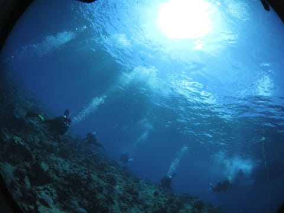

エントリー後にボート下で集合できる

くらいですから．

カレントはもうほとんど止まってる感じ…（涙）

流れがないと，あんまり大物期待できないんですよね…

で．

昨日と同じ下げ潮なので，左手に崖を見ながら

コーナー先端に向かいますが…

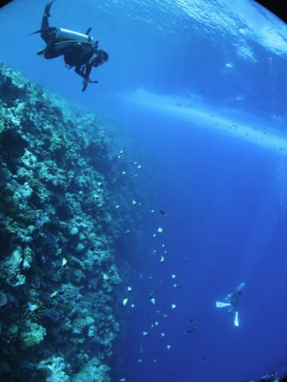

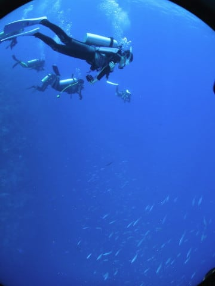

コーナーの先端に到着したら．

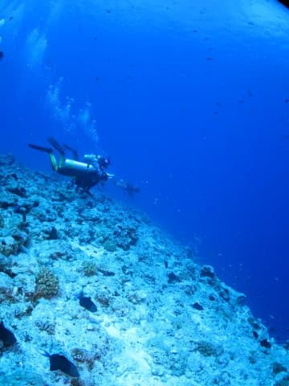

いますね～．

いつもの定番，ホワイトチップとグレイリーフシャーク．

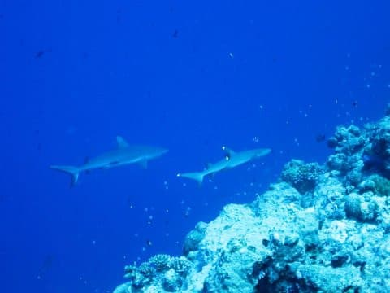

サメはかっこいいなぁ…

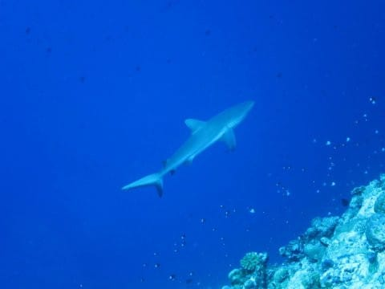

…うーん．

でも．

カレントが弱めなので．

全体的に魚影は薄め…（涙）

いるのは，アカモンガラとサメばかり…

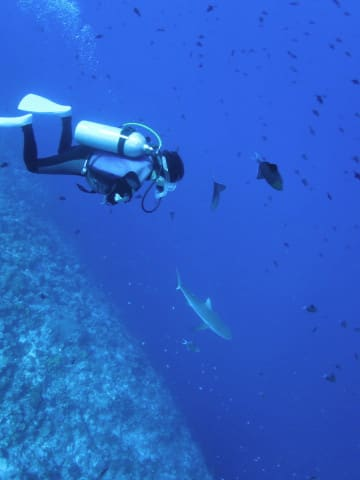

と，カレントフックでぶら下がって，

コーナーの先を眺めていると…

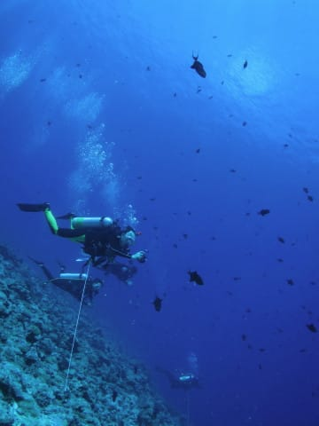

なぜか，私のすぐ頭上まで近づいてくる，

こいつ．

サザナミトサカハギ．

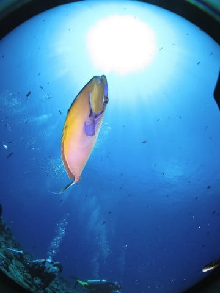

なんだなんだ，お前？？

ぶつかりそうなほど近づいてきたぞ！？？？

と，思ったら．

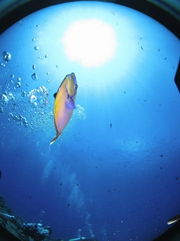

こいつ，どうやらダイバーが吐いた泡が

好きなようです…

泡を浴びて喜んでます．

それでダイバーの頭上に来るのね…

でも，ここの魚，ダイバーに慣れすぎ（笑）．

しばらくコーナーの先端で，カレントフックに

ぶら下がっていると…

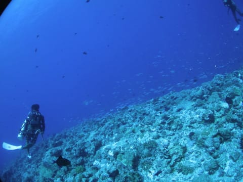

うむ？

下から，ギンガメアジの群れが沸き上がってきました…！

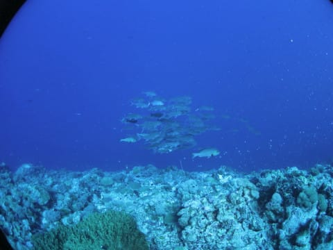

では，こいつについて行ってみましょうか！

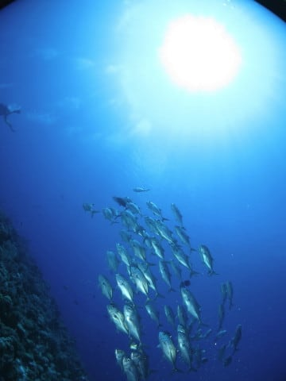

よーし，よーし．

群れに近づけそうだぞ…

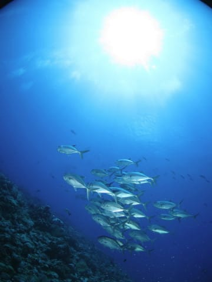

ここまで近づけた～！！

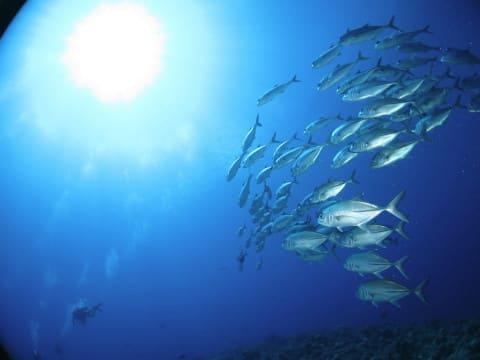

って感じで．

群れを見送ったあとは…

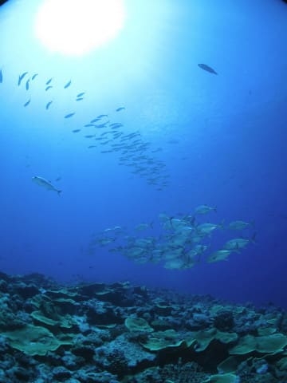

ヨスジフエダイやら

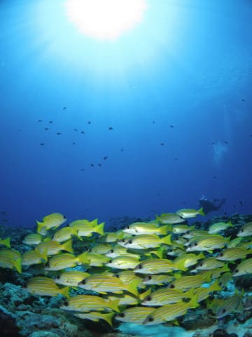

ツムブリの群れなんかがいたけど．

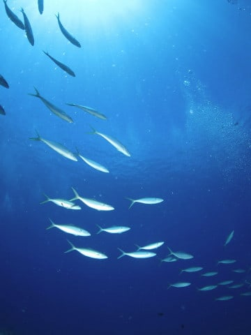

…流れが弱かったからか．

魚がそれほどおらず…

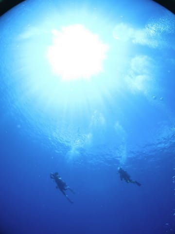

残念ながら，この程度で．

5m安全停止をして，エグジットです…

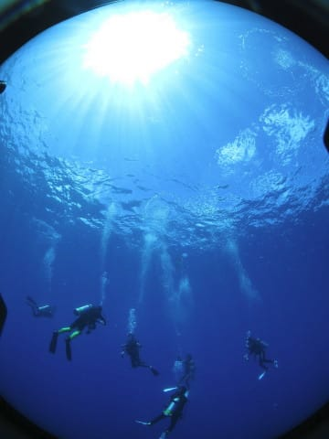

うーん．残念！！

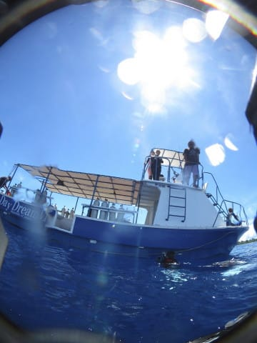

…でも．

普通のポイントなら．

このくらい魚が見られれば十分

…って気もするんですが．

このレベルでも，

「あんまり大したことなかったね」

と言われてしまうのが，

ブルーコーナーのすごいところだなぁ…
