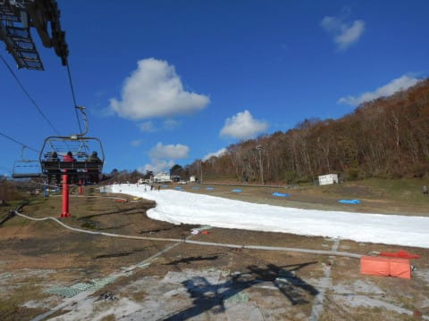

# 2019/11/10(日)のイエティ詳細…ゲレンデ幅はちょっとだけ広がって，リフト待ちも少なかったよ

📅 投稿日時: 2019-11-13 01:42:53

🏷️ カテゴリ: [2020スキー滑走日記](c282e9230de179e245c7334eabeb0a3b3.md)

えー．

昨晩，Blogを書く前に力尽きて

寝てしまったため．

今さらながらの感がありますが，

本日は，11/10(日）のYetiの

詳細レポートです…

ってなことで．

日曜夜の速報で書いたように，

すっきり晴天で始まった日曜日．

あさイチ…

と言っても．

海外出張帰りからの

ご無体スキーだったため，

営業開始から1時間ちょい経った，

朝9時過ぎにゲレンデに出たわけですが…

雲一つない快晴！！

…でも．

9時過ぎの時点で，もう雪は

ちょっと荒れ気味になっていて．

この写真では分かりにくいけど，

結構コースは凸凹してました…（ちょっと涙）

うーむ．

朝9時台で，なぜこんなに凸凹

してるのか…

朝8時から9時までの，ガラガラ

ゴールデンタイムが終わっている

時間だったので．

すでにリフト待ちもそこそこありましたが…

でも，まぁこれで3分待ち程度かな．

ってな感じで．

朝9時過ぎは，それでもまだ

コース上の人が少なかったのですが…

でも．

10時を過ぎてくると…

ううーーーん．

ちょっとゲレンデの人口密度が

高くなってきましたね（涙）

そして，リフト待ちの列も伸びて

来ちゃいました…（泣）

で．

リフト待ちが5分を超えて伸びてきた

午前10時20分ごろ．

クワッドと並行してかかる，

青のリフトが動き出しました！

…こちらのリフトは，

リフトの乗り降りで，ゲレンデまで

多少歩く必要があるので，

人気が無く．

この日は一日ずっとガラガラで，

ほぼ飛び乗り状態でした～！

ってなことで．

リフト待ちは，このあとは

最大でも5分程度，平均的に

3分程度と，短縮したのですが．

…でも．

2本のリフトで，ゲレンデに人が

送り込まれるようになった結果…

…残念なことに，ゲレンデの人口密度が

かなり上がっちゃいました（涙）

とはいえ，先週より心持ちコース幅も

広がったし．

先週や先々週のように，コースに穴が

あいて，取れるラインが限られることも

なく．

まぁ，飛ばして滑るには危ないけど．

まだシーズンインしたばかりだし．

基本的な練習をしながら滑るには

問題ないレベルだったかな…

…しかし．

昼ごろには一旦減ったリフト待ちも…

午後2時を過ぎると，再び人が増え始め，

ゲレンデの人口密度はピーク状態に（涙）

そして．

午後になると，コース上にゲレンデ整備用の

雪山を作り始め，コース幅が狭くなるので，

さらに滑りにくくなってきちゃいました…（涙）

…普通のスキー場は午前が人のピークなのに．

Yetiはやっぱり，午後が混むスキー場ですね…

で．

雪の状況ですが．

この日は晴天で日差しが強かったけど．

最高気温は10℃行くか行かないかという程度で，

比較的肌寒さを感じるほどだったので．

雪の表面はしっとりしてきてたものの，

ドロドロに溶けて緩むほどではなく．

コースの雪は，夕方まで比較的しっかり

していて，良かったかな～．

今週は，16時のナイター前

コース整備直前になっても，

ゲレンデの雪の厚みは十分で．

茶色くなってたのは，リフト乗り場

直前の，ここだけでした…

ってな感じで．

この日は，朝の出遅れを取り戻すべく，

昼休みも取らずにひたすら

滑り続けてしまい．

コース整備の16時まできっちり

滑ってきました…

…さすがに，

今日ナイター滑ったら，帰り道の

運転で死ぬかも

と思ったので．

ナイター開始の17時を待たずに，

コース整備しているゲレンデを後にして，

素直に帰ったのでした…

ナイター滑らずに帰るなんて，

なんと大人の対応なんでしょう！！

ってなことで．

ちょっとずつ，コース幅と雪の厚みが

増えてますが．

…まだ，相変わらずの紐ゲレンデのYetiでした…

まぁ，でも．

リフト待ちも，ペアリフトに乗れば完全0だし．

リフト待ちストレスなく滑れるのはいいかな～．

で．

天気図を見ると，今週14日夜から15日いっぱい，

結構冷えそうなので．

来週は人工降雪機でゲレンデ幅が広がった

Yetiを滑れるかな…？？
