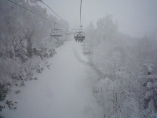
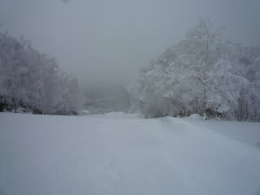
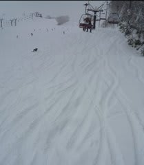
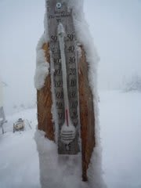
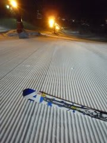

# クリスマスの志賀は

📅 投稿日時: 2010-12-25 22:05:43

🏷️ カテゴリ: [2011スキー滑走日記](ca488c98cfb9169941c3e73770dcefb56.md)

相変わらず降り続けてます．

ただ，夜中の積雪はそれほどでもなく，10cmほどでしょうか…

朝から強く降り始めました．

景色は完全に真冬です．

志賀高原の上り坂，かなりの車がスタックして，詰まっている

みたいです…

雪道になれてない方はご注意を．

で，朝イチの一の瀬メインバーンは足首パフくらい．

昨日ほどは楽しくなかった…

しかし．

今日からフードクワッドが動き出した西舘山は

かなりいいコンディション．

非圧雪バーンはひざパフ．

日中は降ったりやんだり．

時々強く降ります．

気温は寒いよ！！！！

昼間の最高気温がマイナス10度を下回ってます．

焼額の第1ゴンドラも今日から動き出しましたが，

雪の量は十分．

何で今日まで運転できなかったんだろう？

って不思議なくらい．

リフト待ちもそれほどなかったですね～．

とりあえず．

今日もシマシマバーンのナイターまで，十分楽しんできました．

PS．この寒気は正月まで続きそう…
