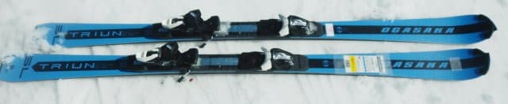
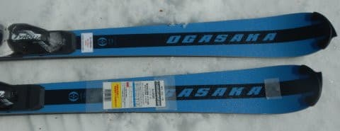
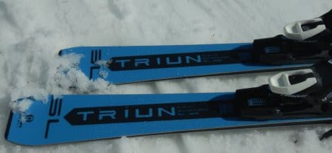
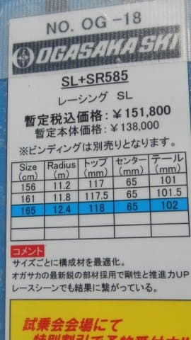
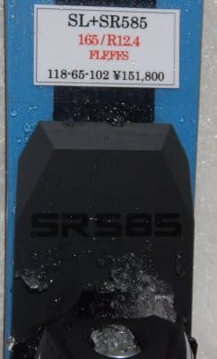
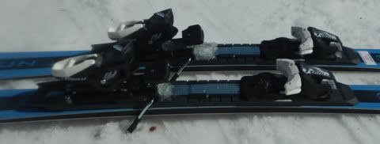

# 2023シーズンモデルのスキー板，試乗レポートその27…OGASAKA TRIUN SL + SR585

📅 投稿日時: 2022-07-15 03:42:02

ってなことで，物欲に敗れ

デジカメとスマートウォッチを

買ってしまった，Skier_Sです．

…しかし，今週末は3連休だったか…

3連休…3日間のんびりしたいけど，

今日もこの時間にBlog更新してる

ようだし，絶対無理だろうなぁ（涙）

でも，せっかく買ったデジカメと

スマートウォッチを使いたいし，

一日くらいは山歩きに行きたいな…

と思っていたら．

この3連休，ずっと天気悪そう（泣）

最終日の18日は，何とか降らないで

いてくれるかな…

でも，山の上は雲がかかって視界が

悪そうなので，山歩き日和じゃ

なさそうな予感…（涙）

とりあえず．

今日もそろそろ外が明るく

なり始める時間に更新！

今回も2023シーズンモデルのスキー板

試乗レポート，

今日はオガサカ編です．

では，どうぞ～！

○OGASAKA TRIUN SL + SR585　165cm

SL競技用．

オガサカのSL競技用はSLとSの2種類が

ありますが，こちらはトップモデルのSL，

プレートはSRプレートとFMプレートが

選べるようですが，今回試乗したのは

強いSRプレートがついている方です．

オガサカのSL競技用としては最も

強い組合せとなります…

ちなみに，試乗板はチロリアの

FreeFlexテストビンディングがついて

ました．

ってなことで，滑ってみると…

意外なことに，[NORDICAのSLR](eda8e52c160f5554bcbe2dd094ed8d456.md)よりも

柔らかく感じる…！

手強い板を覚悟していたのに，

ターンしやすく，普通のゲレンデでの

小回り板として十分行けますね…！！

結構気持ちよくたわんでくれて，

たわみに乗ってスルスル回ってくれます．

そして，テールの張りがあるので，

ターンの仕上げで板の抜けがよく，

リズム良い反動がもらえる，

ゲレンデで小回りするのに気持ちいい

感じの板です．

そして，板なりに回っちゃう板じゃなく，

谷回りで自由に板を動かして狙ったラインに

板を運ぶこともできるし．

春の雪の荒れたバーンで飛ばされるような

時でも，それほど重さを感じず

動かしやすいので．

荒れた雪で吹っ飛ばされた時も，

飛ばされたあとにズラシを入れながら

切っていき，たわみを出しながら山回りに

入れていくというリカバーもできる！！

荒れたバーンを滑っていても，

板が叩かれる感じもなく荒れた斜面を

乗り越えても行けるし．

これ，グリップ力も張りもそこそこある

わりには，かなり扱いやすいよ！！

TCよりテールの張りが強く，返りが

強め…っていう差はあるけど．

もしかしたら…TC-SUと変わらないくらい

ゲレンデでも使える小回り板かも…？？

やはりSL用ということで，実際の

重量はちょっと重めであるものの．

履いた感じは軽快に感じるし．

荒れ荒れ春雪のゲレンデ用としても，

問題なく滑れちゃう！！

SL競技用ということで覚悟していたより

扱いやすく，悪くないかな…

と思ったけど．

お値段もTC-SUと全く同じなんですね…

うーん．

だとするとやっぱり，ゲレンデで

履くにはTC-SUの方がいいかな？
