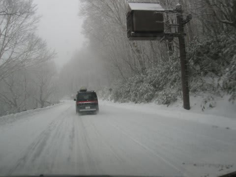
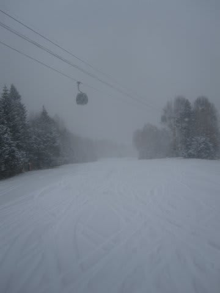
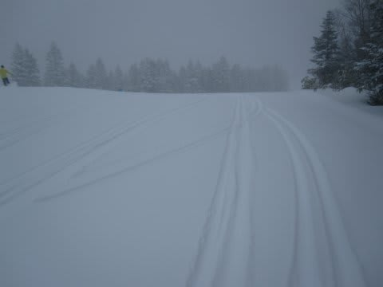
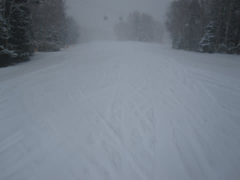
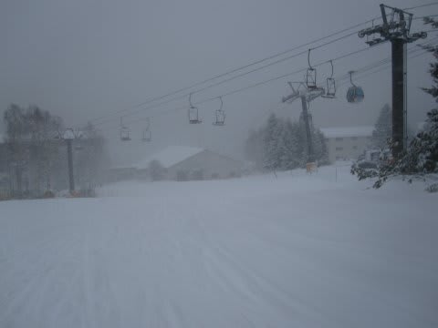
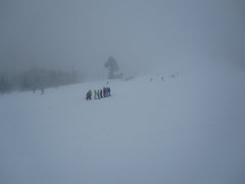
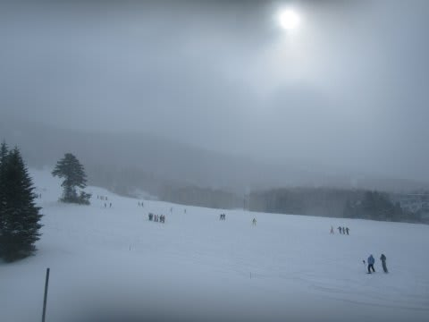
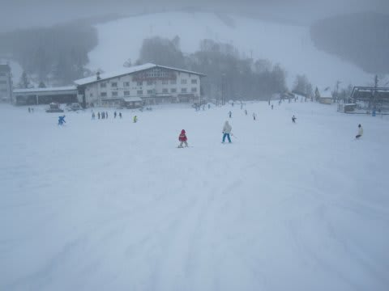
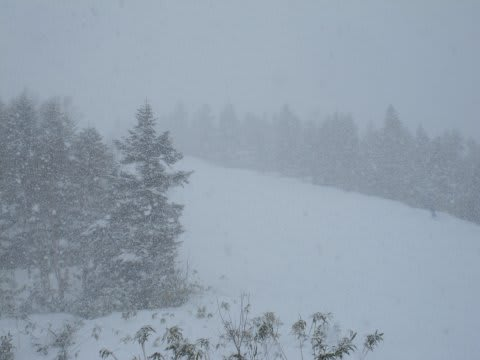

# 12月1日の志賀高原レポート…焼額ゴンドラ動いたよ！

📅 投稿日時: 2012-12-01 22:25:49

ということで．

予告どおり，志賀高原に来ています．

あー．

朝から大雪でした．

当然，道路はこんな感じで完全雪道モードです．

信州中野の街中までなんともないんですが…上林チェーンベース

を超えるとかなりの新雪がつもってますので．

ご注意を．

で．

今朝は．

予告どおり，8時半から焼額第2ゴンドラがうごきました！

帰ってきたよ～．焼額ゴンドラっ！

ってことで，ゴンドラで山頂に上ってみると…

そこに待ち構えていたのは．

トップシーズン並みのパラダイス．

圧雪の上に，20cmほどのパフパフ新雪！

そして，コース幅いっぱい滑走可能っ！

積雪も十分，ブッシュも出ていないっ！

これは，完全トップシーズンのコンディションではないかっ！

…例年の，ペアリフトしか動かない焼額オープン日とは

えらい違いだ…

初日からこんな幸せでいいの？？

コースふもとまで，雪はたっぷり．

まったくちっともこれっぽっちもブッシュは出てません．

新しい板でもぜんぜんOK！

そしてさらに幸せなのは．

ゴンドラ待ちはほとんど0です．

がらがらです．

幸せすぎます．

ちなみに，一の瀬はこんな感じ．

ペアリフトの短いほうしか動いてません．

待ち時間は，10-20人，リフトに列がつく，って感じでしょうか．

ゲレンデもレッスンが多く，ちょっと込んでます．

コース幅いっぱいに滑れそうに感じますが…

ペアリフト側の半分くらいで，それより向うは規制されていました．

みたところ真っ白で滑れそうなんですがね～．

一の瀬の上部は必死に人工雪つけてました．

んで．

今日一日，ものすごい勢いで降りましたね～

今日だけでも，軽く20cm以上積もりましたね～．

車はもう完全に一日で埋もれちゃうくらい．

おかげで，昼ごろにはコースは結構荒れてでこぼこに

なってきましたが．

それでも，12月上旬でこれだけ滑れれば，幸せすぎ…

ちなみに志賀高原．

夜10時半現在も，かなりの勢いで降り続けています．

＃そのうえ一の瀬は，夜中じゅう人工降雪機を動かしてますね～

明日の日曜は，天気も回復傾向だし．

明日は最高のスキー日よりだっ！

＃明日も焼額滑ってる予定
