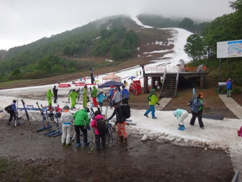
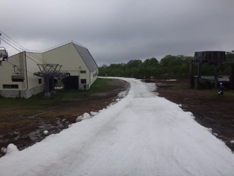
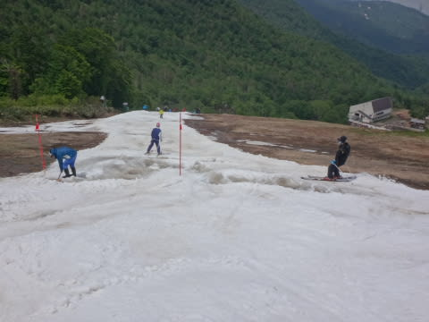
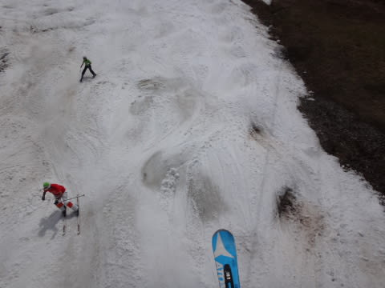
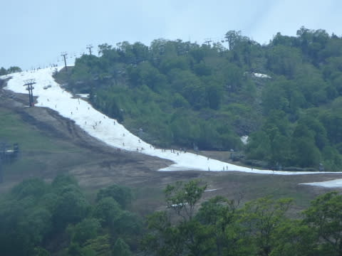
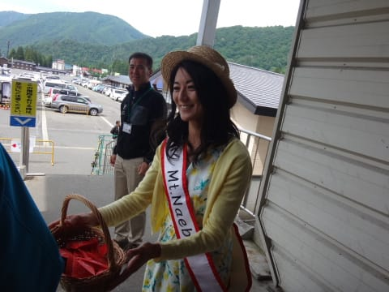

# 5月31日，2015シーズンファイナルかぐら…すごい．すごいよ．これで滑れるのが，すごい！

📅 投稿日時: 2015-06-02 01:21:57

🏷️ カテゴリ: [2015スキー滑走日記](c09ea645cfc085f86dfcd80f49599dd89.md)

ということで．

昨日速報した，かぐらファイナルデー．

本日は，詳細レポートをば…

えーー．

まずは，朝．

8時から営業開始だったのですが…

…8時時点の天気は．

なぜか，雨（涙）

だれだ～！

明日，明け方にかけて，雨が降るかもしれないけど．

リフト営業時には止んでいるはず！

とか書いたやつはっ！！←自分だろ（自己突込み）

＃実際に雨が止んだのは10時頃…予想より2時間遅かった（泣）．

とりあえず．

雨のおかげで．

ロープウェーはガラガラ…

で．

今週からは，ロープウェーを降りてからゴンドラまで，

バス移動になったため，ロープウェーはバスの出発に合わせての

運行で，バス定員の50人ずつの乗車でした…

そして．

ゴンドラに乗ってやってきた，かぐらゲレンデ．

…

…

え？

これは…

気のせいでなければ．

なんだか．

すごい雪が減ってるように見えるのですが…っ！？？

もう，ペアリフトは．

板を脱いで乗るようになっちゃってました…（悲）．

リフト降りてからゲレンデまでもこんな感じ…

ペアリフトは悲惨だけど．

さすがにクワッド乗り場に向かう道は，ちゃんと雪がついていて…

クワッド乗り場までは，廊下状態ながらも，

板を履いたまま乗れます！

良かった…

（ってか，フード付きクワッドに板を脱いで乗る状況って想像したくない）

でも，降り場も廊下状態でした…．

せめてもの救いは．

雨が降ってるってのもあり，リフト待ちが無かったってことか…

でも．

クワッドリフト上がった山頂は…

あうーーーん．

ガスか…（涙）

ガスではっきり前が見えなのは悲しいけど．

表面が雨で洗われたおかげで，

張り付く雪にならず，板が滑ってくれるのが救いかな…

コースは，かなり幅が狭まってますね～（激涙）

で．この狭いコース上の雪．

朝のうちは，ところどころ硫安でカチカチになってました…．

でも．

まだ，この時間は良かったのだ．

幅が狭いと言えフラットで，雪の上を滑れただけ良かったのだ．

午前10時ごろには，雲があるものの雨は止み．

ちょっと人が増えてきたかな？？

そして，10時過ぎには，うっすらと日が！

ガスもすっかり上がり，ゲレンデに日が射すようになって

来たのはいいんですが．

…でも．

この時期の太陽は．

はっきり言って，ありがたくないんですね～．

日が射して，人が増えるってことは…

だんだんゲレンデが荒れていくってことで…

…なんだ，この人口密度は？？

…だんだんコースが凸凹になっていく…

そして．

11時ごろには…

え？

ええええっ！？？

これ…

この上，滑るんですか？？

もう．

ゲレンデ…というか，雪のあるわずかな幅の帯の上には，

ところどころスキー場係員が総出になり…

雪着け作業をして，何とか滑れるようにしようと

必死の努力を続けてます…

もう，なんというか．

作業を止めるとあっという間にまた土が出てくるので．

そこかしこで，ひたすら雪付けを続けてくれるわけですが．

…でも．

ゲレンデは．

昼過ぎには，雪と一緒に土が練りこまれた，

なんだかわけのわからないものの上を滑る状況に…

ということで．

さすがの私も，午後2時前に退散…

いやー．

しかし．

よく，今日まで営業したな～！！！！

＃そして，よくこんな状況で，ここまで人が来るなぁ…←やはり，何かの怨念に憑りつかれた人じゃない何かかも！？？

ってことで．

ゴンドラに乗って下山するけど…

ゴンドラ下の下山コース．もう，全然雪がない…

ホントにここ，3日前まで滑れたのか？？

そして．

ゴンドラを降りてからは，バス→ロープウェーと．

ゴンドラに乗ってからロープウェー山麓まで，1時間コース…（涙）．

ロープウェー山麓に到着すると，ファイナルデー恒例の抽選会を

やってますね～

ミス苗場からくじをもらって…

ん？

なんか，当たったらしい…

…お菓子が当たったようです…

っつーことで．

この日まで，意地でもコースをつないで営業したのは立派っ！！

…というより，かぐらスキー場のすごい根性を感じる…

という感じの，かぐらファイナルだったのでした…
