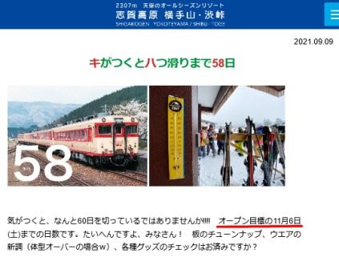

# え？志賀高原の横手山スキー場，今シーズンは11月6日オープンなの！？

📅 投稿日時: 2021-09-15 01:37:25

えー．

本日．

志賀高原の横手山のホームページを見ていたとき…

思わず，

「え？ええええ！！！？」

と叫んでしまったのですが．

…なんと．

今シーズンの横手山

11月6日オープン

を目指しているようです…！！！

（[横手山ホームページ](https://yokoteyama2307.com/news/16030/)より）

昨シーズンから人工降雪機を導入した

横手山ですが．

いや…さすが横手山とはいえ，

比較的日当たりのいい南東斜面の海和

ゲレンデ．

アイスクラッシュ無しの普通の人工

降雪機で，はたして11月6日までに

滑れるようになるだけの雪を

着けられるのか！？？

昨シーズンは，11月14日にオープンした

ものの，11月16日に雪が解けてしまい，

翌日からまた営業中止…という感じ．

これよりさらに1週間早いオープンを

目指すとは…っ！！

すごい．

まぁ目標値ということで，実際のオープンは

厳しいかな…と思ってしまいますが．

もしこれが可能なら，間違いなくアイス

クラッシュ以外のスキー場で，日本一早く

オープンですね！！

ぜひ，実現してほしいところ！！！

しかし．

どうでもいいけど…

残り58日をキハ58にこじつけるのって，

分かる人は少ないのでは…

なんでキハ58？？

あ，そうか．

キハ58のエンジン換装車って，古いDMH17

からカミンズ社のDMF14系にエンジンを

載せ換えてて．

圧雪車，ピステンブーリーのエンジンも

同じカミンズ社製インタークーラー

ターボディーゼルだから…

そのつながりかな？？←違うと思う．そしてちょっとマニアックすぎる

## 💬 コメント一覧

### 💬 コメント by (小布施のおもち)
**タイトル**: Unknown
**投稿日**: 2021-09-19 00:21:17

初めまして。いつも楽しく拝見しております。

まだ信越本線が碓氷の峠越えをしていた頃、上野から長野にかけて特急｢志賀｣という急行列車が走っておりました。

はるか昔の記憶なもので間違ってるかもしれないのですが、信越本線から長野電鉄に乗り入れて湯田中まで行ってた気がします。

その列車がキハ58系だったかもしれません。

しかし、碓氷の峠越え対策で違う型式だったような気もします。

以上、雑学披露でした(*^^*)

いつもS様の知識には感服しております。これからも楽しく読ませて頂きます(*^^*)

### 💬 コメント by (Skier_S)
**タイトル**: ＞小布施のおもちさま
**投稿日**: 2021-09-19 04:45:19

私の認識では，急行志賀は169系電車での運行だった気がしたので，

しらべてみたら…

確かに，1961年終わりから1963年初めまでの2年間ほど，キハ58系のキハ57で

運行されていたようです！！

知らなかった…

ちなみに，キハ58に碓氷峠アプト線（1961年は碓氷-軽井沢間はアプト式）を通過する

能力を付加したのが

キハ57です…

車体もエンジンも同じで台車だけ違います．

