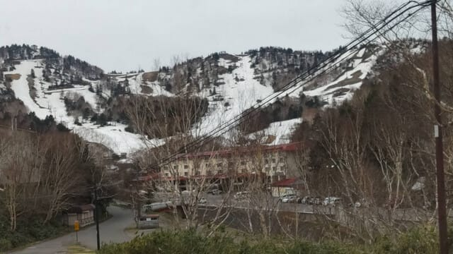
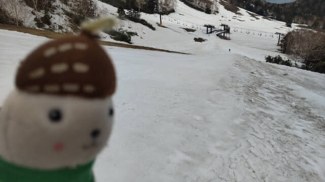
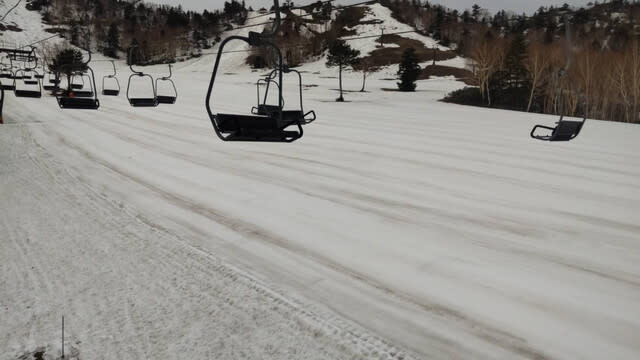

# 果たして明日は滑りに行けるのか？？…明日の朝考えよう…

📅 投稿日時: 2025-05-10 01:23:52

🏷️ カテゴリ: [日記](cc4b5682fb7b8b144980957a978653fb0.md)

ということで．

今日の昼に，今日の熊の湯スキー場の

特派員レポートをお送りしましたが…

本日の熊の湯の写真が，おこみん特派員

からも送られてきました～！！

うーん．

まだかなり雪があるように見える熊の湯スキー場．

今日の昼のレポートにも会ったように，まだ

馬の背コースが滑れるし…

第3緩斜面も行けるし…

第2緩斜面はまだまだ幅いっぱい滑れて，

この時期に時々出てくる水たまりも

なさそうな，いいコンディションに見えます…！

…しかし．

山頂からのコース，今日の雨に耐えるかな…

明日はそもそも強風でリフトが動くか

微妙だし．

リフトが動いても，雨でやられて

山頂からは滑れないかも…

ちなみに，今は志賀高原もかぐらも

雨が降ってるっぽい…

果たして明日，無事リフトが動くのか？

日帰りでスキー場に行って，

一日リフトが動かないと悲惨なので，

明日の朝，天気を見てリフトが動きそう

なら移動しようかと考えてますが．

リフトが動くことが確定してから

家を出たら，スキー場到着は昼近くに

なっちゃって，全然滑れないし…

悩ましい．

とりあえず，明日朝…というか，これから

3時間後に起きて，滑りに行くかどうか

考えます～！！

しかし，今週滑りに行けなかったら

かなり辛い（泣）

日曜の用事が無ければ日曜に滑りに

行けるのに…（涙）
