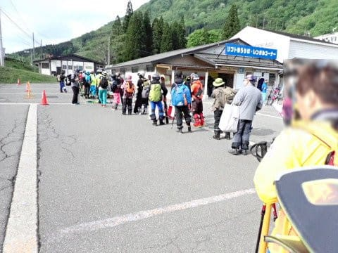
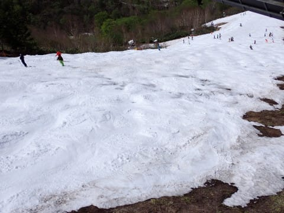
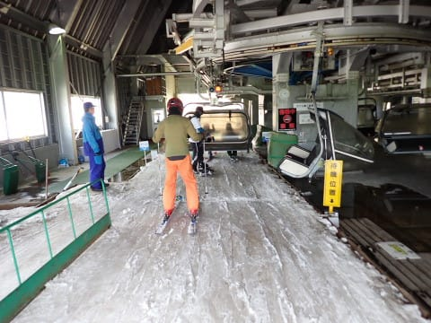
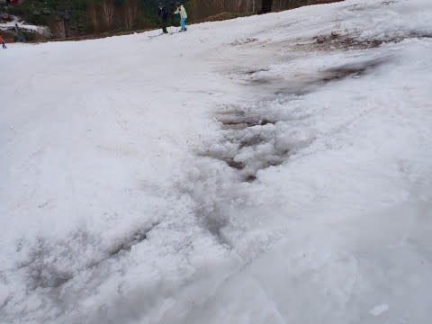

# 2024/5/12(日)のかぐらスキー場ファイナル，詳細レポート！…雪は薄くかなり土が出ていたけど，コース幅はまだそこそこあってまだあと何日かいけそうだった…

📅 投稿日時: 2024-05-14 01:14:53

どうやら本日一日悪天候で，

横手山は営業見合わせだったようですが…

この雨でも雪は大丈夫だったのかな？

とりあえず，明日は営業予定との

ことなので，雪は無事残ってくれた

ようですが…

今週末までもつかな？

ってなことで．

昨晩速報レポートした，12日の日曜，

今シーズンの最終営業日となった

かぐらスキー場の詳細レポートです！

まず．

朝7;30からのロープウェー営業開始

10分前くらいでこのくらいの待ち．

待っている人数はピークに比べれば

圧倒的に少ないけど，

かぐらまでの移動に使うペアリフトの

輸送人数分しかロープウェーに乗せないので，

結構待たされて，ロープウェーに乗れたのは

7時45分でした…

駐車場もがら空きなので，今日は人が

少ないことがわかりますね…

で．

ロープウェーの山頂についたら，

キャリーサービスに板を預けて…

そこから，リフト乗り場へ歩き．

まずはみつまた高速リフトに乗車．

みつまた高速リフトに乗ること5分ほど．

リフトを降りたら，今度はペアリフトに

向かって歩き…

今度はペアリフトに乗車．

基本的に一人ずつしか乗せず，

輸送力が低いので，

ここの輸送力に合わせロープウェーの

乗車人数を絞ってます．

で．

ペアリフトで降りて，ゴンドラ乗り場へ

向かい…

ゴンドラ乗り場前でキャリーサービスに預けた

板を受け取ります．

そしてゴンドラに乗りますが…

基本的にペアリフトで送られる人数しか

来ないので，待ち時間はほぼ無し．

ゴンドラに10分ほど乗り…

ロープウェーに乗ってから1時間ほどの

長い旅路の果てに，やっとゲレンデに

到着です！

うーん．

しかし，GW翌週でこれだけしか雪がない

ってのは…

今シーズン，4月の高温でかなり雪が

融けたんだなぁ…(泣)

で．

いつもはかなり雪がヤバくなる，

ゴンドラを降りてからクワッドリフトまでの

部分は…

意外と雪が残ってますね！！

リフト乗り場前の雪もまだそこそこ残ってて．

ファイナルとしては，まだ余裕が

ありそうな感じ…

朝のうちのリフトは，ペアリフトで送り込まれる

人数しかゲレンデに来ないので，ガラガラ！

ただ…

リフト上からコースを見ると．

メインバーンは幅が半分以下に

狭くなってますね…(泣)

でも，この写真も一見コース幅が狭そうに

見えますが．

真上から見ると，このくらいの幅があるので…

そこまで狭い感じはないです．

リフト降り場付近も，まだ雪はわりと

残っている感じで．

リフトを降りてからしばらくの緩斜面は，

まだかなり幅が広いよ！！

うーん．

例年のファイナルに比べれば，

かなり雪が残っている感じ…

ってなことで．

ロープウェーの7時半営業開始前に

並び始めたというのに．

やっと8時50分ごろに1本目！！

朝から雪は柔らかかったものの，

曇り空で日が射さなかったので

雪はそこまでひどく緩んでなくて，

人も少ないので荒れておらず．

見ての通り，滑ってみるとコース幅も

普段のファイナルの日に比べれば十分広く．

雪の滑りも良かったので，

数本は気持ちよく滑れましたよ～！

…ただ，1時間も経つと．

雪が結構柔らかかったこともあり．

さらに，ペアリフトの輸送力で制限

されるのでゆっくりだったとはいえ，

確実にコースに人が送り込まれて

来るので…

コース上の人口密度はすごいことに

なった上．

この人数で柔らかいゲレンデの掘削作業が

進められていくため…

11時ごろには，コース全面，コブが

育っていきました…

そして．

コブが育っていくとともにコブ溝に

現れ始める，ヤバげな茶色いエリア…(涙)

さらに昼12時ごろには，曇りの天気予想を

裏切って日が射し始め．

日差しで雪が融けていくのと，

雪が柔らかくなり掘削作業の

効率が向上したので…

12時を過ぎると，かなり激しい

コブに成長してきました(泣)

いや．

いいんですよ．

全面コブになるくらいはいいんですよ．

雪が薄いのに，コブが深くなっていくため，

コース上のデンジャラスエリアはかなり

広がっていき…

うん．

これはヤバい感じ…

横一列，どこのコブの溝に入っても

やられるパターンですね．

石が出てないところを探して

横切らないと危ない場所が2か所ほど．

ここを上から見るとこんな感じ．

そして，リフト乗り場付近も…

真ん中に穴が開き始めてきてます(泣)

ただ，コンディションが悪化したからか．

午後はリフトはほぼ飛び乗り．

せいぜい待って搬器2-3台と，

リフトはガラガラ！

このデンジャラスゾーンを滑るよりは

帰ろう…

という人が結構いたんでしょうね．

午後2時過ぎになると…

コース上の人は，結構少なくなって

来ましたね…

とはいえ，かなりコース上のデンジャラス

ゾーンは広がっていき．

写真で見えるところ以外にも，雪が融けて

石が浮いているところも多数あり，

結構注意して滑らないといけない感じに…

でも．

営業終了時の15時半になっても，

例年のかぐらファイナルのように

コース途中が切れかけるような

ことになる場所もなかったし．

営業終了時になってこれだけ

しっかりした幅で雪が残っているのに

ファイナルって，ちょっともったいないな…

と思いつつ．

いつもなら帰りに混むみつまたペアリフトも，

今日は人が少なかったからほぼ待ち0で

載れることにホッとしながら．

行きの道を逆ルートでたどり，

はるか1時間かけて駐車場まで戻ったの

でした…

ってなことで．

かつては5月最終週まで営業してくれた

かぐらが，今シーズンはGW後の週の

1回しか滑ることなく，5月上旬で

終わってしまったのでした…

うーん．

2019年とかは，5月26日の

5月最終週でもこんなだった年が

あったというのに…

だのに，今シーズンは5月第2週で

終わるとは…

残念…
