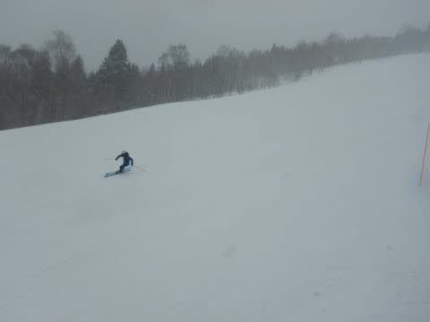

# 2020/3/14(土)の志賀高原スキー場は…一日雪降り，ザクザク雪の上に新雪でちょっとバーンコンディションは良くなかったかな（涙）

📅 投稿日時: 2020-03-15 00:21:09

🏷️ カテゴリ: [2020スキー滑走日記](c282e9230de179e245c7334eabeb0a3b3.md)

ってなことで．

本日も志賀高原で滑っていたわけですが．

本日の志賀高原．

昨日の予想通り，

終日雪降り

の一日でした…（涙）

まず．

朝の志賀高原への登り道．

ほとんど雪がなく，今日朝にちょっと

積もった雪が路上に乗ってるだけ…

気温も高めで，ツルツルに凍っては

おらず．

うーん．

今日のゲレンデ，そんなに良くないかな？？

と，やってきました，焼額第1ゴンドラ．

今日はいつもより15分早め，8:15からの

オープンだったせいか，いつもより並んでいる

人がちょい少なめだったかな…

そして，営業開始と同時にゴンドラに

飛び乗り，山頂にやってきましたが…

今日は雪降りの天気ですね．

で，山頂の気温-5℃！

思ったより冷えてますよ！

ってな感じで．

朝イチシマシマに飛び込む！

わけですが．

「あれ？？

　おもったほど，雪が良くない…」

一見．

締まった雪の上に，うっすら数㎝の新雪が

積もり．

GSコースなんか，結構いい感じに

見えるんだけど…

実際は，カバーしている新雪の下．

結構ザクザクした感じの，まだ固まりきってない

春雪って感じで．

ちょっと快感度は低め…（涙）

そしてさらに．

雪不足でブッシュが出始めたのに．

うっすら積雪でどこがブッシュか

分からなくなり危険…

ということで．

本日はオリンピックコース，クローズ（泣）

で．

それ程ひどい降りではないものの．

雪が降り続け．

さらに，ところどころガスで，

ちょいと滑りにくい感じで…（涙）

さらに，コース上の人も，ちょいと増えて

来たので．

うーん．これは，4人乗車に制限している

第1ゴンドラ，混みそう…

…

……と．

今日も，ホームゲレンデの焼額に

ちょっと後ろめたさを感じつつも．

また今週も，奥志賀方面へ

ちょっとだけ様子を見に来ました～！

いや．

ちょっとだけ．

ホントにちょっとだけですから…

ってなことで．

第2高速ペア沿い，奥志賀エキスパートコース．

焼額よりは下地が荒れておらず，滑りいいよ！

朝のうちは，人も少なく，フラットバーンの

ライン取り放題！！

リフトもほとんど待ちがなく．

人の少ないゲレンデを，好きにかっ飛ばせるよ！！

…ただ．

本日は天気がよろしくなく．

時折ガスったり，雪が強く降り始めたり…

だもんで．

視界が悪くなることはありましたが．

本日，雪が降り続けたおかげで，

奥志賀では，下地の硬いザラメは隠れて，

いい感じ滑ることがてきました…

で．

雪も結構降り積もって来たので．

奥志賀がガラガラな本日．

うーーーむ．

もうそろそろ，焼額の雪も回復して．

ゴンドラも混んでないんじゃないかな…？？

と．

昼頃に，

ホームゲレンデ焼額に戻ったところ．

をを！

コースはもうヤバいくらいに

ガラガラですね…！

そして，ゴンドラも．

ほぼ待ちなく，飛び乗りですね…！

うーむ．

コロナウイルスの影響か．

お客さんは，先週より圧倒的に

少なくなって．

普段の3月の週末ではありえない

ガラガラさですね…！

気温も，昼間になっても⁻4度と，

朝からほとんど上がらず．

そして，ゲレンデには冷えた雪が，

午後になっても積もっていき．

午後3時ごろには…

圧雪コース上も，結構積もってきましたよ…！

ただ．

朝から新雪が10㎝弱ほど積もった

ゲレンデは．

ちょっとモサモサしてきて．

そして，急な部分は，ところどころ

下地の硬いところが出てきている

ところもあり…

午後のゲレンデは，モサモサ雪と

カリカリがところどころ入り乱れた，

ちょっと滑りにくい感じに（涙）

…でも．

ちょいと滑りにくいとはいえ．

外出を自粛している人も多いこの

ご時世もあり．

とても3月の週末と思えない，

ガラガラで，好きなライン取り放題の

ゲレンデを．

今日もゴンドラ終了まで，

滑り倒してきたのでした…

で．

この調子で明日まで降り積もって

くれれば，明日のゲレンデコンディションは

よさそうですが．

志賀高原の夜9時頃には，すっきり星が

きれいに見える晴天になってまうす…(涙）

まぁ．

夜の積雪はそんなになかったのは

残念ですが．

今日，柔らかい雪が降り積もってくれたので．

明日の朝イチはいい感じのシマシマで

スタートできるんじゃないかな～．

うーん．

でも．

先週火曜の雨のおかげで．

先週末からぐっと雪が減ってしまったので．

出来れば明日の朝までに，1mほど

積もってほしいんだけど…←無理だから

## 💬 コメント一覧

### 💬 コメント by (m&t)
**タイトル**: Unknown
**投稿日**: 2020-03-15 02:32:21

終礼サボりました!ごめんなさいm(_ _;)t

ウェアに穴が空いたので、奥ゴン終了後フェニックスに行って来ました!19日にまた参戦予定です。

### 💬 コメント by (ほっぽ)
**タイトル**: 昨日
**投稿日**: 2020-03-15 06:22:20

Ｓさん

昨日は珍しいエキスパでご挨拶できましたね。

私はサンバレーまで旅に出ましたが、どこも空いててガラガラでした。

昨日の滑走記録はblogにアップしておきました。

今日も朝イチ宿から出動します。

http://www2.tokai.or.jp/nana_hoppo/

### 💬 コメント by (AK)
**タイトル**: Unknown
**投稿日**: 2020-03-15 08:02:55

S様

昨日朝イチ声掛けさせて頂いた者です。

お近づきの印ありがとうございました。

昨日のバーンは下手くそ家族連れには厳しいバーンでした(涙)

また来週迄に新たな積雪を期待して雪乞いせねば

### 💬 コメント by (m&t)
**タイトル**: Unknown
**投稿日**: 2020-03-15 11:46:45

19日ではなく20日でした!寝ぼけてました。

### 💬 コメント by (Skier_S)
**タイトル**: 今日は最高だったよ！
**投稿日**: 2020-03-16 01:29:56

＞m&tさま

終礼欠席は残念…

しかし，ウエアに穴ですか！

次は20日，3連休にお愛しましょう！

＞ほっぽさま

いや…ヤケビゴンドラの乗車定員制限いらい，ちょっと1ゴンが混むので，

いつも午前中はエキスパートに逃げちゃいます．

しかし，今日もまたお会いしましたね(笑)．

＞AKさま

お声がけありがとうございました～！

土曜のバーンは厳しかったですね…

日曜は最高でした！！

また来週，志賀高原でお会いしましょう！

