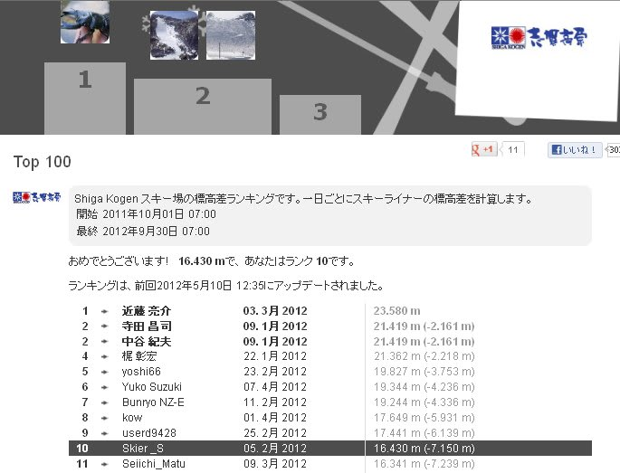

# 志賀高原シーズン券終了…Skilineの結果はいかに？

📅 投稿日時: 2012-05-11 02:33:09

って感じで．

志賀高原の今シーズンのシーズン券利用期限が終了したので．

[Skiline](eb2a0029115b8205c8168295e2d9d49ef.md)のデータもこれ以上更新されることはないわけで．

…今シーズンの結果は如何に？？

と，見てみたところ．

今シーズンの志賀高原での一日滑走標高差ランキングは，10位という結果でした…

まぁ，私より上位の人は2人を除いてすべて一の瀬ファミリーぐるぐるパターン．

焼額オンリーで滑った場合，物理的にこれ以上稼ぐのは不可能に近いと

思うんで，ホームゲレンデが焼額の人間としては，まぁよくやったかと…

しかし．

一日奥志賀ゴンドラぐるぐるで私より上位に行っている人が

いるんだけど．

この人，4分50秒とか5分とか，そのペースで奥志賀ゴンドラ

1本滑り続けてるという…

物理的に可能なのかなぁ？

まぁ．

でも，

私より上位の人を見ると．

ほぼ毎日，一の瀬ファミリーぐるぐるをやっているらしく．

滑走50日以上で，一日平均滑走標高差が10000mを余裕で超えている人もいたりして．

…世の中，人間とは思えない人もいるもんだ(感動)．
