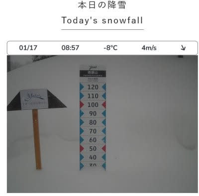
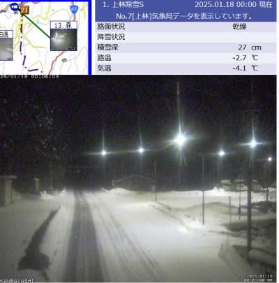

# 1/17(金)の志賀高原スキー場は積雪30cm，根性の無いスキーヤーふるい落としデーだったみたいだけど，この週末は晴れ！

📅 投稿日時: 2025-01-18 00:44:22

🏷️ カテゴリ: [日記](cc4b5682fb7b8b144980957a978653fb0.md)

ということで．

予想通り本日の金曜は一日雪降り

だったようで…

朝は積雪30cmほどだったようですね！

（[焼額山スキー場ライブカメラ](https://www.princehotels.co.jp/ski/shiga/livecamera/)より）

昼間も横手方面は運休するリフトが

でるほど風が強く，ゴンドラも減速

運転になるほどだったようで…

それで雪が降り続けていたので，

今日は予告通り，

根性の無いスキーヤーふるい落としデー

だったようで．

風が強かったのは予想に書いて無く，

積雪も想像よりちょっと多かったけど，

まぁ予想はおおむね当てたのかな…

で，深夜0時過ぎ現在，まだ志賀高原は

ちょっと雪が積もっているようですが…

（[北信建設事務道路気象状況カメラ](http://hokushin.pref-nagano-roadcamera.jp/)より）

この雪は朝までに止み，

朝は雲が多めかもしれないけど，

リフト営業開始のころには晴れますよ～！

土日とも晴れますよ～！

…ちょっと気温が上がりそうなのが

気になるけど…

日曜の朝の気温が-7～8℃くらいに冷える

かも，という以外は，土日の天気は水曜の

予想から変更無しです～！

ってなことで．

この週末も志賀高原に行ってきます～！

…てか，もうあと2時間半後に出発

じゃないか…

また今日も2時間しか寝られない（泣）

## 💬 コメント一覧

### 💬 コメント by (Unknown)
**タイトル**: Unknown
**投稿日**: 2025-01-18 18:38:33

根性ってなんだよ。行きたくても行けない人、自身のレベルを鑑みて止めた人もいるだろ。

### 💬 コメント by (Skier_S)
**タイトル**: Unknown
**投稿日**: 2025-01-18 23:03:01

いますよねぇ…

私もこの日は行きたくても仕事でスキーに行けなかった一人ですから（涙）

