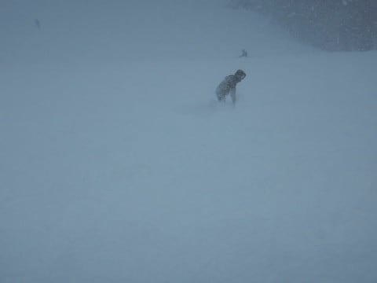
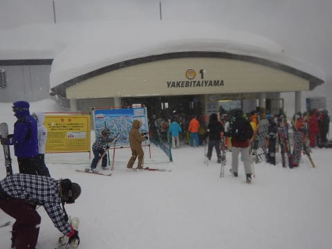
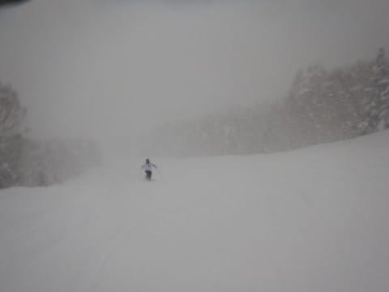
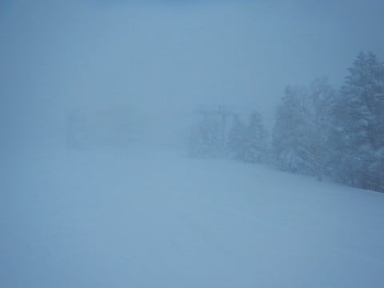
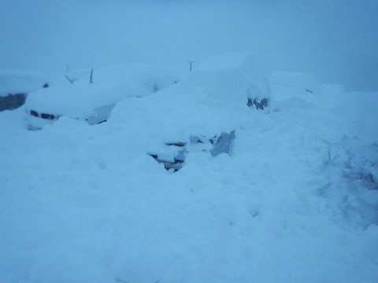

# 1月3日の志賀高原，焼額山スキー場は…荒天で運休やら営業開始が遅れたりしたけど…朝イチは腰パフ！終日パフパフデー！

📅 投稿日時: 2018-01-04 03:04:12

えー．

本日の志賀高原．

荒れ荒れ天気でした．

むちゃくちゃ降りました．

終日パフパフデーでした！

…まず．

昨晩から激しく降り続けていた雪は，今朝になっても…

すごい吹雪（涙）

一晩でむちゃくちゃ雪が積もったようで…

宿を出たところから，いきなりひざパフです．

この吹雪のせいで，

奥志賀は全面運休．

一の瀬，高天ヶ原は高速リフトが動かず．

東館山ゴンドラも運休．

そして．

焼額も．

第2ゴンドラ運休．

第1ゴンドラは30分遅れの9時営業開始予定，

それ以外のリフトは除雪＆コース整備完了後，

逐次オープン予定．

ということで．

第1ゴンドラは，営業開始が30分遅れたうえ．

運休の奥志賀や第2ゴンドラから人が流れてきたので．

オープン待ちの長い列が…

実は，昨日の夕方故障した第1ゴンドラ．

今朝まで修理して，ギリギリ直ったようで…

きわどかった．

直ってよかった…

とりあえず．

定時から30分遅れの9時にオープンした1ゴンで

山頂に出ると…

気温は-15度！

今シーズン一番の冷え込みだよ！！

…そして，吹雪いてますね（涙）．

朝に圧雪したコースも，ブーツパフ状態！

こんな日は太板の本領発揮だっ！

で．

当然，オリンピックコースへ突撃だ！

パトロールさん曰く．

「オリンピックコース，圧雪と非圧雪の境目に

　壁があるから注意して！

　いきなり腰くらいの雪に突っ込むので注意して！」

え？？

私もかなり長いことスキーをやってきた

つもりでいたけど，こんな注意初めて聞くよ…

そして．

非圧雪エリアに突っ込むと．

確かに圧雪からいきなりの太ももパフに突っ込む！

注意を聞いていたはずなのに，

壁の生贄になりつんのめる方々…

そして．

まだ誰も滑ってないフレッシュパウダーの

オリンピックコースは…

太もも～腰パフ！

今シーズン一番のディープパウダー！

最初の1本目は，完全浮遊パウダーっ！！

前が見えなくなるほどの．

口に雪が入ってくるほどのパウダーだっ！！

もう，昇天モノ…

シアワセすぎて，気分は天国へ登ってます…

風が強かったからか，ちょいと重めの

感じだったけど．

でも，シアワセ！

…だけど．

シアワセもオープン後1時間ほど…

10時になると，オリンピックコースも人が増えてきて．

凸凹荒れ荒れ斜面になり果てて行きました…．

すごい勢いで雪が降り続けるので，

雪面が見にくく．

荒れてくると雪面の凸凹がわからず，

かなり滑りにくいのが，残念…

で．

奥志賀も全リフト・ゴンドラが動かず．

第2ゴンドラも運休のこの日．

第1ゴンドラは混むんじゃないか…

と心配してたけど．

こんな日に滑ろうという人はそれほどいないのか．

ゴンドラ待ちはそれほどではなく．

最高でもこんな感じで，ぎりぎりゲートの外まで

人が並ぶか…という程度．

タイミングによっては，待ちがゼロの時も…

どうしてこんな楽しいパフパフパウダーデー

だというのに．滑ってる人がこんなに

少ないんだろう？？←普通の人はこのような日をパフパフパウダーデーと呼ばず，吹雪と呼ぶ

結局この日は．

終日こんな感じの天気で…

終日激しく雪が降り続け，

風も強く吹き…

でも．

そのせいで．

まさに終日パフパフデー！！

コース脇や人が入らないコースは，

圧雪コースでも，午後までパフパフ！

…とても圧雪コースとは思えない…

だもんで．

本日はラストまで太板の実力発揮！

…しかし．

本日は天気が激しすぎたからか．

志賀高原のほとんどのリフトが予定より早い時間に

終わってしまい…

焼額も，

普段なら16時までのゴンドラが15:45に終了，

16:15までのリフトが16:00に終了…

と，早めの営業終了（涙）．

でも．

最後の方は．

さすがの私も

「これ…何の修行？？」

と思うほど，あらゆるものが凍り付いていく

激寒の強風の中滑っていたので．

まぁ，早めに終わってよかったのかも…

ということで．

16時に営業終了してしまった本日．

さて．

滑り終わったし．

車を動かしましょうか…

…

…

これが我が車か…（激涙）．

どこに車があるか分からんレベルだよ（泣）．

リフトストップまで滑ったあと．

吹雪の中，1時間以上発掘作業するとは

思わなかったよ…（涙）

とりあえず，発掘作業の結果…

脱出成功！

ルーフボックスの上の積雪が，

ここ数日の雪のすごさを物語ってますね…

ってことで．

吹雪の中，志賀高原を下山して．

今晩，一旦帰宅しましたが．

…志賀高原は，明日の朝も，

かなりのパウダーデーになりそうです…

明日，志賀に登る方は道路もかなりの積雪だと

思うので，ご注意を…

いやー．しかし．

今年は良く降るなぁ…

もしかすると．

2シーズン前の冷え冷え踊りが，ものすごい時間差で．

今，強烈に効いているのかもしれない…←違うから

## 💬 コメント一覧

### 💬 コメント by (はっち)
**タイトル**: Unknown
**投稿日**: 2018-01-04 13:12:38

なかなかのコンディションでしたね。

GSはあまり滑らなかったので、お会いできず残念です。

我が車もオブジェと化してました。

### 💬 コメント by (つーちゃん)
**タイトル**: Unknown
**投稿日**: 2018-01-04 13:15:48

4ロマも動いてたんですね、、、

乗ったら冷凍人間必至ですね

パウダー好きにはたまらない年始でしたね

かくいう私はパウダーが苦手なので

寒いし疲れるしで修行モードでした！笑

でもいいんですパウダーの楽しみが分かってしまったら

また板が増えてしまいますから←

### 💬 コメント by (Goku)
**タイトル**: 本日も
**投稿日**: 2018-01-04 15:10:15

今日1/4もパフパフ祭りでした。

オリンピックは膝、ミドルコースはもう少しあったかな～。

しかし、激寒で半日で切り上げ、既に自宅です（笑）

しばらく雪はいいから、今週末は青空の下で滑りたいです。

### 💬 コメント by (はなげ親分)
**タイトル**: 2シーズン前の冷え冷え踊り
**投稿日**: 2018-01-04 15:35:44

いやいや～

以外とそうかもしれませんよ～

なんて言ったって、あの時の全国の信者の魂を込めた踊りのパワーは巨大でしたから!!

巨大過ぎてどこかで詰まっていたのが、突如吹き出したのでは…

### 💬 コメント by (しんちゃん)
**タイトル**: 近畿はｸﾞｯﾄﾞｺﾝﾃﾞｨｼｮﾝでした
**投稿日**: 2018-01-04 16:53:26

発掘作業に１時間もかかるぐらいヤケビは降っていたんですね。すごーい(*_*)

帰省先より近畿のスキー場で滑っていましたが、雪がちらつきつつ日が差すという、なかなかのグッドコンディションでした。

また皆さんとお会いできるよう、体には気を付けて年始休暇を過ごしていこうと思います。

### 💬 コメント by (Skier_S)
**タイトル**: 中1日で志賀復活
**投稿日**: 2018-01-05 09:13:22

＞はっちさま

いや～、すごい天気でしたね…

車発掘するのに死ぬかと思いました。

今日から志賀復活してますので、

またお会いしましょう！

＞つーちゃんさま

いや～、パウダーも楽しいですよ！

ぜひ新しい楽しさを知って、物欲にはまってください！

＞Gokuさま

4日もかなり降ったのですね…

今朝は薄曇り。久しぶりの圧雪バーンです！

かなり柔らかい圧雪ですが…

明日は滑りにいらっしゃるのでしょうか？

＞はなげ親分さま

あれだけの怨念が詰まった祈りですから、

今まで詰まっていたのが一気に放出されるとなると…

これから毎週激冷え腰パフパウダーが楽しめそう

ですね！

＞しんちゃんさま

あら。志賀にはいらっしゃらなかったのですね…

次の志賀はいつですか？

またお待ちしています～！

### 💬 コメント by (まうちゅう)
**タイトル**: Unknown
**投稿日**: 2018-01-05 20:29:17

ゴキブリホイホイにならなくて済む程に軽い雪でしたね！

熊の湯よりヤケビの方がひと晩での積雪量が多いですね。

### 💬 コメント by (Skier_S)
**タイトル**: まうちゅうさま
**投稿日**: 2018-01-05 23:03:25

3日の雪より4日の雪のほうが軽かったのですか…

うーむ．

4日も滑ってみたかったです…（残念）

