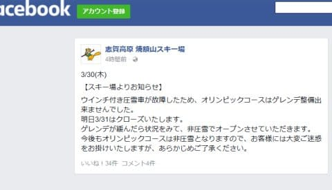
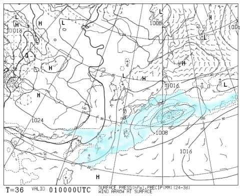
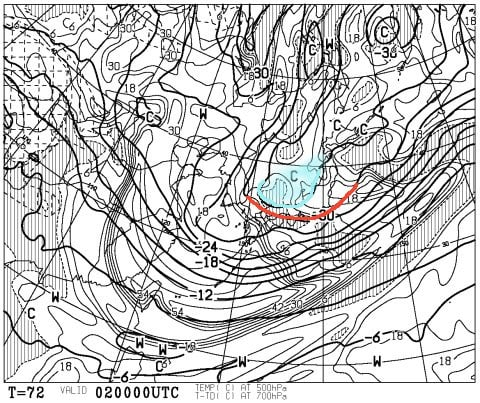
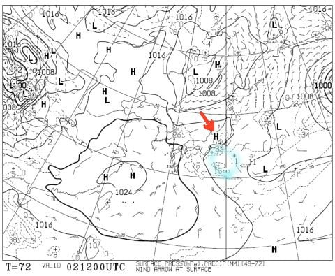
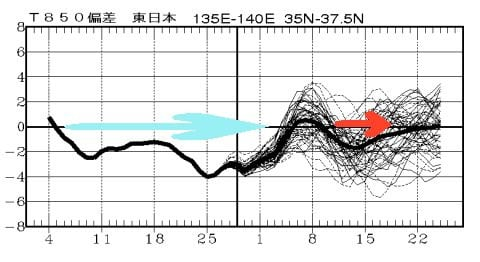
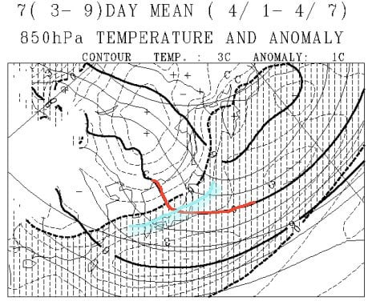
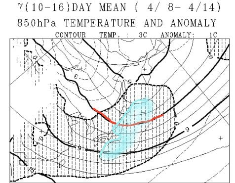
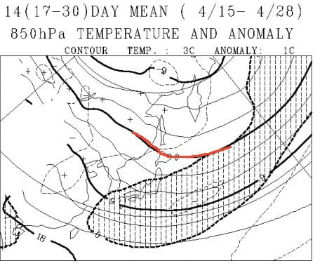

# ええ？もう4月！？スキー場の雪が良すぎて信じられないんだけど…4月も冷え冷えなのか？一か月予想図を読み解いてみる

📅 投稿日時: 2017-03-31 02:01:59

えー．

今日は，予想より気温が上がったのか．

志賀高原も，ちょっとしっとりした雪に

なっちゃったようで．

これから雪が降らなかったら，土曜日の朝は

ちょっと固めの雪面で始まりそうな今日この頃．

皆様いかがお過ごしでしょうか．

…で．

本日．

焼額山のFacebookを見てみると…

うむ？？？

な，なんだと？

圧雪車故障で．今シーズン残りはオリンピックコース

圧雪なし！？？

うーむ．

フラットなオリンピックコースを気持ちよく落下していくのが

好きなのだけど…（涙）

今週末が，今シーズンのオリンピックコース滑走

ラストチャンスなわけですが．

どうやらコブ斜面のラストオリンピックバーンになりそうです…

＃まぁ，雪不足で3月半ばにクローズしてしまった

＃昨シーズンに比べれば100倍マシだけど…

そして．

今週末の天気．

読みづらくなってきました…

なんてったって，土曜の天気図．

こんな見事な南岸低気圧なので．

わずかに低気圧の通過位置がずれると，

雪が降るか降らないか，全く変わります．

わずかに北にずれれば終日雪降り，

南にずれれば終日晴れで雪が降らず…

という感じなのですが．

うーむ．

きわどい．

昨日の天気図より，ほんのわずか低気圧が

北にずれたので．

今の天気図だと，土曜は朝から雪が降って．

終日雪がぱらつく天気かも…

でも．

もし．

土曜に通過する低気圧が，わずかに南にずれて

雪が降らなかった場合．

土曜のバーンは結構固めのバーンになっちゃいそうなので，

できれば雪が降ってほしいところ．

で，だ．

今度は，最新版の日曜の500hpa図を見てみると．

…なんだ！？？

この時期に，赤く線を引いた-30℃の寒気が関東近辺まで

下がっているんですがっ！？？

そして，志賀高原には水色で示した-33℃線が！

…これは…

この時期としてはありえないレベルの強烈寒気．

…分からない．

天気が読めない．

上空の寒気から言えば，雪が降ってもおかしくないけど…

この日の地上天気図を見ると，

こんな感じで．

赤矢印部分は高気圧がありますが．

水色で丸を描いた部分．

ここには「L」マークは無いものの．

ここにプチ低気圧が存在するので．

…こいつがもう少し北に行くと，

日曜も結構な雪になりそう…

日曜の天気，現時点では終日曇りって感じの天気図に

なってきましたが．

このプチ低気圧の動き次第で，

日曜は晴れになってもおかしくないし．

雪が降る可能性もあります…

うーむ．

雪が降るか，あるいは降らないか．

難しい…

とりあえず，分かっているのは

土日とも，4月とは思えない冷え冷えになる

ということが確実だということ．

降っても絶対雪．

それも，かなりいい雪質の雪．

雨にはなりませんので，ご安心を…

ってことで．

また明日，直前予想します～．

…さて．

で，ここからが本題なわけですが．

＃今回も，長い前フリだった…

そうなんですよ．

なんと！

もう，4月になるんですよ！

…今シーズンの志賀高原．

2月並みのゲレンデコンディションが続いているので．

もしかすると，今年はこのままずっと春が来ないのではないか？？

…ということを，信じてしまいかねない勢いなんですが．←んなわけない

そうですか…

もう4月ですか…

春ですねぇ…（涙）．

ってことで．

これからの春スキーシーズン．

＃今週末も冷え冷えなので，まだ春スキーシーズンという実感は全然わかないけど…

果たして，3月の奇跡の冷え冷えはこのあとも続くのか？？？

あるいは，これまでの反動で，一気に気温が上がるのか？？？

そのあたり，1か月予想図から読み解いてみましょう…

えー．

まず，FCVX14の，850hpa気温偏差時系列グラフですが．

水色で示した，3月5日あたりから4月3日まで．

一日たりとも，平年より高い気温に上がっていない

という，すさまじい冷え方．

いやーーー．

やっぱり，この3月は冷えひえだったんだなぁ…

で．この冷えが，4月3日まで続いた後は．

一旦気温が上がりそうです．

…でも，また赤矢印で示した，4月11日から17日ごろまで，

平年より冷えてる期間が続くので．

うーん．

まぁ，3月ほどではないにしろ．

この4月も，ちょっと冷え気味の4月になりそうで．

異常高温で一気に雪が消える

という危険性はなさそう…

はい．

おそらく．

今年のGWは安泰でしょう．

もう少し詳しく見てみましょうか…

FCVX12を読み解いてみると．

まず，4月1日～7日の期間は．

ふむ．

4月というのに．

赤く印した850hpaの0℃線は，まだ志賀高原にかかってますね～．

そして，水色で示した平年より1℃低い領域．

志賀高原はここに入っているので．

平年より冷える一週間になりそうですね～．

＃週間予想だと，6，7日は平年並みくらいまで上がりそうだけど

で．

その次の週．

4月8日～14日の期間は．

うーむ．

赤く印した0℃線，

東北まで行っちゃいますね…

でも，志賀高原は，水色で示した平年より1℃冷えている領域に

入っているので．

平年よりは冷えた一週間となりそう．

そして，4月15日～28日の2週間，4月下旬は．

さすがにこの時期になると，0℃線は

北海道くらいまで上がっちゃいますか…

大体，平年通りの場所に行っちゃいますね．

でも，志賀高原は網掛けエリア…平年より気温が低い領域に

入っているので．

まぁ，異常に高温になって，一気に雪が解ける心配は

なさそうです．

ということで．

去年の反動か，史上最高レベルの積雪量を誇る

今シーズンの志賀高原．

おそらくGWまで，かなり大量の雪が残ってくれそうな感じ…

GWまで，たっぷり楽しめそうです！

うーむ．

焼額がGWまで営業してほしかった…（涙）．

## 💬 コメント一覧

### 💬 コメント by (かず)
**タイトル**: 金曜の状況です
**投稿日**: 2017-03-31 17:10:23

朝8時に奥志賀ゴンドラ乗りました　山頂-6度　しかし昨日気温上昇してかなりぐちゃぐちゃになったと思われます　その結果10時前にBです　13時頃から雪パラパラしてきましたよ

### 💬 コメント by (arumama)
**タイトル**: 初コメ失礼します♪
**投稿日**: 2017-03-31 22:44:12

この記事にコメントして良かったのは謎ですが、タオ島ダイビング で検索してお邪魔しました〜ww

ダイビングカテ 半日かけて楽しく読破し、タオじゃなくてコモド行きたくなってしまい・・悶々としております笑

志賀高原がホームグランドなのですね〜。

群馬在住なのでスキー好きなんですけど・・ダイビングと両立は無理ですぅ ・・はぁ・・山にも行きたくなってしまった^ - ^

ボチボチとダイビング記事のUPも頑張ってくださいませ〜ww楽しみに待ってます。

### 💬 コメント by (Skier_S)
**タイトル**: 今週末は冷え冷え！
**投稿日**: 2017-03-31 23:36:36

＞かずさま

明日の朝までに，ちょっとゲレンデに雪がかぶりそうなので，

ゲレンデは少し改善するのかと…

でも，そんなに積もらなさそうなので

土日はちょっと固めのゲレンデになりそうな予感…

＞arumamaさま

初コメありがとうございます～．

私が行ったときは，たまたま天候が悪かったので，

タオのレポートはそんなに楽しいものに

なってませんが…

私も真のタオの姿が分かっていません（笑）．

コモドも5年以上前の情報なので，ちと古いです．

今もあのままの海だといいのですが…

＃船は完全に変わっています

スキーは志賀高原がホームグラウンドというか，

もう生息地です（笑）．

ぜひスキーにも行ってみてください．

7月に入ると夏モードなので，ダイビング記事を書き始めます…

今年の夏はどこに行こうかな～．

パラオ再訪できるといいなぁ，と思ってますが．

お財布が…（涙）．

