# 2019年8月，座間味で小6の娘と親子ダイビング！その14…ダイビング3日目のお昼休みは，運悪く雨（涙）

📅 投稿日時: 2020-07-07 02:15:12

🏷️ カテゴリ: [ダイビング日記](ce3a7a8d424d112fce83ee85c81a0e344.md)

…結局この週末も，どこにも行かずに

家でずっと過ごしていたのですが．

先週，先々週と久しぶりにお出かけをして．

外に出かけて朝早くから活動すると，

すごく一日が長く感じるのですが．

家に居るとついつい昼過ぎまで寝てしまうので，

一日が異常に短い感じ…

ってか．

出かける週末は睡眠時間2-3時間だし．

出かけない時は睡眠時間12～13時間で，

睡眠時間で一日10時間短くなっているわけ

なので．

短く感じて当たり前なのですが…

しかし．

何もしない週末．

ホントに何時間でも寝てられる，この体．

何かおかしんじゃなかろうか…

ということで．

本題のダイビング日記です！

ーーー

ってなことで．

晴天の中の2本目のダイビングを終えて．

これで，午前のダイビングは終了です…

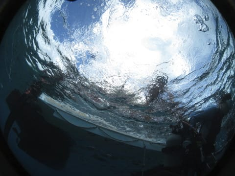

2本目終了後．

ボートはお昼休みのポイントへ

移動します…

…そうです．

いつもの嘉比島の，ガヒビーチ！

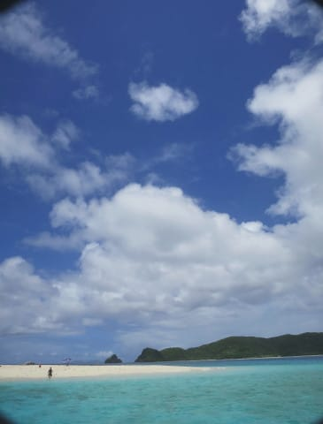

…かなりの確率で，ザマミセーリングさんは

お昼はここに立ち寄りますが．

ホントにここ，景色がよくて．

きれいなビーチ！

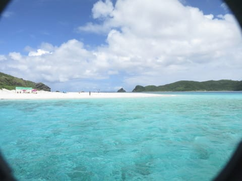

そして．

お昼ご飯はいつも通り，ペンション星砂さんで

作ってもらったお弁当．

これで3人分ですが…

星砂さんの夜ご飯と同じ感じで，

ボリュームたっぷり！

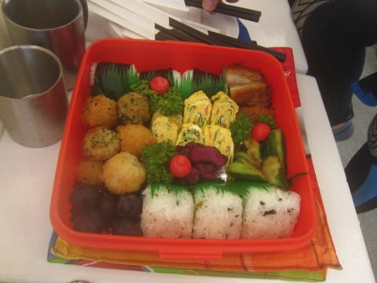

これで一人500円はお得…

このお弁当を，こんないい景色を

堪能しながら食べられるんだから．

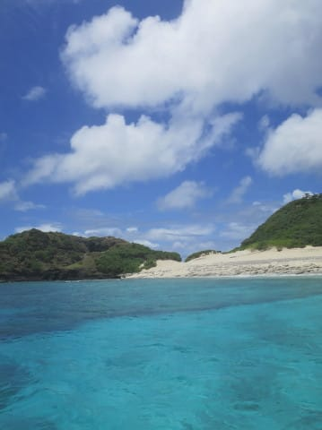

もう，ザ・夏休み！

って感じですね…

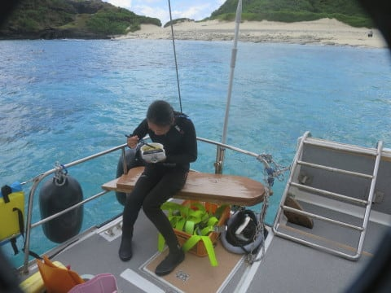

どうやら，ダイバーが食事中に，

体験ダイバーで乗船しているゲストが，

体験ダイビングをやるようですが…

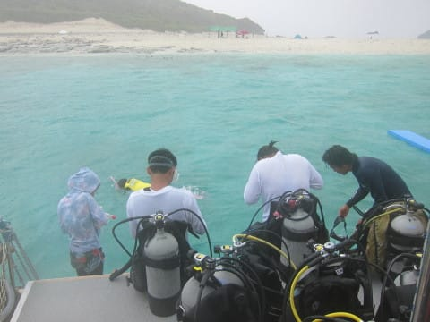

娘も，[今から2年前は体験ダイバーだった](e16a591663b668a6e76bba8c275430ea1.md)なぁ…

と．

わずか2年前のことながら，懐かしく

思い出しますね…

と，体験ダイバーを見送ったあと．

急いでお弁当を掻き込んだ娘．

いつも通り海で遊び始めましたが…

なんだか，空が一気に掻き曇り，

暗くなってきましたね…

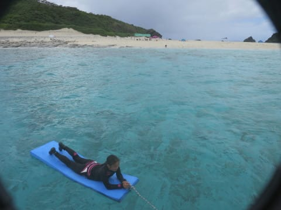

…と，思ったら．

いきなりの豪雨！？？

すごいスコール！！

海面をすごい勢いで雨粒が叩いてます！！

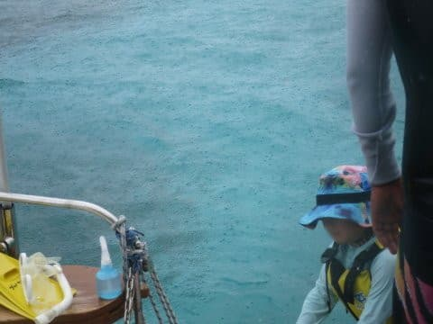

…が．

雨にも関わらず，遊び続ける

子供たち…

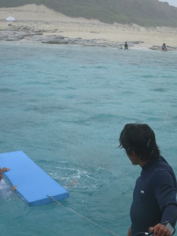

まぁ，海に入っちゃえば．

濡れるのは一緒だもんね…

でも．

しばらくすると，黒い雲の隙間から

日が射してきて…

雨が降ったのはわずかな時間でした．

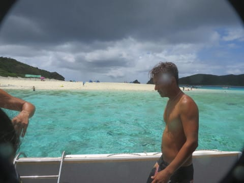

が．

食事が終わって，子供たちが遊んだ時間に

ちょうど雨が降りはじめ，

雨が上がったころに，ちょうど昼休みが

終わる時間という感じで．

「なぜ，子供たちが遊ぶ時間だけ

　ちょうど雨になる？」

という，狙ったかのようなバッドタイミングでの

雨でした…（ちょっと残念）

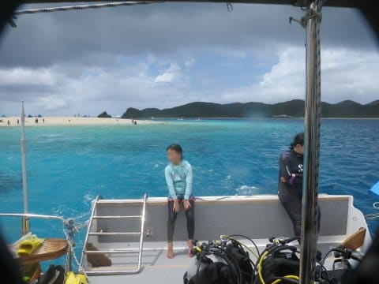

ってなことで．

ボートは本日の3本目のポイントへ移動します…
