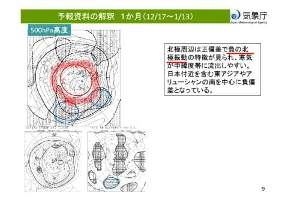

# 焼額山スキー場，17日からの第2高速運転決定！！そして18日の日曜は志賀高原でも積もりそう…

📅 投稿日時: 2022-12-16 02:54:57

🏷️ カテゴリ: [日記](cc4b5682fb7b8b144980957a978653fb0.md)

実は先日，エキップの社長さんより

驚きのニュースを聞いたのですが．

オーストリア製となり，[試乗でかなり
良いフィーリング](e365707c42944ab9a8c0597cc8d39d1c6.md)だった2023シーズン

モデルのFISCHERのRC4 SC．

どうやら今年5月か6月ごろにウクライナ

工場が復活したらしく，今シーズン

モデルは，ウクライナ製とオーストリア製

が混ざっているそうです．

うーむ…

ウクライナ製とオーストリア製の性能に

違いが無ければいいのですが…

話題は変わって．

昨日，今週末オープンするかも？という

アナウンスがあった，焼額第2高速．

正式に，17日(土)のオープンが決定しました～！！

（[焼額山スキー場ホームページ](https://www.princehotels.co.jp/ski/shiga/informations/20221215/)より）

今週末から，焼額山はペアリフトと

高速クワッドの2本が滑れます！！

…でも，そろそろゴンドラが動いて

欲しいんだけど…

…そして．

本日の最新の天気図を見ると．

18日の日曜の天気図が結構すごいことに…！

18日夜9時の地上天気図を見ると…

日本海側に降水域が広がっているのが

見えますが．

これを拡大すると…

水色に塗った部分．

降水量53mmや47mmといった，

帯状に降水量の高いところが連なって

いますね…

これは，シーズン中でもそうそう

見ることができない強烈なJPCZ！！

ここまで強烈なJPCZが出ると，

普通なら豪雪レベルですが…

ただ…ちょっとこのJPCZ，東に

たなびきすぎてます（涙）

志賀殺しの東風っぽい．

もう少し北風に押されて南に

流れるJPCZになるようだったら，

志賀にめちゃくちゃ積もるんだけどな…

でも．

志賀殺しの東風だけど．

この日の500hpa気温図を見ると．

大雪の目安の-30℃線が志賀に近づいて

来ています！！

この，500hpaの-30℃線が志賀にかかると…

西風でも，根性のある雪雲が北アルプスを

越えて志賀高原にまで達するので．

志賀高原でもまぁまぁ積もるパターン！！

18日の夜までに，志賀では20cmほど積もって

くれるかな？

西風じゃなければ，もっとすごい積もる

パターンなんだけど…（涙）

とりあえず．

18日は一日，激冷えの雪が降る，

根性の無いスキーヤーふるい落とし機能が

発揮される一日になりそうです．

この雪は，19日まで降り続けますね…

19日の月曜か20日の火曜には，

焼額もゴンドラが動かせるほどの

積雪になりそうな感じ…

ってなことで．

例年にないスタートが遅い12月上旬

となった今シーズンですが．

今後はリカバリーがあるのか？？

それとも，このまま雪が少ない日々が

続くのか…？

恒例の木曜発表の，気象庁の1か月予想を

見てみましょう！！

とりあえず，1か月の傾向を見てみますが…

…なんだか．

先週までと違って，確率の高い部分が

枠で囲われてますね…

で．

東日本日本海側の降雪量ですが…

赤く括ったところを見ると．

なんと平年より多くなる確率が70％！！！！

…これは，積もる．

これから1か月は，雪が積もる予想です！！

さらに，気温傾向を見ると…

東日本は，全期間を通して気温が高くなる

確率は10～20％と低く．

平年並みかそれより低くなる確率が

高いですね…

激冷えではないまでも，12，1月が

平年並み以下なら．

志賀なら激冷えです！！

気温傾向を見ても…

今後は平年並みかそれ以下の気温が

続きそうで．

11月下旬の当たりに見える，平年比+5℃を

ピークとする激烈高温時期みたいな

異常高温になる心配はなさそう！！

1か月予想を見てみると．

負の北極振動

という，スキーヤーにとっては

ちょっと嬉しいキーワードが見えて

ます…！

この逆の

正の北極振動

は，[ここ](e5bde56aeb97978df16133d718c475baf.md)に書いたようにスキーヤー殺しですが…

（詳しくは[この資料](https://www.jma.go.jp/jma/press/2001/24b/r01shousetsu.pdf)などを参考に…）

負の北極振動は，かなり冷えて

雪が多くなるパターンです！

うむ．

これからしばらくは．

負の北極振動で冷えてくれるという

1か月予想なので．

これから1月上旬までは安心だな…

と思いたいところだけど．

2週間前の1か月予報を見てみると…

3～4週目になる12月17日～1月2日は

平年並みかそれ以上の高め気温と

予想していたわけですが…

（2週間前の予想）

それが今週の1か月予報では．

その期間は，

平年より気温が高くなる可能性は低い

という予報に変わってしまっている

わけなので．

気象庁の1か月予報の3-4週目の予想は

占い程度の信頼性だと思って

見ておくのが良い

ということを心にとどめて置いて．

この予報に安心せず．

今シーズン，1月も冷えるといいなぁ…

と，願い続けましょう…

## 💬 コメント一覧

### 💬 コメント by (ノーザンレインボー)
**タイトル**: Unknown
**投稿日**: 2022-12-16 06:18:09

Sさん

FISCHERのRC4 SCの情報、衝撃的ですね。私のSCも今週末に引き取りなので、良く確認しておこうと思います。乗り味が試乗会の時と違ってたら嫌ですね。また昨日のコメント欄で来週の平日の天気予想、ありがとうございます。年内期限の強制有休が１日残ってるので、20日に決めました。今シーズン初の志賀高原、楽しみです。

本当にこのブログには感謝しかありません。

### 💬 コメント by (愛読者)
**タイトル**: Unknown
**投稿日**: 2022-12-16 07:58:00

Ｓさんに憧れてSCを買いましたが、カタログ通りウ製でした。まあ、ウクライナ支援になったと思って諦めました。エキップさんはパイロット版の窓口だからオーストリア製なのかなとおもっていました。

### 💬 コメント by (レインボー改めブラボー75)
**タイトル**: Unknown
**投稿日**: 2022-12-16 15:21:44

金曜日の志賀高原情報

朝の上林0℃小雪、蓮池-5℃雪。

四ロマは圧雪の上に朝から降り始めた新雪が8センチ程。めっちゃ快適です。仕事してる場合じゃないですよ。雪も気持ち良く降ってくれてます。寒いけど。

でも、その快適も永遠には続かないのが世の常というもの。密度が濃くなってきたところで終了。今日から赤の軍団(大阪の指導員さん)がご来志賀ですよ。

### 💬 コメント by (おおすぎ)
**タイトル**: Unknown
**投稿日**: 2022-12-16 15:27:34

S様

わたしも、Ｓ様スキーレポートに乗っかり、近所の〇ンダハーに、（割引き）ハガキを持って、見に行きました・・・

やはり、ウクライナ製造でした・・・

店員（バイト風）に聞いてみたところ・・・

知らないっすね～（爆）

泣きながら、家路に就きました・・・

### 💬 コメント by (真美子)
**タイトル**: Unknown
**投稿日**: 2022-12-16 16:09:57

変形成股関節症で、右股関節が曲げると激痛。自然とかばい痛くない様にしながら生活をしています。

人口間接センターの医師は「人口股関節にしたらスキーは絶対にダメ」と言うので、私は痛み止で、股関節痛と付き合いながら、スキーをします。

28日から2泊3日、ちんたら焼額で滑っていますので、是非声をかけていただけると嬉しいです。

### 💬 コメント by (Skier_S)
**タイトル**: 今週末も無事滑りに行けそう
**投稿日**: 2022-12-17 00:21:45

＞ノーザンレインボーさま

そうなんですよ…SCの話，衝撃的でした…

ウクライナ製がオーストリア製と同じ性能であることを願いましょう．

今の天気図のままなら，志賀高原は20日が当たりだと思います！！

＞愛読者さま

やっぱり，ウクライナ製でしたか…

試乗板は昨年2月ごろの板なのでまだウクライナ工場が止まっており

オーストリア製でしたが，エキップさんでも製品として入ってきたのは

全てウクライナ製だったみたいです…

まぁ，ウクライナへの応援ということで！

…しかし，憧れる相手をちょっと間違えてますよ~！！と，ツッコミを入れちゃいました(笑)．

＞ブラボー75さま

新雪8cmですか！

意外と積もりましたね…(まだ足りないけど)

そうか…明日の焼額は団体さんいっぱいで混みそうですね(涙)

＞オオスギさま

やっぱりウクライナ製ですか…

でも，オーストリア製かウクライナ製か気にしている人は世の中

ほとんどいないと思います…

というか，そんなこと知っている人はまずいないと思います(笑)．

＞真美子さま

股関節が痛いと，スキー大変ですよね…

というか，それ以前に生活も大変だと思います．

無理せず，痛みと付き合いつつスキーを楽しんでください．

私はまだ年末のスキーの予定は未定です…

### 💬 コメント by (高橋昭)
**タイトル**: Unknown
**投稿日**: 2022-12-17 11:05:26

ちょくちょく読ませて貰ってます。

今しがた一ノ瀬に着きまして、この後ファミリーで滑りますが、明日はヤケビの唐松コースへ。シーズン序盤に、あの斜度変化がとても練習に良く、気に入ってます。

私は月曜までいるので、明日からの大雪に期待してます(^_^)ノ

### 💬 コメント by (Skier_S)
**タイトル**: 高橋昭さま
**投稿日**: 2022-12-18 00:08:05

コメントありがとうございます～！！

明日は焼額なんですね．

私も焼額滑っていると思います…

もし見つけられたらお声がけください！

