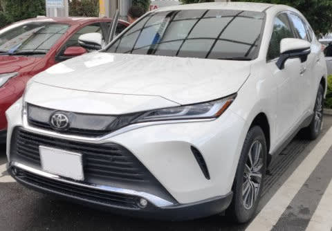
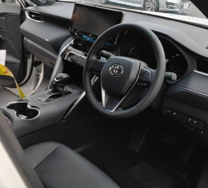
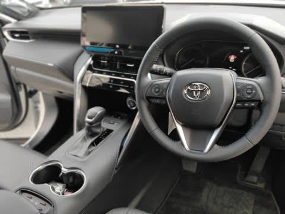
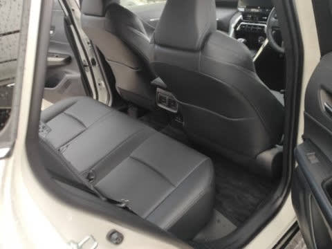
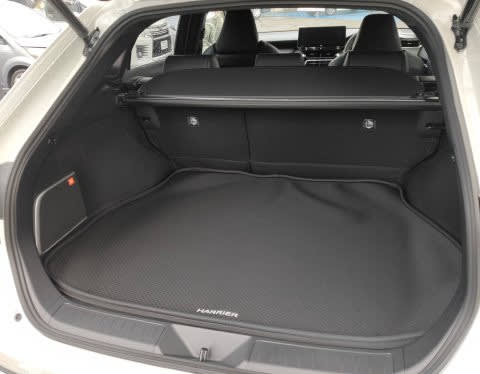

# TOYOTA新型ハリアーの，ガソリン2Lに乗ってきた

📅 投稿日時: 2020-07-31 00:19:00

ということで．

どこにも行く予定の無い週末の日々が続く

今日この頃．

今度は近所のトヨタに試乗へ行ってみました…

いや，ハリアーがフルモデルチェンジしたから，

ちょっと見に行ってみようかな，と…

試乗車は，残念ながら2Lガソリン車しかなかったので，

試乗したのは2Lガソリン車のFF，グレードは

G Leather Packeage．

中間グレードの本革シート仕様車になります．

中間グレードのガソリン車だけど，

お値段はナビを付けると，

乗り出し400万を超えてきて，

4WDだとナビつけて420万…

ハイブリッドだとさらに高くて

乗り出し450万を超えてきそうな，

かなりお高い車になります…

ってな感じで，ざっと見まわしてみますが…

さすが高い車だけあって，内装は

高級感がありますね～！

運転席を見てみると．

シートの皮もいい感じで，

フロントシートはベンチレーションと

ヒーターが着きます．

ステアリングやドアトリムの手触りも

いいですね…．

やっぱり高い車だから，この程度の

質感は欲しいところ．

この車は，オプションでJBLスピーカー&

12.3インチワイドディスプレイナビが

着いてましたが…

12.3インチ，デカいよ…

シートポジションは高めで，

見晴らしがよく感じます．

ノーズの見切りはよくないけど，Aピラーも

そんなに太く感じず，視界は広めなので，

車両感覚は比較的つかめます．

シートも，表皮の張りとか座面の感じとか．

いい感じ…！

長距離乗ってないので，長時間乗ったら

どうなのかは分からないですが…

リヤシートは…

車のデカさから想像するほど

広くはないけど，まぁこれで

十分な感じかな…

トランクは十分広いよ！

サスのでっぱりが大きい分，

奥の方はLEVORGより幅が狭いけど，

奥行きはありますね．

そして，JBLのスピーカーが着いてます…

ってなことで．

走り出してみると…

あら．

足は意外とよくできてる！！

前回の足はかなり柔らかい感じだったけど，

今度のは締まってますね．

スポーティーなしっかり感があります．

段差の乗り越えは滑らかだけど，

何も感じないぶよぶよ感は無く，

コトンとした感じの乗り越え感が

きちんと伝わってくるのに，

収まりがいい感じ．

路面のうねりの抑え込みもいいです．

街中で走ってみたところでは，全く問題点は

見つけられません…

以前の，バネレートがかなり低く，ブッシュ

容量も大きそうな足回りに比べれば，かなり

引き締まった感じで，

…見た目SUV的だけど，完全に舗装路に

合わせた仕上げ．

ハイスピードクルーズの安定感も高そう．

そして…

アクセルペダルがオルガンペダル

じゃないですか！

トヨタも，オルガンペダル使うんだ…

以前のハリアーは，アクセルやブレーキペダルが

異常なほど軽く（アクセルのリターンスプリングを

入れ忘れてるんじゃないかと思った），

アナログ的に操作するより，オン・オフ的に

使うような感じのペダルフィールでしたが，

今回はアクセルも適度な重さがあります．

…そして，ブレーキペダルのフィールも

悪くないじゃないですか．←なんでいつもそんな上から目線なんだ…

先代ハリアーのように，妙にブースターが

効きすぎた，すっとペダルが入っていく

軽い踏力の感じではなく，

しっかり踏み応えがあり，踏んだ分だけ効く

リニアリティがあります．

踏み込んで，ブレーキ系に圧がかかっていった

時に感じる「ぐにゅ」感が無い，ソリッドな

ふみ心地で．

ブレーキペダルの踏み心地がいい…

と表現したくなる，これまであまり経験した

ことのない感じ．

エンジンは…

かなり静か．

2L NAで，ボディが重そうだから完全アンダー

パワーかと心配したけど，走ってみると

そうでもない．

意外とトルク感があり，トルクで引っ張って

いく感じがあります．

2Lでこれなら十分かも．

…ただ，フラット道しか試してないので，

志賀高原へ行く山道みたいな，登り坂が

続く道でどうなのかは分からないけど…

街中で普通に加減速している分には，

妙なCVTシフトダウンもなく，エンジンの

ダイレクト感＆トルク感はいい感じ．

ステアリングの反力もかなりナチュラルで，

意志に反する不自然なアシスト感や

遅れ感は無く，極めて適度な重さを

感じます．

ステアフィールもしっとりGood．

横Gがかけられなかったので，

ワインディングの切り返しとか

どう動くか分からないけど…

かなりしっかりした足なので，

結構イケそう．

ってな感じで．

乗り終わった感想としては…

先代と比べて，すごく進化してます！

…かなーーーーりお高い車だけど．

それ相応の高級感があり，

トヨタが本気で作ってきたことが

伺えます．

その金額が払える人は，所有する

ヨロコビをもてそうな感じの車ですね…

ハイブリッドにも乗ってみたかったけど…

ハイブリッドだと，車両本体だけで軽く

400万超えて来るからなぁ…

乗り出し450万超え…

我が家では買えない車だなぁ…

でも．

それだけの価値はありそうな，結構よくできた

車でした！
