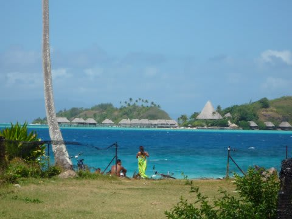

# 2009年　初の海外子連れダイビング旅行記　10　Start cruising

📅 投稿日時: 2012-09-06 00:11:52

🏷️ カテゴリ: [ダイビング日記](ce3a7a8d424d112fce83ee85c81a0e344.md)

で．

とりあえず，預けている間もずーっとギャン泣き…ってわけではなかったようで．

すぐ機嫌も良くなってきたので．

とりあえず一安心…

んで，今回利用したBora Diving Centerは午前中しかファンダイブをやっていないので．

午前中でダイビングは終わり，ホテルに帰ります．

ホテルに戻ったころには，娘はもう完全にいつもどおりのゴキゲンに．

「…子供，これからは他人に預けても大丈夫そうだなぁ…」

と，ちょっと黒い心を抱いてしまったわが夫婦でした．

で．ホテルについたらお昼ご飯タイムなので，

前回そこそこ安く食事ができた思い出がある，

ホテルから徒歩10分ほどの「ルロット・マティラ」に行くことに．

こんな景色を眺めつつ，海岸沿いを歩いて行きましたが…

ルロット・マティラに到着すると，残念ながら工事中のため簡易メニューで営業．

食べたかったメニューがほとんど無い…

で，またまたハンバーガー．

グリルしたてのあつあつハンバーグがのってて

結構ボリュームがあって，美味いです．

ハンバーガーと馬鹿にしてはいけません．

…でも，お値段も馬鹿にしてはいけません．

ハンバーガー+ポテトだけで800円近い．

これでもこの店，ほかに比べると安いほう…

んで．

ご飯を食べ終わると．

2時半からチャーターボートツアーです．

このボートチャーター．

最短2時間から，1時間単位でお願いできます．

で，「島一周」「ラグナリウム（シュノーケリングポイント)」

「エイ，サメとタッチ」「無人ビーチ」…などと，いくつか

サンプルメニューがあって，リクエストすれば時間内で

いけるポイントに寄ってくれます．

んで，最短の2時間でも27000XPF．

日本円で約25000円！！！！！！！！！！

…2万5000円…

にまんごせんえん…

…

我が家の一ヶ月の食費に近い．

ダイブフィー4本分．

安い2泊3日の旅行くらいなら余裕でいける金額．

ぐはぁっ！！！！

た，高いっ！！！

…でも，大人2人+子供1人の4人で行けば，一人8000円．

で，我々が船の上から見たきれいな海を，子供にも見せて

あげなくては…，ということで．

（という言い訳で？）

チャーターすることに決定．

予約した時間に，ホテルの桟橋に5-6人が乗れる程度のモーターボートが迎えに来てくれてます．

ボートに乗り込んで…

ボートキャプテン　「とりあえず2時間，どこにでも好きなところに行くよ！」

私　　「適当にいいポイントで時々泳いだりしながら，島一周できますかね～」

ボートキャプテン　「2時間じゃ，遊びながら島一周はきついかな～．まぁ，いけるところまで

　　行ってみよう！無理そうなら途中で戻るって事で…」

私　　「OK!」

ボートキャプテン　「じゃ，最初はオススメのシュノーケリングポイントに連れて行くよ！」

…っていうことで，出発！

