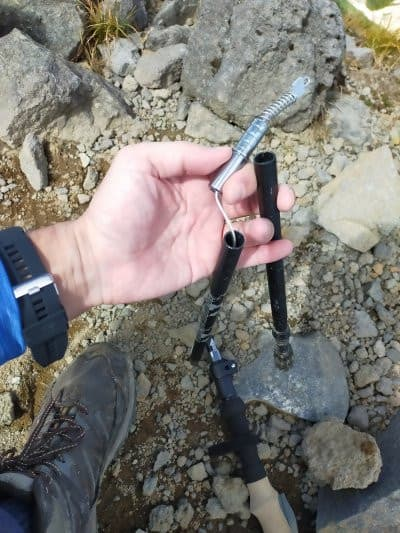

# 登山用にトレッキングポールを買ってみた…2300円の激安ポールは使えるのか？？その2

📅 投稿日時: 2021-10-07 02:29:46

えー．

以前，[トレッキングポールネタを書いた](ed9b91207b2a019621d18b12789937fe7.md)ものの．

「続く」と書いたのち，続きを書かずに

来てしまいましたが…

ようやっと続きを書きました～！←続きを書くのが遅いよ…

お待たせしました！！←誰も待ってないから

…ということで．

前回，初めてのトレッキングポールを

使った登山の快適さに驚いたところまで

書いたわけですが．

トレッキングポールを使っている人には

常識なんだろうけど．

トレッキングポールを使うと，

登り坂で足の力だけじゃなく

腕の力の補助付きで段差を登れて

むちゃくちゃ楽だし．

そして，下り坂でも上手くポールを

使えば，足だけでブレーキをかける

のに比べて，使う筋力はすごく

少なくて済みます…！

…自分がスキーヤーでストックを

使うのに慣れているからか．

トレッキングポールを使って坂を

降りるのに違和感は全く無くて．

急斜面を降りるのは，コブ斜面の

ストックワークに近かったかも（笑）．

ポールを突くことでリズムもとれて，

ポール無しよりハイスピードで歩けるし．

（人のいないところはほとんど走ってたかも）

足元が不安定な凸凹道でも，とっさに

ポールを突いてバランスがとれるので

安定感も増します！！

ポールを使った登山，登りも下りも

こんなに快適とは…！

…と，喜びながらいくつかの山を越え．

とある山頂付近の，こんな感じの

岩場をトコトコ歩いていたところ…

え？

ポールの先端が，いきなり軽くなった？？

あれ？

あれれ？？

…なんだ，これは！？？

いきなりポールの先端が

外れちゃったよ…！？？

えええええ～！

これがデビュー戦なのに，いきなり

利用初日の山頂で壊れてしまったんですが！！

なんということか…！！！

曲げ強度や軽さ的には問題なく，

「このお値段にしては，いいのでは？」

と思っていたけど．

…やっぱり，2300円のポールは

ダメだったのか…（涙）

しかし，山頂でぶっ壊れるかなぁ…（泣）

ということで．

最後の下山はポール無しで降りましたが．

家に持って帰ってみてみると．

折り畳み式のポールの一番先．

シャフトを繋ぐ銀色の部品と，

シャフトの融着が外れてしまって

ました…

うむ．

さすがにこのお値段だと，

「1年保証」

とかいうものは無く．

保証書もついてなかったので．

さすがに保証はないだろうなぁ（泣）

とりあえず，利用初日にぶっ壊れたことを

通販のコメントに書き込んでみたら…

なんと，翌日．

「品質面でご迷惑をかけたようで

　すみません．無償で新品を送ります」

という，予想外のメッセージが！！

そして，それから3日後に…

無償で新品が届きました～！

しかし…

無名の中華系メーカーの，2300円の

激安ポールなのに．

壊れたらホントに無償で新品を届けて

くれるとは…

ありがたい．

とりあえず，壊れたやつも強力接着剤

でくっつけて，上手くいけば使えそうな

状態になったので．

これで，予備機と合わせて2セット

揃ったな！

これで，また壊れても予備があるから

大丈夫だな！！←大丈夫じゃないから

ということで．

果たして，この激安ポール．

最初に壊れたのが初期不良だったのか？

あるいは，この新品もまた壊れるのか？

確認してみないと…！！

と， 先日．

古いポールの壊れてない方と新品1本の

組み合わせで，小仏峠～陣馬山

往復20kmで使ってみましたが，

壊れませんでした～！

そして，壊れたポールを接着剤で

くっつけて，奥高尾近辺を13kmほど

歩いてみましたが．

いろいろ体重をかけてみたり，

強く突きながら走ったりしてみたけど，

壊れませんでした…

　

接着した奴でも，十分使えるなぁ…！

（むしろ，工場でやわな融着された

　新品より強いかも？？）

ってなことで．

まだ十分な寿命があるとまでは断言

できないものの．

さすがに使った初回で壊れてしまったのは，

ものすごい当たりを引いてしまった

だけだったようです！

…うーん．

やっぱり，自分は何かの引きが強い

みたいですね…

…宝くじ買おうかな，やっぱり…

## 💬 コメント一覧

### 💬 コメント by (Northfox)
**タイトル**: Unknown
**投稿日**: 2021-10-07 20:45:38

買う ⇒ 気に入る ⇒ 壊れる ⇒ 同じものが増殖。

デジャブ感がありますね．．．（^^；

### 💬 コメント by (ダウンヒル)
**タイトル**: Unknown
**投稿日**: 2021-10-08 01:31:33

買う ⇒ 気に入る ⇒ 壊れる ⇒ 同じものが増殖

これはまさに...スキー以外にも現れる現象...

人の事は言えない...物欲...嗚呼、恐るべし物欲...

### 💬 コメント by (Skier_S)
**タイトル**: それは気づかなかった…！
**投稿日**: 2021-10-08 02:03:25

＞Northfoxさま

確かに強烈なデジャブ感が…

でも，そんなことしたことあったかな…

思い出せない…

何のことだろう…

＞ダウンヒルさま

こ，壊れて買ったものは，仕方なく買ったもので．

物欲に負けて買ったものじゃないから，セーフ…

セーフのはずなんですが…

### 💬 コメント by (パンダ熊猫)
**タイトル**: Unknown
**投稿日**: 2021-10-08 11:23:18

ウチは家族全員中華系ポール使用。

それも最初に買った見た目だけイイやつの

ネジが錆びててクレーム入れたら直ぐに新品ゲット、次にワイフ用にアンチショック付きのヤツ買って、埃が付いてたとクレーム入れたらサイズミスの倉庫管理品を無償交換で手持ちは送料が無駄になるから返送しないでくれって

これで現在4セットタライ廻しで

子供がチャンバラごっこしてるし　危

### 💬 コメント by (Skier_S)
**タイトル**: >パンダ熊猫さま
**投稿日**: 2021-10-09 06:38:59

あら…

意外とちゃんと不具合品で無償新品提供してくれるんですね…

しかし4セットですか（笑）

ちなみにアンチショックって，使えますか？

ちょっと気になってたんですが，重量が増すので今回はやめたのですが…

