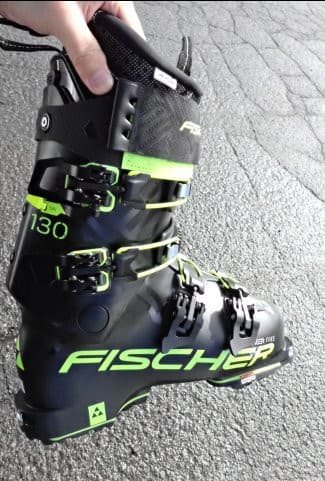

# 今シーズンの前にGetしたFISCHER RANGER 130のブーツを春に初めて履いてみたんだけど…春の重い雪は固いブーツがいいかも？

📅 投稿日時: 2023-06-01 01:25:48

🏷️ カテゴリ: [スキー雑談](c1f9d2cb7478308da16419928ea3945e9.md)

ということで．

昨年夏に開催された，前回の物欲選手権で

敗れた結果として．

・板　FISCHER　RC4 RC 185cm 魔改造バージョン

・ブーツ　FISCHER Ranger 130 

・ウェア

・ゴーグル

を購入して，今シーズンに臨んだわけですが…

今シーズンインの時には，まだREXXAM

ブーツが生きていたので，

HEAD Raptor WCR3 (フレックス140)

REXXAM REVO2 130（フレックス130）

の2種類を，硬めの締まった雪の時は

フレックス140のHEAD，柔らかめの

雪の時はフレックス130のREXXAMと，

雪の状態によって履き分けていたの

ですが…

以前記事にしたように，この春に

[REXXAMのブーツがヘタってしまった](e8f13e053373781df72b9d77ff5af2cdd.md)という

衝撃の事実に気づいてしまい．

ようやっとこの4月に，REXXAMの130の

代わりとして，同じフレックス130の

FISCHER Ranger130をデビューさせて

みたのでした～！

というところまで，ブーツがヘタった

レポートに書いたと思うので．

今回は，このブーツを履いて滑った

詳細レポートです！！

（ブーツを買った時のレポートは[こちら](e274b570b59c67d262b2990836063233b.md)）

うーむ．さすが新品のRanger 130 ，

やっぱり粘りがある！

ヘタってしまって，まったく粘りが

感じられなくなったREXXAMとはえらい

違い…

ブーツを押していったときに，ブーツが

粘る感じがあるよ！！

…ただ，フレックス130なので，結構

しっかりしているかと思ったけど．

4月で気温が＋10℃近かったのもあり…

フレックス130というよりもブーツが

柔らかく感じる…！

ブーツを押したとき，粘りはあるものの．

圧をかけ続けていると，ブーツがつぶれきって

しまう感じ．

さらに，このブーツはあまり強いグリップの

板と合わせることを想定していないのか…

ブーツの左右方向の動きにもちょっと

柔らかめのようで．

角付けを強めて強い横Gを受けたとき，

フレックス140のHEADブーツ比べると，

ブーツが横方向にヨレてしまって，

エッジホールドがちょっと甘めに感じる…

まぁ本来，テックビンディングで

使うことを想定していて，ハイクアップ用の

ウォークモードがある山スキー用ブーツで

なので．

そんなにがっつりカービングで硬い斜面を

滑るための設計はしてないってのもある

だろうけど…

それよりもこの日は気温が＋10℃近くと

高かったこともあり，フレックス140の

HEADのレース用ブーツでも高温で

柔らかく感じるくらいだったので．

このブーツもシェルがかなり柔らかく

なっちゃってたんだろうなぁ…

と思います．

でも，気温10℃の晴れで緩んでざぶざぶの

柔らかい雪なので，フレックス140の硬めの

ブーツより，柔らかいブーツのほうが

いいかな…と思ったけど．

気温が高くて，かなりずっしり重くなった

雪の場合は．

硬いブーツのほうが，重い雪に突っ込んで

いった時，ブーツの硬さで雪の重さに

やられずに，しっかり板が抑えられる！

柔らかいブーツの場合は，重い雪に押されて

ブーツがグニョグニョ動いてしまう感じで，

スピードを出していくと，ブーツが重い雪に

負けちゃうので，力で板が暴れるのを抑え

なくてはならなくなっちゃうよ！！

硬いブーツならすごい重い雪でも

ブーツ任せで滑ることができるけど．

柔らかいブーツでスピードを出すと，

ブーツが雪の重みに負けて板が暴れて

怖いし，暴れる板を抑えるのに力が

かなりいるのですごい疲れる…

…ということを，

硬いブーツと柔らかいブーツを履き替えて

初めて知りました…

ということで．

春のざぶざぶ雪は，足場が崩れていく

ほど柔らかいから，硬いブーツは意味が

なくて柔らかいブーツのほうが良いと

思っていましたが…

春の重い雪は，硬いブーツのほうが

圧倒的に楽

ということを，学びました～！

さらに．

気温が＋10℃になると，フレックス140の

ブーツでも柔らかくなっちゃうので．

もっと強いブーツがあってもいいのかも？？

とも思ってしまった，Skier_Sだったのでした…←危険だ．

道具の嗜好がだんだん強いほうに行っているって，

かなり危険な発想だ…
