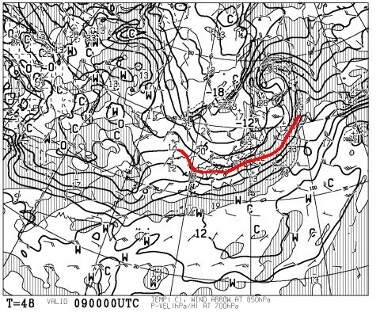
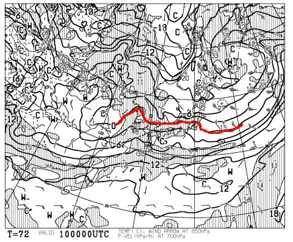
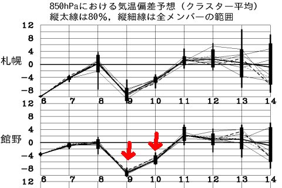

# 2016/11/6，定番のイエティのコース状況の動画…

📅 投稿日時: 2016-11-08 02:24:20

えー．

ニュースなどでやっていたので，

ご存知の方も多いと思うのですが…

11月9日の850hpa気温を見てみると…

うむ？

0℃線が，太平洋側にまで下がってるよ！？？

そして，10日朝も…

うむ．

志賀高原近辺まで，0℃線が下がってきてます…

これは．

9日一日，志賀高原は雪が降り続けるのでは？？

…とりあえず．

10日朝まではいい感じで冷え続けそうなのですが．

…まだ，志賀高原で人工雪を打ち始める前だと思うし．

うーむ．

この雪が根雪になって，ゲレンデに残ってくれると

いいんですけど…

それ以降の気温は，こんな感じで．

矢印で示した9，10日以降は．

…平年なみの気温に戻っちゃいそうなので．

うーん．

まだ，志賀高原のオープン時の積雪を

確実にしてくれる雪じゃない感じかな…

望むべくは，これから一週間後くらいにも．

このレベルでガンガン冷えてほしいところ…

…って，ちょっと期待の冷え込みニュースのあとは．

Yeti定番の，コース動画です…

コーススタート後，ボーダーが板を履くエリアを

通過したあたりからの映像です．

午後3時ごろ，夕方の結構混んできたころなので．

人が多めです…

午前中はもう少し空いていたんですけどね～．

まぁ，先週よりコース幅が広がったのが

わかるかな？

## 💬 コメント一覧

### 💬 コメント by (yama)
**タイトル**: 昨日は?
**投稿日**: 2016-11-08 09:25:50

昨日はどうでしたか。こちらは普段の半分くらいしか仕事が進みませんでした。土曜日のナイターをラストまで滑ったのが効いています。やはりS様と滑る時は万全を期す必要がありますね。風邪は具合はどうですか。週末に備えて仕事を頑張っておきます。土曜日はお待ちしています。

### 💬 コメント by (はなげ親分)
**タイトル**: こ、怖い!!
**投稿日**: 2016-11-08 19:29:44

相変わらず日中のコースはにぎわってますね。私の技術では回避するのでやっとこさです。やはり空いているナイターで大人しくしています♪

### 💬 コメント by (Skier_S)
**タイトル**: 完全に風邪…（涙）．
**投稿日**: 2016-11-09 02:11:14

＞yamaさま

風邪の具合は…

ひどいです．

咳が止まりません（泣）．

今週末までに治さないと…

土曜日はよろしくお願いします！

＞はなげ親分さま

ナイターは滑りに行かれたんですか？

ナイターも，土曜のナイターはすごいですよ…

でも，日曜はナイター開始後の3本目までは

最高でした！

