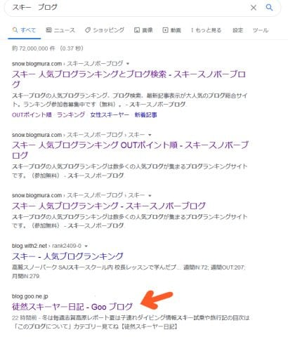
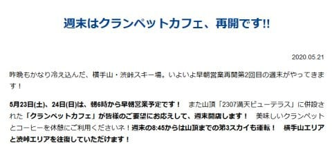
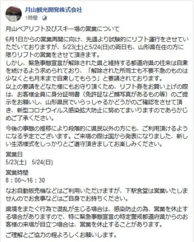
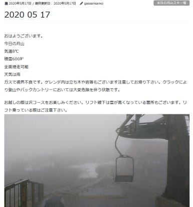

# 月山スキー場は緊急事態宣言解除後の6/1の営業再開予定，今週末も山形県民限定オープンらしいけど…滑れるのは沢コースのみなの？

📅 投稿日時: 2020-05-22 06:26:44

Google様でいろいろ検索していた時に．

「スキー　ブログ」

で検索すると，上位5位はブログランキングの

スキーカテゴリが表示されるのですが．

ブログそのものとしては，なぜかこのブログが

最高位に現れる

ということを知って．

喜ぶというよりむしろ引いている今日この頃，

皆様いかがお過ごしでしょうか．

個人履歴で最適化されてて，自分だけが

こういうランキングで出てくるのかな？？

…と思いましたが．

違うPCからログインしてもこの結果だったので，

どうやら日本全国津々浦々，誰が検索しても

この結果になるようです…

さすがに私も，

「スキー　ブログ　志賀高原」とか

「志賀高原　天気」とかで検索されたら

上位に来るかも…と思って調べたことがあり．

「志賀高原　天気」では50位にも入ってない

ことにがっくり来たことはありましたが．

「スキー　ブログ」で検索したことは

なかったので，この結果にちょっと驚き…

まぁ，この時期にまじめに更新している

スキーブログは少ないから，←まじめ？？誰が？？

時期限定の瞬間最大風速的結果とは

思いますが（笑）

それにしても，有名スキーヤーやら

スキー場公式ブログやら，

そういうのを差し置いて，

このBlogを上位に表示する

Google様の神経を疑うのですが…

…という長い前フリの後は，

本題へ．←いや，ここから後が，書いている本人的には実はオマケなのでは？？

志賀高原の横手山，渋峠．

今日も横手第2，渋峠ペアの2本のリフトが

動いたようですが…

残念ながら，特派員がいないので，詳細情報は

分かりません（涙）．

でも，今週末も，6時から横手第2，渋峠が

早朝営業．

8:45からは横手第3が動き，横手と渋が

行き来できるようになるみたいですね…！

（[横手山スキー場ホームページ](https://yokoteyama2307.com/news/9052/)より）

うーむ．

渋峠は行けると思ってたけど．

まさか，23，24日の週末まで横手山が滑れるとは…っ！！

何度も繰り返すけど，雪不足だった今シーズンを

考えると，ホントに素晴らしい！！

で．

月山スキー場は…

6月1日のオープンを目指して準備中ってことですが．

今週末も，山形県民限定でオープンするみたいですね．

（[月山観光開発株式会社Facebook](https://www.facebook.com/gassankannkou/posts/2911624245612417?__tn__=-R)より）

…滑る際には，身分証明書で山形県民である

ことを示さなくてはならないようです…

しかし，月山スキー場Blogによると．

先週末，滑れたのは沢コースだけのようですね…

なぜか，大斜面は滑れないようです．

（[月山スキー場ホームページ](https://mtgassan.gassankanko.jp/honjitu/2020-05-17/)より）

まぁ，まだ5月なので問題なく板を履いてリフトに

乗り降りできるだけの雪の量はあるはずですが…

大斜面にトラバースできないクラックか何かが

あるのかな？？

うーむ．

しかし．

緊急事態宣言が解除されれば，

6月1日以降は県外の人にも

オープンするみたいだけど…

都道府県またぎの長距離移動，

許されるのかな…？？

もし，長距離移動が許されて，6月になって

月山が県外の人にもオープンしたら．

私のような，

ありえない幻覚を見たり（自宅にいるのに，目をつぶるとなぜか雪景色が…っ！）

訳の分からないことや危険なことを口走ったり（死ぬ！スキーしなかったら死ぬ！と突然叫んだり）

理性を失った行動をとりそうになったり（何度もいろんなものをポチりそうになったり…）

という，白い粉を切らした禁断症状に苦しむ人が←いや，あなたの場合は，普段からこれらの症状はいつも出てるでしょ

大量に集まり，

むちゃくちゃ混むと思うんだけど…

月山，輸送力の低いペアリフトしかないから，

リフト30分以上待ちとかになりそう…

それでも，「滑れるだけマシ！」と，

日本中からおかしい人が集まるだろうなぁ…←あなたもおかしい人の一人でしょ

おそらく．

一般オープン直後の週末，6月6，7日に．

月山が爆撃されたら，

日本のスキーバカが根こそぎ淘汰されるん

じゃなかろうか…

と思うほど，濃い人がこの1点に集中しそう（笑）．

あるいは…

やはり，6月1日以降も，首都圏からの移動ができず．

私の心配は杞憂になるのか…？？

うーむ．

でも．

混んでてもいいから．

今シーズン，あと1回は滑りたい…

PS.ちなみに，

　「スキーブログ」だとGoogle検索順位5位，

　「スキーヤーブログ」だと3位，

　「志賀高原　ブログ」だと当然のごとく1位でした（笑）

## 💬 コメント一覧

### 💬 コメント by (naoちゃんねる)
**タイトル**: Unknown
**投稿日**: 2020-05-22 19:01:49

私は確か「子連れスキー ブログ」で検索でたどり着きました。

これも２番目位に出てきますよ～

娘にスキーを始めさせた時に色々情報収集してて、おんぶして滑っていたと言うのに驚いた記憶があります😁

そして、１日標高差20000㍍を滑るネタを楽しく見てたのと同時に、絶対自分にはありえない世界だと思ってましたが…

まさかその世界に足を踏み入れてしまうとは…😅

何とか６月に、月山に行かれるといいですね…😣

### 💬 コメント by (Skier_S)
**タイトル**: ＞naoちゃんねるさま
**投稿日**: 2020-05-23 10:17:47

子連れスキー　ブログで検索すると…

確かにこれでも結構上位に来ますね．

おんぶして滑るの，そんなに驚くところでしょうか…（笑）．

しかし，確かに初めてお会いしたころのことを考えると，

まさか20000mゴールドチャレンジするとはゆめゆめ思ってなかったですね…（笑）．

もう，ずっぽりこの世界にはまりましたね．．．

