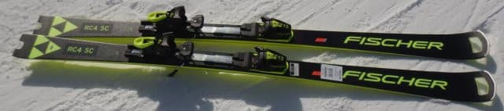
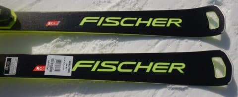
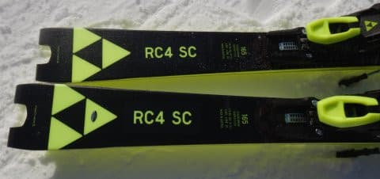
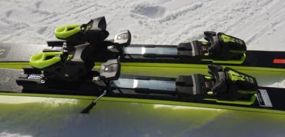
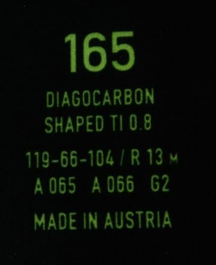

# 2023シーズンモデルのスキー板，試乗レポートその3…FISCHER RC4 Worldcup SC Pro

📅 投稿日時: 2022-05-24 02:34:26

🏷️ カテゴリ: [スキー板試乗](c0bd8048615710cee890e403a36cc9a2b.md)

えー．

本日は，日曜に行ったかぐらの詳細レポートを

書こうと思ったのですが…

ちょっと時間がないので，書きためておいた

2023シーズンモデルのスキー板

試乗レポートです！

今回はフィッシャー編．

では，どうぞ～！

○FISCHER RC4 Worldcup SC Pro 165cm

基礎小回り用

FISCHERのRC4シリーズは，

大回りのRC，中回りのCT，小回りのSCの3種類あり．

そのうち，大回りと小回りにはそれぞれ

・プレートが優しいRacetrackの板

・強めのM/Oプレートがついた「Pro」がつくモデル

の2種類がありますが…

この板は，小回りのSCの，強めのM/Oプレートが

ついたバージョンの「SC Pro」になります．

この板については，[以前こんな記事を書いている](e365707c42944ab9a8c0597cc8d39d1c6.md)ので，

一見見た目は2022シーズンモデルの継続にしか

見えず．

2022シーズンから全く変わってないのでは…？

と思われるかもしれませんが．

改めて書いておきます．

2022シーズンモデルと2023シーズンモデル，

乗った感じが全く違います

圧倒的に2023シーズンモデルがいいです．

手に持った感じは結構重いんですが．

履いた感じはそこまで重さを感じません．

滑り出すと…

なんだか，しっとり…というか，ネットリとした

粘りのある踏み心地で．

踏んだ分だけ板に圧が溜まっていき，それが

切替の時に気持ちよく解放される感じ．

ばね感はあるのですが，小回りスペシャル板の

ように左右にふっとばされて，反復横飛び

させられるような強烈な返りではなく，

次のターンの推進力と加速力に使われる，

いい感じの返りが返ってきます．

踏み心地が気持ちよくて，踏んだだけたわむ

たわみ感があって，好きなようにたわませて

自由に回転半径が作れる自由度があります．

たわみの出方がすごいきれいで，

板のトップからテールまでしっかり均一に

グリップするようにたわんでくれる感じで．

トップからテールまでしっかりグリップした

エッジに沿って，きれいに回っていきます．

トップがインに入ってくるとか，サイド

カーブで曲がってくるとかいうより，

トップからテールまで綺麗にたわんだ

エッジに沿って，弧が描かれる感じ．

谷回りで踏んでいくと比較的柔らかく

たわませられるように感じられて，

好きなようにたわませられるのに，

一旦グリップすると決して板の弱さは

感じず，強い張りで板がグリップして

行く感じ．

プレートが強いだけあって，板の

グリップは結構強めです．

自分のトップスピードを出しても，

板がたわみすぎて小回り強制マシンに

なりません．

トップスピードでも，中回りの弧が

作れる張りの強さがあります．

サイドカーブでどうしようもなく回って

来る板というより，たわみで回っていく

板なので，意外と縦目に落とすターンも

できます．

踏まなければ，結構まっすぐ目に落とす

ことも可能．

綺麗にたわんで，トップからテールまでの

エッジがしっかり効いてまわって行き，

切替でちょうどいい，気持ちいいばね感で

板が返ってくるという，快感度がかなり

高い板です．

おそらく，そこそこのレベル＆スピードで

滑る人なら，かなり気にいる板なんじゃ

ないでしょうか．

この板，おススメです．

私も2023シーズンモデル，欲しい…←2021シーズンモデル持ってるでしょ

かなり物欲を刺激する板でした．

## 💬 コメント一覧

### 💬 コメント by (ikkun)
**タイトル**: Unknown
**投稿日**: 2022-05-29 12:27:25

展示会より試乗会本当にヤバいですね(・・;)

私しはELANが心に残った熊でした

### 💬 コメント by (Skier_S)
**タイトル**: ＞ikkunさま
**投稿日**: 2022-05-30 02:36:15

今シーズン，ELANは試乗しなかったです…

ELANは，どの板がおススメだったんでしょうか？

